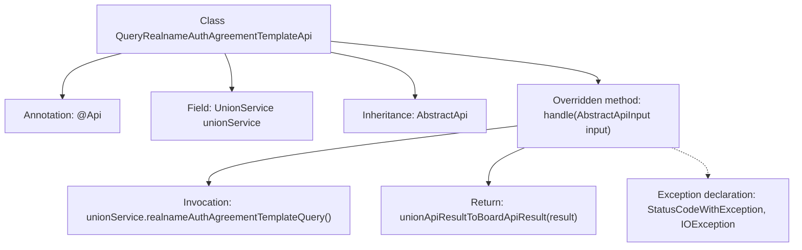

# Basic Information

|      |      |
|------|------|
| Name | QueryRealnameAuthAgreementTemplateApi |
| Language | .java |
| Code Path | WeFe/board/board-service/src/main/java/com/welab/wefe/board/service/api/union/member_auth/QueryRealnameAuthAgreementTemplateApi.java |
| Package Name | com.welab.wefe.board.service.api.union.member_auth |
| Dependencies | ['com.alibaba.fastjson.JSONObject', 'com.welab.wefe.board.service.sdk.union.UnionService', 'com.welab.wefe.common.exception.StatusCodeWithException', 'com.welab.wefe.common.web.api.base.AbstractApi', 'com.welab.wefe.common.web.api.base.Api', 'com.welab.wefe.common.web.dto.AbstractApiInput', 'com.welab.wefe.common.web.dto.ApiResult', 'org.springframework.beans.factory.annotation.Autowired', 'java.io.IOException'] |
| Brief Description | This is an API class for querying real-name authentication agreement templates, which retrieves results by invoking the UnionService and converts them into the API response format. |

# Description

This is an API class named QueryRealnameAuthAgreementTemplateApi, designed to query the real-name authentication agreement template. It inherits from the AbstractApi base class, uses AbstractApiInput as the input parameter, and returns a result of type Object. The class annotation @Api defines the API path as union/realname/auth/agreement/template/query and the name as realname auth agreement template query. The class injects the UnionService via @Autowired and calls the realnameAuthAgreementTemplateQuery method of unionService in the handle method to obtain a JSONObject result, which is then converted into the ApiResult format for return. The method may throw StatusCodeWithException and IOException exceptions.

# Class Summary

| Name   | Type  | Description |
|-------|------|-------------|
| QueryRealnameAuthAgreementTemplateApi | class | This is an API class for querying real-name authentication agreement templates. It invokes the realnameAuthAgreementTemplateQuery method through UnionService to obtain results and converts them into ApiResult format before returning. |


## Class QueryRealnameAuthAgreementTemplateApi

|      |      |
|------|------|
| Access Modifier | @Api(path = "union/realname/auth/agreement/template/query", name = "realname auth agreement template query");public |
| Type | class |
| Name | QueryRealnameAuthAgreementTemplateApi |
| Description | This is an API class for querying real-name authentication agreement templates. It invokes the realnameAuthAgreementTemplateQuery method through UnionService to obtain results and converts them into ApiResult format before returning. |


### UML Class Diagram

```mermaid
classDiagram
    class AbstractApi~T~ {
        <<Abstract>>
        +handle(T input) ApiResult~Object~
    }

    class AbstractApiInput {
        <<Abstract>>
    }

    class QueryRealnameAuthAgreementTemplateApi {
        -UnionService unionService
        +handle(AbstractApiInput input) ApiResult~Object~
    }

    class UnionService {
        <<Interface>>
        +realnameAuthAgreementTemplateQuery() JSONObject
    }

    class ApiResult~T~ {
        +T data
    }

    class JSONObject

    AbstractApi <|-- QueryRealnameAuthAgreementTemplateApi
    AbstractApiInput <|-- : Generic Parameter
    QueryRealnameAuthAgreementTemplateApi --> UnionService : Dependency
    QueryRealnameAuthAgreementTemplateApi --> JSONObject : Returns
    QueryRealnameAuthAgreementTemplateApi --> ApiResult : Returns
```

This code demonstrates the class structure of a real-name authentication agreement template query API implementation. QueryRealnameAuthAgreementTemplateApi inherits from the generic abstract class AbstractApi and implements business logic by injecting the UnionService interface. The core method handle receives AbstractApiInput parameters, calls UnionService to obtain JSON-formatted results, and converts them into ApiResult for return. The class diagram clearly illustrates the abstract base class, interface dependencies, generic usage, and return type relationships, showcasing a typical Spring Boot service-layer API implementation pattern.


### Internal Method Call Graph



This flowchart illustrates the core structure of the QueryRealnameAuthAgreementTemplateApi class, which inherits from AbstractApi and overrides the handle method. The process starts with the class definition, showing its annotation, the UnionService property injected via dependency injection, and the method that invokes unionService during request processing while transforming the return result. It also marks the types of exceptions that may be thrown. The entire flow clearly presents the data transfer and exception handling path of the API request processing.

### Field List

| Name  | Type  | Description |
|-------|-------|------|
| unionService | UnionService | Automatically inject the UnionService instance. |

### Method List

| Name  | Type  | Description |
|-------|-------|------|
| handle | ApiResult<Object> | Handling method override for real-name authentication protocol template query, invoking unionService to obtain results and converting them into ApiResult format for return. |


