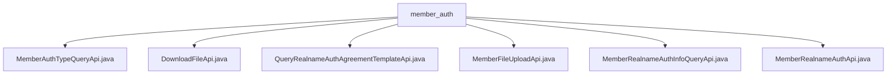

# Basic Information

|      |      |
|------|------|
| Name | member_auth |
| Language | .java |
| Code Path | WeFe/board/board-service/src/main/java/com/welab/wefe/board/service/api/union/member_auth |
| Package Name | docs.board.board-service.src.main.java.com.welab.wefe.board.service.api.union.member_auth |
| Brief Description | MemberAuthTypeQueryApi queries member authentication types. DownloadFileApi handles file downloads. QueryRealnameAuthAgreementTemplateApi queries real-name authentication templates. MemberFileUploadApi handles file uploads. MemberRealnameAuthInfoQueryApi queries real-name authentication information. MemberRealnameAuthApi processes real-name authentication requests. |

# Description

## Overview  
The core responsibility of this module is to provide API services related to alliance member authentication, including authentication type queries, file upload/download, real-name authentication agreements, and information management. The interface specifications follow a unified design pattern, all inheriting from the AbstractApi base class, using annotations to define paths and names, and returning data in the ApiResult format. Key data structures include AbstractApiInput and its subclasses, such as Input classes containing fields like file IDs and entity names. External dependencies include UnionService, CertOperationService, and RestTemplate. For example, MemberRealnameAuthApi handles CSR generation and authentication requests, while DownloadFileApi enables secure file downloads.  

## Key Business Scenarios  
The module supports a complete member authentication workflow: first querying the authentication type (MemberAuthTypeQueryApi), uploading necessary files (MemberFileUploadApi), and then initiating real-name authentication (MemberRealnameAuthApi). The interaction model resembles a workflow engine, with APIs collaborating via UnionService. Typical scenarios include downloading agreement templates (QueryRealnameAuthAgreementTemplateApi) and querying authentication status (MemberRealnameAuthInfoQueryApi). For instance, file processing employs RSA signatures for security, and authentication information is persisted through CertOperationService. Exception handling uniformly captures StatusCodeWithException to maintain business continuity.

### Package Internal Structure View

This flowchart illustrates the structure of 6 API interface files under the member_auth directory. All Java files are directly subordinate to the member_auth directory without any deeper nesting relationships. These API interfaces pertain to member authentication functionalities, including file downloading, real-name authentication information querying, file uploading, and other operations, forming a comprehensive member authentication service module. Each node displays only the filename, adhering to the naming convention for the last-level elements of the path.

# File List

| Name   | Type  | Description |
|-------|------|-------------|
| [MemberAuthTypeQueryApi.java](MemberAuthTypeQueryApi.md) | file | This is an API for querying member authentication types, with the path union/member/authtype/query, which retrieves data through UnionService and returns the results. |
| [DownloadFileApi.java](DownloadFileApi.md) | file | The DownloadFileApi class handles file download requests by verifying RSA signatures, concatenating URL parameters, and invoking remote services to retrieve the file byte stream for return. The input parameter is fileId. |
| [QueryRealnameAuthAgreementTemplateApi.java](QueryRealnameAuthAgreementTemplateApi.md) | file | This is an API class for querying real-name authentication agreement templates, which retrieves results by invoking UnionService and converts them into the API response format. |
| [MemberFileUploadApi.java](MemberFileUploadApi.md) | file | The MemberFileUploadApi class handles file upload requests, invokes the UnionService to upload files, and returns the results. Input parameters include the file name and purpose. |
| [MemberRealnameAuthInfoQueryApi.java](MemberRealnameAuthInfoQueryApi.md) | file | The API class for querying real-name authentication information invokes UnionService to retrieve authentication data. If successful, it saves the certificate information, request ID, and status via CertOperationService, and finally returns the processing result. |
| [MemberRealnameAuthApi.java](MemberRealnameAuthApi.md) | file | Real-name Authentication API class, handling user real-name authentication requests, generating certificate requests, and invoking alliance services to complete authentication. Includes input parameter classes for recording user information and certificate request content. |

