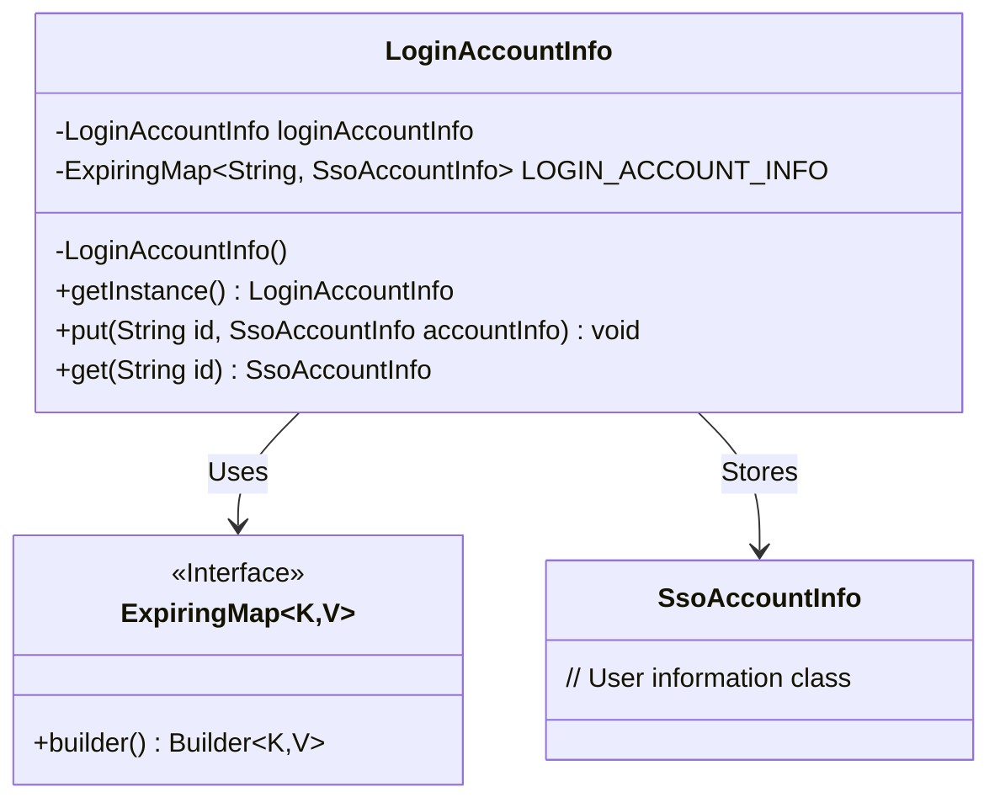
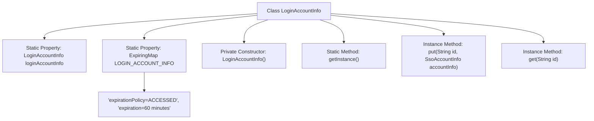

# Basic Information

|      |      |
|------|------|
| Name | LoginAccountInfo |
| Language | .java |
| Code Path | WeFe/board/board-service/src/main/java/com/welab/wefe/board/service/base/LoginAccountInfo.java |
| Package Name | com.welab.wefe.board.service.base |
| Dependencies | ['com.welab.wefe.common.web.service.account.SsoAccountInfo', 'net.jodah.expiringmap.ExpirationPolicy', 'net.jodah.expiringmap.ExpiringMap', 'java.util.concurrent.TimeUnit'] |
| Brief Description | The singleton class `LoginAccountInfo` manages logged-in user information, utilizing `ExpiringMap` to store TOKEN-to-user data mappings, which automatically expire after 60 minutes of inactivity. It provides `put` and `get` methods for data operations. |

# Description

This is a singleton-pattern login account information management class used for storing and retrieving the information of the currently logged-in user. The class contains a static ExpiringMap collection, where the key is the login TOKEN and the value is the user information object. The collection is configured with a 60-minute expiration policy, automatically cleaning up expired data based on the last access time. The class provides methods to obtain the singleton instance, as well as public methods for adding and retrieving user information. It is primarily used in Board's WebSocket functionality to manage login status.

# Class Summary

| Name   | Type  | Description |
|-------|------|-------------|
| LoginAccountInfo | class | The `LoginAccountInfo` class uses the singleton pattern to manage logged-in user information, employing `ExpiringMap` to store TOKENs and user data, which automatically expires after 60 minutes of inactivity. |

## Class LoginAccountInfo

|      |      |
|------|------|
| Access Modifier | public |
| Type | class |
| Name | LoginAccountInfo |
| Description | The `LoginAccountInfo` class uses the singleton pattern to manage logged-in user information, employing `ExpiringMap` to store TOKENs and user data, which automatically expires after 60 minutes of inactivity. |

### UML Class Diagram

Class diagram description: LoginAccountInfo is a singleton class for managing logged-in user information cache. It uses ExpiringMap as the storage container, with TOKEN strings as keys and SsoAccountInfo user information objects as values. ExpiringMap configures expiration policies (expires after 60 minutes of inactivity) via the builder pattern. The class provides put/get methods to manipulate the cache and ensures singleton pattern through a private constructor.

### Internal Method Call Graph

This flowchart illustrates the structural design of the LoginAccountInfo singleton class. The core mechanism utilizes a static ExpiringMap to implement a login information cache with time-based expiration, adopting an ACCESSED policy that refreshes the expiration timer upon access. The class enforces singleton pattern through a private constructor and provides put/get methods for key-value pair management, where the Map is configured with a 60-minute automatic expiration mechanism. The entire design suits scenarios requiring temporary storage with automated cleanup, such as WebSocket session management.

### Field List

| Name  | Type  | Description |
|-------|-------|------|
| LOGIN_ACCOUNT_INFO = ExpiringMap.builder()            .expirationPolicy(ExpirationPolicy.ACCESSED)            .expiration(60, TimeUnit.MINUTES).build() | ExpiringMap<String, SsoAccountInfo> | Defined a static ExpiringMap named LOGIN_ACCOUNT_INFO to store SSO account information, which automatically expires 60 minutes after access. |
| loginAccountInfo = new LoginAccountInfo() | LoginAccountInfo | Initialize the static login account information object. |

### Method List

| Name  | Type  | Description |
|-------|-------|------|
| get | SsoAccountInfo | Retrieve the corresponding SsoAccountInfo object from LOGIN_ACCOUNT_INFO by ID. |
| put | void | The method stores the user ID and corresponding SSO account information in the LOGIN_ACCOUNT_INFO mapping. |
| getInstance | LoginAccountInfo | Get the singleton instance of the logged-in account information. |

