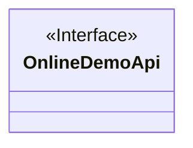
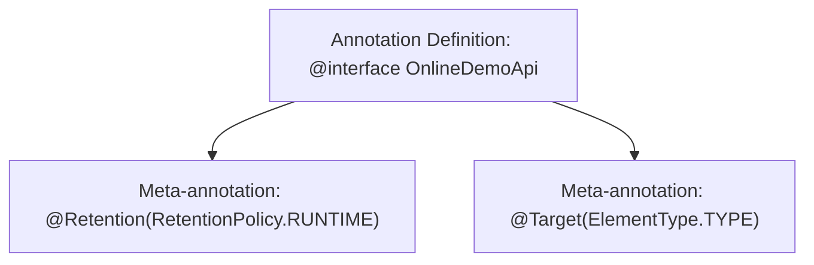

# Basic Information

|      |      |
|------|------|
| Name | OnlineDemoApi |
| Language | .java |
| Code Path | WeFe/board/board-service/src/main/java/com/welab/wefe/board/service/base/OnlineDemoApi.java |
| Package Name | com.welab.wefe.board.service.base |
| Dependencies | ['java.lang.annotation.ElementType', 'java.lang.annotation.Retention', 'java.lang.annotation.RetentionPolicy', 'java.lang.annotation.Target'] |
| Brief Description | The Java annotation `@OnlineDemoApi`, retained at runtime, is used solely for class declarations. |

# Description

This is a Java annotation definition named OnlineDemoApi, annotated with @Retention(RetentionPolicy.RUNTIME) to specify that the annotation is retained at runtime, and @Target(ElementType.TYPE) indicating that the annotation can only be applied to classes, interfaces, or enum types. The annotation does not define any member variables and serves as a marker annotation.

# Class Summary

| Name   | Type  | Description |
|-------|------|-------------|
| OnlineDemoApi | annotation | The Java annotation `@OnlineDemoApi` is retained at runtime and applies to the class level. |

## Class OnlineDemoApi

|      |      |
|------|------|
| Access Modifier | @Retention(RetentionPolicy.RUNTIME);@Target(ElementType.TYPE);public |
| Type | annotation |
| Name | OnlineDemoApi |
| Description | The Java annotation `@OnlineDemoApi` is retained at runtime and applies to the class level. |

### UML Class Diagram

This class diagram describes an annotation interface named OnlineDemoApi, marked with <<Interface>> and <<annotation>> to indicate its characteristics. The annotation is annotated with @Retention(RetentionPolicy.RUNTIME), meaning it will be retained at runtime and can be read via reflection mechanisms. It is also annotated with @Target(ElementType.TYPE), indicating that this annotation can only be applied to class, interface, or enum declarations. As a metadata marker, this annotation does not contain any explicitly defined member variables or methods and is primarily used to identify specific functionalities or behaviors at the class level.

### Internal Method Call Graph

This flowchart illustrates the definition structure of the Java annotation `OnlineDemoApi`. The annotation specifies runtime retention via `@Retention` and restricts usage to type declarations (classes/interfaces/enums) through `@Target`. The two meta-annotations are directly associated with the main annotation definition as core attributes, forming a typical Java metadata tagging pattern commonly used for framework-level type marking or runtime reflection processing scenarios.

### Field List

| Name  | Type  | Description |
|-------|-------|------|

### Method List

| Name  | Type  | Description |
|-------|-------|------|

