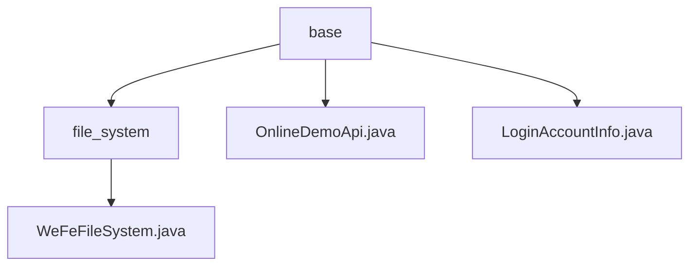

# Basic Information

|      |      |
|------|------|
| Name | base |
| Language | .java |
| Code Path | WeFe/board/board-service/src/main/java/com/welab/wefe/board/service/base |
| Package Name | docs.board.board-service.src.main.java.com.welab.wefe.board.service.base |
| Brief Description | The WeFeFileSystem class manages file upload storage and directories, including the UseType enum to define file purposes, with subclasses handling model downloads and invocations. OnlineDemoApi is a runtime class annotation. The LoginAccountInfo singleton class manages logged-in user information, utilizing an expiring Map for storage. |

# Description

## Overview  
The core responsibility of this module is to provide file system management and user session state maintenance functionalities, akin to a combination of a resource manager and a session center. The `WeFeFileSystem` class handles file storage, directory categorization, and deep learning model-related operations, supporting multiple file usage types (e.g., temporary files, model invocation). The `LoginAccountInfo` class implements token-based session management, utilizing `ExpiringMap` to automatically clean up expired data. Key data structures include the `UseType` enumeration, `ExpiringMap` collection, and user information objects. External dependencies are limited to the Java standard library. For example, `DownloadDeepLearningModel` handles model downloads, while `CallDeepLearningModel` manages sample compression and decompression.  

## Key Business Scenarios  
The module supports full lifecycle management of files, from upload classification (e.g., temporary storage or model invocation) to cleanup and maintenance, while ensuring WebSocket session validity. Typical workflows include: caching a user's token for 60 minutes after login, during which file services can be invoked to process model files (e.g., decompressing sample ZIPs or cleaning up temporary images). The interaction mode employs singleton access (e.g., `LoginAccountInfo.getInstance()`) and type-driven path generation (e.g., `getSubDirectory(UseType)`). Integration examples cover end-to-end AI workflows from file uploads to model invocations, as well as automatic recycling mechanisms for expired sessions.


### Package Internal Structure View



This flowchart illustrates the foundational service structure of the board-service module in the WeFe project. The root node is the base directory, which contains three child nodes: the file_system folder and two Java files. The file_system folder further includes the WeFeFileSystem.java implementation file, clearly presenting the hierarchical relationships of the file system and the distribution of core service components.

# File List

| Name   | Type  | Description |
|-------|------|-------------|
| [OnlineDemoApi.java](OnlineDemoApi.md) | file | ```textJava annotation @OnlineDemoApi, retained at runtime, used only for class declarations.``` |
| [LoginAccountInfo.java](LoginAccountInfo.md) | file | The singleton class `LoginAccountInfo` manages logged-in user information, using `ExpiringMap` to store TOKEN-associated user data, which automatically expires after 60 minutes of inactivity. It provides `put` and `get` methods for data operations. |
| [file_system](file_system/_module.md) | package | The WeFeFileSystem class manages file system operations, including file path retrieval, resource type handling, deep learning model downloading and invocation, as well as supporting functionalities such as temporary files, data resource uploading, and image processing. |


