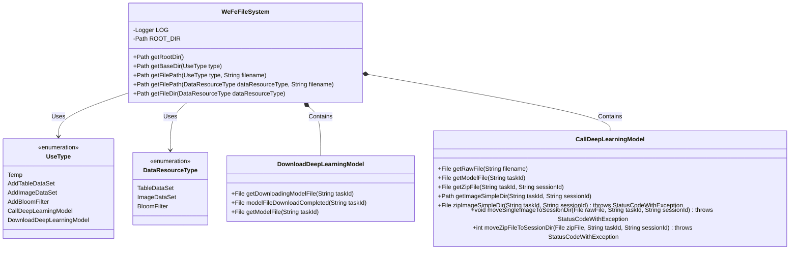

# Basic Information

|      |      |
|------|------|
| Name | WeFeFileSystem |
| Language | .java |
| Code Path | WeFe/board/board-service/src/main/java/com/welab/wefe/board/service/base/file_system/WeFeFileSystem.java |
| Package Name | com.welab.wefe.board.service.base.file_system |
| Dependencies | ['com.welab.wefe.board.service.constant.Config', 'com.welab.wefe.common.StatusCode', 'com.welab.wefe.common.exception.StatusCodeWithException', 'com.welab.wefe.common.file.compression.impl.Zip', 'com.welab.wefe.common.file.decompression.SuperDecompressor', 'com.welab.wefe.common.file.decompression.dto.DecompressionResult', 'com.welab.wefe.common.util.FileUtil', 'com.welab.wefe.common.util.StringUtil', 'com.welab.wefe.common.web.Launcher', 'com.welab.wefe.common.wefe.enums.DataResourceType', 'org.slf4j.Logger', 'org.slf4j.LoggerFactory', 'java.io.File', 'java.io.IOException', 'java.nio.file.Path', 'java.nio.file.Paths'] |
| Brief Description | The WeFeFileSystem class manages file system operations, including file path retrieval, resource type handling, deep learning model downloading and invocation, with support for temporary files, data resource uploading, and image processing functionalities. |

# Description

The WeFeFileSystem class is a file system management tool primarily designed for handling file uploads, storage, and directory management. It includes an enumeration UseType that defines various file purposes, such as temporary files, data resource additions, deep learning model invocations, and downloads. The class provides methods to retrieve the root directory and obtain subdirectories based on different types. The DownloadDeepLearningModel subclass manages the downloading and renaming operations of model files. The CallDeepLearningModel subclass handles file operations related to deep learning models, including compressing image sample directories, moving single images, extracting ZIP files, and cleaning non-image files. All operations incorporate error handling and logging.

# Class Summary

| Name   | Type  | Description |
|-------|------|-------------|
| WeFeFileSystem | class | The WeFeFileSystem class manages file system operations, including file upload paths, resource type handling, and deep learning model-related functionalities. |

## Class WeFeFileSystem

|      |      |
|------|------|
| Access Modifier | public |
| Type | class |
| Name | WeFeFileSystem |
| Description | The WeFeFileSystem class manages file system operations, including file upload paths, resource type handling, and deep learning model-related functionalities. |

### UML Class Diagram

This code defines a file system management class WeFeFileSystem, primarily used for managing storage paths and operations of files for different purposes. Core functionalities include obtaining root directory, retrieving base paths based on file usage types, and handling data resource file paths. The system contains two nested classes: DownloadDeepLearningModel handles file operations related to model downloads, while CallDeepLearningModel manages file compression, decompression, and movement during model invocation. Through the enumeration types UseType and DataResourceType, it categorizes and manages file paths for different purposes, achieving modular file system management.

### Internal Method Call Graph

```mermaid
graph TD
    A["Class WeFeFileSystem"]
    B["Static Initialization Block: Check/Create ROOT_DIR"]
    C["Method: getRootDir()"]
    D["Enum UseType: Define File Purposes"]
    E["Method: getBaseDir(UseType)"]
    F["Method: getFilePath(UseType, String)"]
    G["Method: getFilePath(DataResourceType, String)"]
    H["Method: getFileDir(DataResourceType)"]
    I["Nested Class DownloadDeepLearningModel"]
    J["Nested Class CallDeepLearningModel"]

    A --> B
    A --> C
    A --> D
    A --> E
    A --> F
    A --> G
    A --> H
    A --> I
    A --> J

    I --> I1["Method: getDownloadingModelFile(String)"]
    I --> I2["Method: modelFileDownloadCompleted(String)"]
    I --> I3["Method: getModelFile(String)"]

    J --> J1["Method: getRawFile(String)"]
    J --> J2["Method: getModelFile(String)"]
    J --> J3["Method: getZipFile(String, String)"]
    J --> J4["Method: getImageSimpleDir(String, String)"]
    J --> J5["Method: zipImageSimpleDir(String, String)"]
    J --> J6["Method: moveSingleImageToSessionDir(File, String, String)"]
    J --> J7["Method: moveZipFileToSessionDir(File, String, String)"]
```

This flowchart illustrates the core structure and functionality of the WeFeFileSystem class. The class includes a static initialization block to ensure the root directory exists, provides methods for obtaining file paths for different purposes, and manages download and invocation of deep learning model-related files through nested classes DownloadDeepLearningModel and CallDeepLearningModel. Key features include file path resolution, resource type mapping, file operations (move/compress/extract), and multi-scenario file classification management via the UseType and DataResourceType enums.

### Field List

| Name  | Type  | Description |
|-------|-------|------|
| LOG = LoggerFactory.getLogger(WeFeFileSystem.class) | Logger | Define a static constant LOG for logging in the WeFeFileSystem class. |
| ROOT_DIR = Paths.get(Launcher.getBean(Config.class).getFileUploadDir()) | Path | Define the root directory path for file uploads, obtain the path via a configuration class, and convert it into a Path object. |

### Method List

| Name  | Type  | Description |
|-------|-------|------|
| getFilePath | Path | The static method `getFilePath` generates a file path based on `UseType` and the file name, returning a `Path` type. The method concatenates the base path obtained via `getBaseDir` with the file name. |
| getRootDir | Path | Static method to get the root directory path, returns the constant ROOT_DIR. |
| getBaseDir | Path | The static method `getBaseDir` generates a subdirectory path based on the `UseType` type, converts it to lowercase with underscores, and then concatenates it with the root directory before returning the result. |
| getFilePath | Path | The static method `getFilePath` generates a complete path based on the resource type and file name. It calls `getFileDir` to obtain the directory and then concatenates the file name to return a `Path` object. |
| getFileDir | Path | The static method `getFileDir` returns the corresponding directory path based on the data type: for `TableDataSet` and `ImageDataSet`, it returns the base directory of `AddTableDataSet` and `AddImageDataSet`; for `BloomFilter`, it returns the `AddBloomFilter` directory; in all other cases, it returns the root directory. |

