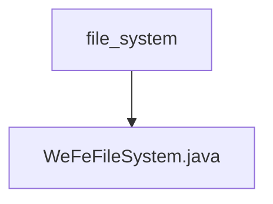

# Basic Information

|      |      |
|------|------|
| Name | file_system |
| Language | .java |
| Code Path | WeFe/board/board-service/src/main/java/com/welab/wefe/board/service/base/file_system |
| Package Name | docs.board.board-service.src.main.java.com.welab.wefe.board.service.base.file_system |
| Brief Description | The WeFeFileSystem class manages file system operations, including file path retrieval, resource type handling, deep learning model downloading and invocation, as well as supporting functionalities such as temporary files, data resource uploading, and image processing. |

# Description

The WeFeFileSystem class is a file system management tool primarily designed for handling file uploads, storage, and directory management. It includes an enumeration called UseType, which defines various file purposes such as temporary files, data resource additions, deep learning model invocations, and downloads. The class provides methods to retrieve the root directory and obtain subdirectories based on different types. The DownloadDeepLearningModel subclass handles the downloading and renaming operations of model files. The CallDeepLearningModel subclass manages file operations related to deep learning models, including compressing image sample directories, moving single images, extracting ZIP files, and cleaning non-image files. All operations incorporate error handling and logging.

### Package Internal Structure View

This flowchart illustrates the simple hierarchical structure of the file system module, where the top-level directory is `file_system`, containing a core file `WeFeFileSystem.java`. Such a structure is commonly found in foundational service modules of projects, designed to encapsulate file system-related operations. The entire architecture is concise and clear, embodying the principle of single responsibility.

# File List

| Name   | Type  | Description |
|-------|------|-------------|
| [WeFeFileSystem.java](WeFeFileSystem.md) | file | The WeFeFileSystem class manages file system operations, including file path retrieval, resource type handling, deep learning model downloading and invocation, with support for temporary files, data resource uploading, and image processing functionalities. |

