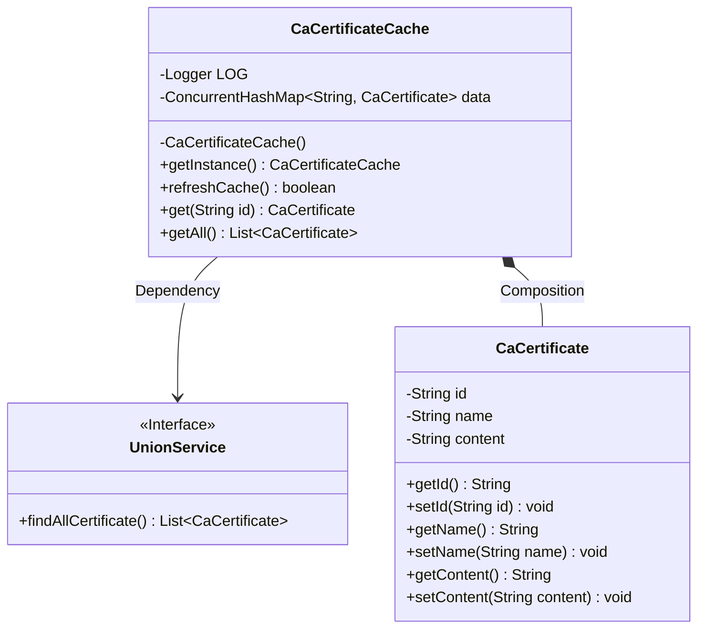
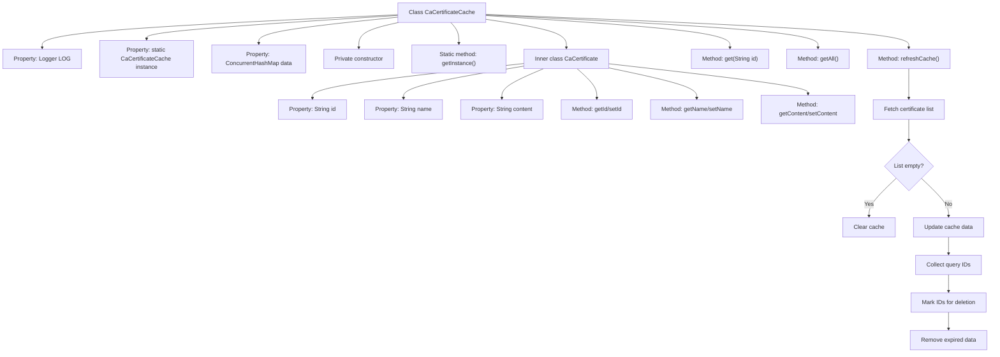
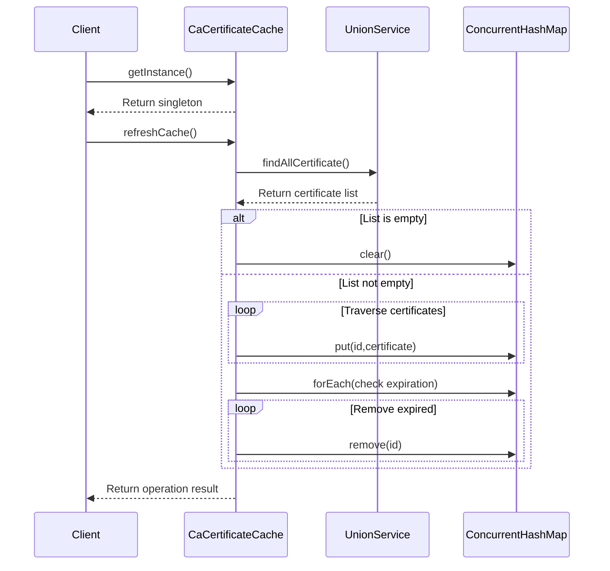

# Basic Information

|      |      |
|------|------|
| Name | CaCertificateCache |
| Language | .java |
| Code Path | WeFe/board/board-service/src/main/java/com/welab/wefe/board/service/cache/CaCertificateCache.java |
| Package Name | com.welab.wefe.board.service.cache |
| Dependencies | ['com.welab.wefe.board.service.sdk.union.UnionService', 'com.welab.wefe.common.web.Launcher', 'org.apache.commons.collections4.CollectionUtils', 'org.slf4j.Logger', 'org.slf4j.LoggerFactory', 'java.util.ArrayList', 'java.util.List', 'java.util.concurrent.ConcurrentHashMap'] |
| Brief Description | The CaCertificateCache class is a singleton-pattern CA certificate cache that uses ConcurrentHashMap to store certificate data, providing functionalities such as refreshing the cache, and retrieving single or all certificates. The inner class CaCertificate contains attributes including id, name, and content. |

# Description

CaCertificateCache is a singleton class used to manage CA certificate caching. It employs a ConcurrentHashMap to store CaCertificate objects and provides functionalities for refreshing the cache, as well as retrieving individual or all certificates. When refreshing the cache, it fetches the latest certificate list from UnionService, updates the data, and cleans up invalid entries. CaCertificate is an inner class containing id, name, and content attributes along with their corresponding getter and setter methods.

# Class Summary

| Name   | Type  | Description |
|-------|------|-------------|
| CaCertificateCache | class | The `CaCertificateCache` class is a singleton cache used to store `CaCertificate` objects. It provides methods for refreshing the cache, as well as retrieving individual or all certificates. Internally, it uses a `ConcurrentHashMap` to store data, where `CaCertificate` contains the `id`, `name`, and `content` attributes. |

## Class CaCertificateCache

|      |      |
|------|------|
| Access Modifier | public |
| Type | class |
| Name | CaCertificateCache |
| Description | The `CaCertificateCache` class is a singleton cache used to store `CaCertificate` objects. It provides methods for refreshing the cache, as well as retrieving individual or all certificates. Internally, it uses a `ConcurrentHashMap` to store data, where `CaCertificate` contains the `id`, `name`, and `content` attributes. |

### UML Class Diagram

This code demonstrates a singleton-pattern CA certificate caching system, consisting of the main CaCertificateCache class and the nested CaCertificate data class. CaCertificateCache uses ConcurrentHashMap to store certificate data, synchronizes cache updates via the refreshCache method by retrieving the latest certificate list from the UnionService interface, and provides get and getAll query methods. The CaCertificate class encapsulates basic certificate attributes such as ID, name, and content, following standard JavaBean design. The overall architecture implements thread-safe certificate cache management with dynamic update and query capabilities.

### Internal Method Call Graph

The flowchart illustrates the structure of the CaCertificateCache class and the execution logic of its core method refreshCache. This is a singleton-pattern certificate cache class that stores certificate data via ConcurrentHashMap, providing cache refresh and query functionalities. The refreshCache method implements incremental updates and expired data cleanup by comparing database query results with existing cache, ensuring cache data consistency. The sequence diagram details the interaction process between client calls for cache refresh, UnionService, and internal storage structures.

### Field List

| Name  | Type  | Description |
|-------|-------|------|
| data = new ConcurrentHashMap<>() | ConcurrentHashMap<String, CaCertificate> | A thread-safe hash table that stores mappings from strings to CaCertificate objects. |
| LOG = LoggerFactory.getLogger(CaCertificateCache.class) | Logger | The class CaCertificateCache defines a private immutable logger LOG. |
| caCertificateCache = new CaCertificateCache() | CaCertificateCache | Declare a static immutable CA certificate cache instance. |

### Method List

| Name  | Type  | Description |
|-------|-------|------|
| getInstance | CaCertificateCache | This is a static method that returns the singleton instance caCertificateCache of the CaCertificateCache class. |
| refreshCache | boolean | The method `refreshCache` is used to update the certificate cache: it retrieves all certificate lists, clears the cache if the list is empty; otherwise, it updates the cache data and removes non-existent certificate IDs. It returns `true` upon success, or logs the error and returns `false` upon failure. |
| get | CaCertificate | The method `get` retrieves the corresponding `CaCertificate` object from `data` by `id`. |
| getAll | List<CaCertificate> | This method returns a list of all stored CA certificates, providing a copy of the data in the form of an ArrayList. |

