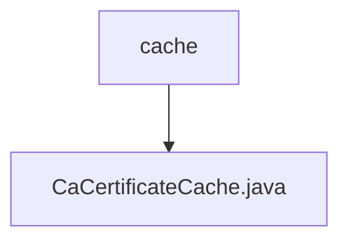

# Basic Information

|      |      |
|------|------|
| Name | cache |
| Language | .java |
| Code Path | WeFe/board/board-service/src/main/java/com/welab/wefe/board/service/cache |
| Package Name | docs.board.board-service.src.main.java.com.welab.wefe.board.service.cache |
| Brief Description | The `CaCertificateCache` class is a singleton-pattern CA certificate cache that uses `ConcurrentHashMap` to store certificate data, providing functionalities such as refreshing the cache, and retrieving single or all certificates. The inner class `CaCertificate` contains the attributes `id`, `name`, and `content`. |

# Description

CaCertificateCache is a singleton class used for managing CA certificate caches. It employs ConcurrentHashMap to store CaCertificate objects and provides functionalities such as refreshing the cache, retrieving individual or all certificates. When refreshing the cache, it fetches the latest certificate list from UnionService, updates the data, and cleans up invalid entries. CaCertificate is an inner class containing id, name, and content attributes along with corresponding getter and setter methods.

### Package Internal Structure View

This flowchart illustrates the cache directory structure under the board-service module in the WeFe project. The root node is the cache directory, which contains a Java cache implementation file, CaCertificateCache.java. This structure is a typical service-layer caching approach, where certificate caching functionality is encapsulated in a separate file for easier maintenance and management.

# File List

| Name   | Type  | Description |
|-------|------|-------------|
| [CaCertificateCache.java](CaCertificateCache.md) | file | The `CaCertificateCache` class is a singleton-pattern CA certificate cache that uses `ConcurrentHashMap` to store certificate data, providing functionalities such as refreshing the cache, retrieving individual or all certificates. The inner class `CaCertificate` contains attributes like `id`, `name`, and `content`. |

