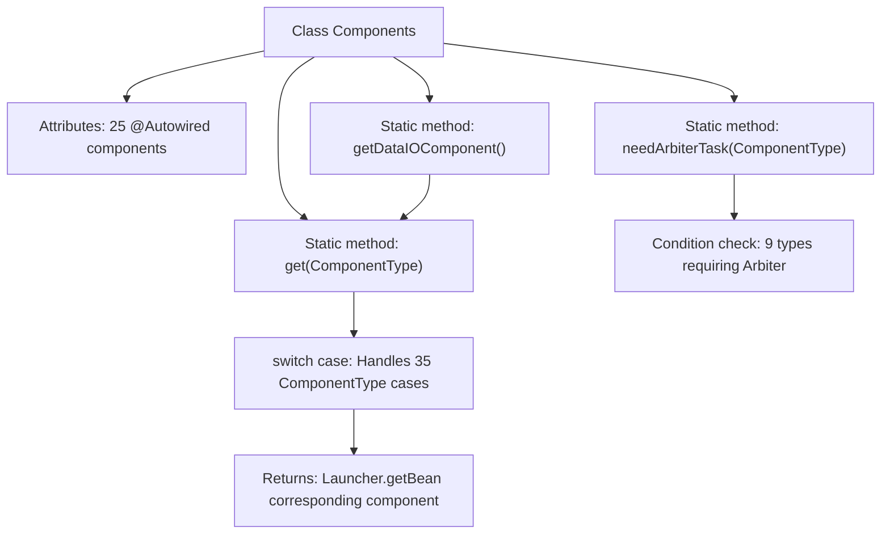

# Basic Information

|      |      |
|------|------|
| Name | Components |
| Language | .java |
| Code Path | WeFe/board/board-service/src/main/java/com/welab/wefe/board/service/component/Components.java |
| Package Name | com.welab.wefe.board.service.component |
| Dependencies | ['com.welab.wefe.board.service.component.base.AbstractComponent', 'com.welab.wefe.board.service.component.deep_learning.ImageDataIOComponent', 'com.welab.wefe.board.service.component.deep_learning.PaddleClassifyComponent', 'com.welab.wefe.board.service.component.deep_learning.PaddleDetectionComponent', 'com.welab.wefe.board.service.component.feature', 'com.welab.wefe.board.service.component.modeling', 'com.welab.wefe.common.web.Launcher', 'com.welab.wefe.common.wefe.enums.ComponentType', 'org.springframework.beans.factory.annotation.Autowired', 'org.springframework.stereotype.Service'] |
| Brief Description | The `Components` class is a Spring service that contains multiple auto-injected components. It provides methods to retrieve corresponding components based on `ComponentType` and determines whether arbitration tasks are required. |

# Description

The code defines a Spring service class named Components, which contains multiple auto-wired component instances covering functional modules such as data processing, machine learning, and feature engineering. The class provides a static method `get` that returns the corresponding component instance based on the ComponentType enum parameter, and defines a `needArbiterTask` method to determine whether a specific component type requires an arbiter task. The component types include horizontal/vertical logistic regression, secure boosting trees, feature binning, PCA, neural networks, etc., supporting extended functionalities such as image processing and scorecards.

# Class Summary

| Name   | Type  | Description |
|-------|------|-------------|
| Components | class | The `Components` class is a Spring service that contains multiple auto-injected components. It provides methods to retrieve corresponding components based on `ComponentType` and determines whether arbitration tasks are required. |


## Class Components

|      |      |
|------|------|
| Access Modifier | @Service;public |
| Type | class |
| Name | Components |
| Description | The `Components` class is a Spring service that contains multiple auto-injected components. It provides methods to retrieve corresponding components based on `ComponentType` and determines whether arbitration tasks are required. |


### UML Class Diagram

```mermaid
classDiagram
    class Components {
        -DataIOComponent dataIOComponent
        -IntersectionComponent intersectionComponent
        -EvaluationComponent evaluationComponent
        -HorzLRComponent horzLRComponent
        -VertLRComponent vertLRComponent
        -BinningComponent binningComponent
        -HorzSecureBoostComponent horzSecureBoostComponent
        -VertSecureBoostComponent vertSecureBoostComponent
        -FeatureSelectionComponent featureSelectionComponent
        -SegmentComponent segmentComponent
        -FeatureStatisticsComponent featureStatisticsComponent
        -FeatureCalculationComponent featureCalculationComponent
        -FillMissingValueComponent fillMissingValueComponent
        -FeatureStandardizedComponent featureStandardizedComponent
        -VertPearsonComponent vertPearsonComponent
        -MixLrComponent mixLrComponent
        -MixSecureBoostComponent mixSecureBoostComponent
        -MixStatisticComponent mixStatisticComponent
        -OotComponent ootComponent
        -FeatureTransformComponent featureTransformComponent
        -HorzOneHotComponent horzOneHotComponent
        -VertFilterComponent vertFilterComponent
        -VertOneHotComponent vertOneHotComponent
        -VertPCAComponent vertPCAComponent
        -HorzFeatureBinningComponent horzFeatureBinningComponent
        -HorzStatisticComponent horzStatisticComponent
        -VertNNComponent vertNNComponent
        -HorzNNComponent horzNNComponent
        -MixBinningComponent mixBinningComponent
        -ImageDataIOComponent imageDataIOComponent
        -PaddleClassifyComponent paddleClassifyComponent
        -PaddleDetectionComponent paddleDetectionComponent
        -ScoreCardComponent scoreCardComponent
        -FeaturePsiComponent featurePsiComponent
        +static AbstractComponent~?~ getDataIOComponent()
        +static AbstractComponent~?~ get(ComponentType componentType)
        +static boolean needArbiterTask(ComponentType type)
    }

    class AbstractComponent~T~ {
        <<Abstract>>
    }

    class ComponentType {
        <<Enumeration>>
    }

    Components --> AbstractComponent~?~ : "returns via get()"
    Components --> ComponentType : "depends on enum type"
    DataIOComponent --|> AbstractComponent~?~
    IntersectionComponent --|> AbstractComponent~?~
    EvaluationComponent --|> AbstractComponent~?~
    // Other concrete component classes similarly inherit AbstractComponent
```

This code demonstrates a service class named `Components`, which injects over 30 different types of component instances via `@Autowired` and provides a static method `get()` to retrieve corresponding component instances based on the `ComponentType` enumeration. The class diagram clearly illustrates the association between `Components` and the abstract component class `AbstractComponent`, as well as the implementation relationship of all concrete component classes with `AbstractComponent`. Serving as a centralized component management hub, this class employs a type-safe enum mapping mechanism to achieve unified component retrieval and arbiter task determination, embodying the typical factory pattern design philosophy.


### Internal Method Call Graph



This code defines a Spring service class Components, which injects 25 different types of components via @Autowired and provides three static methods. Its primary functionality is to retrieve corresponding component instances through the ComponentType enum, where the get method contains a large switch-case structure handling 35 component types. The needArbiterTask method determines whether specific component types require arbitration tasks. Serving as a centralized component management hub, this class implements unified component retrieval and arbitration requirement determination for diverse component types.

### Field List

| Name  | Type  | Description |
|-------|-------|------|
| vertPCAComponent | VertPCAComponent | Automatically inject an instance of the VertPCAComponent. |
| mixSecureBoostComponent | MixSecureBoostComponent | Automatically inject an instance of the MixSecureBoostComponent. |
| featurePsiComponent | FeaturePsiComponent | Using @Autowired to automatically inject an instance of the FeaturePsiComponent. |
| vertPearsonComponent | VertPearsonComponent | Using @Autowired to automatically inject an instance of the VertPearsonComponent. |
| horzFeatureBinningComponent | HorzFeatureBinningComponent | The code snippet uses @Autowired to automatically inject an instance of the HorzFeatureBinningComponent. |
| horzNNComponent | HorzNNComponent | The code snippet uses @Autowired to automatically inject an instance of the HorzNNComponent. |
| vertFilterComponent | VertFilterComponent | Using @Autowired to automatically inject an instance of the VertFilterComponent. |
| mixLrComponent | MixLrComponent | Use @Autowired to automatically inject an instance of the MixLrComponent. |
| scoreCardComponent | ScoreCardComponent | Using @Autowired to automatically inject an instance of the ScoreCardComponent. |
| mixBinningComponent | MixBinningComponent | Automatically inject the MixBinningComponent instance. |
| fillMissingValueComponent | FillMissingValueComponent | Automatically inject missing value imputation component instances. |
| mixStatisticComponent | MixStatisticComponent | Using @Autowired to automatically inject an instance of the MixStatisticComponent. |
| featureStatisticsComponent | FeatureStatisticsComponent | Use @Autowired to automatically inject an instance of the FeatureStatisticsComponent. |
| evaluationComponent | EvaluationComponent | Automatically inject an instance of the EvaluationComponent. |
| paddleDetectionComponent | PaddleDetectionComponent | Automatically inject an instance of the PaddleDetectionComponent. |
| paddleClassifyComponent | PaddleClassifyComponent | Use @Autowired to automatically inject an instance of the PaddleClassifyComponent. |
| featureCalculationComponent | FeatureCalculationComponent | Automated Injection Feature Calculation Component Instance. |
| ootComponent | OotComponent | Using @Autowired to automatically inject an instance of the OotComponent. |
| horzSecureBoostComponent | HorzSecureBoostComponent | In the code snippet, a private component named horzSecureBoostComponent is automatically injected via the @Autowired annotation. |
| binningComponent | BinningComponent | Automatically inject an instance of the BinningComponent. |
| segmentComponent | SegmentComponent | Using @Autowired to automatically inject an instance of the SegmentComponent component. |
| featureSelectionComponent | FeatureSelectionComponent | Automatic injection feature selection component instance. |
| imageDataIOComponent | ImageDataIOComponent | Using @Autowired to automatically inject the ImageDataIOComponent. |
| horzStatisticComponent | HorzStatisticComponent | Using @Autowired to automatically inject an instance of the HorzStatisticComponent. |
| featureStandardizedComponent | FeatureStandardizedComponent | Automated injection feature standardization component instance. |
| horzLRComponent | HorzLRComponent | Using @Autowired to automatically inject an instance of the HorzLRComponent. |
| vertLRComponent | VertLRComponent | Automatically injects an instance of the VertLRComponent. |
| horzOneHotComponent | HorzOneHotComponent | The code snippet utilizes Spring's @Autowired annotation to automatically inject an instance of the HorzOneHotComponent. |
| vertSecureBoostComponent | VertSecureBoostComponent | Automatically inject the VertSecureBoostComponent instance. |
| dataIOComponent | DataIOComponent | Use @Autowired to automatically inject an instance of the DataIOComponent. |
| vertNNComponent | VertNNComponent | The code snippet uses @Autowired to automatically inject an instance of the VertNNComponent. |
| featureTransformComponent | FeatureTransformComponent | Automatically inject feature transformation component instances. |
| vertOneHotComponent | VertOneHotComponent | Automatically injects an instance of the VertOneHotComponent. |
| intersectionComponent | IntersectionComponent | Automatically inject the IntersectionComponent instance. |

### Method List

| Name  | Type  | Description |
|-------|-------|------|
| get | AbstractComponent<?> | Static methods return corresponding instances based on component type, involving components such as data loading, processing, analysis, and machine learning, returning null if no match is found. |
| needArbiterTask | boolean | Determine whether the component type requires arbitration tasks, applicable to various horizontal and hybrid component types. |
| getDataIOComponent | AbstractComponent<?> | Static methods for obtaining DataIO type components. |


