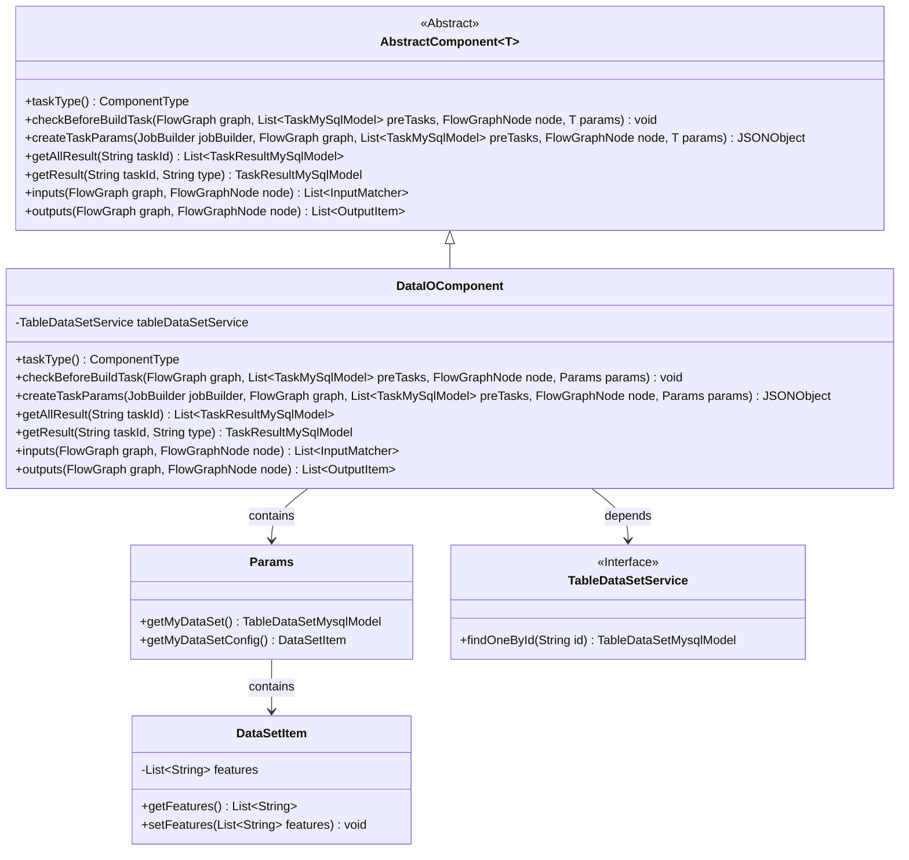
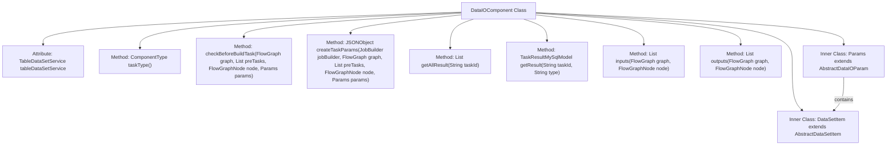
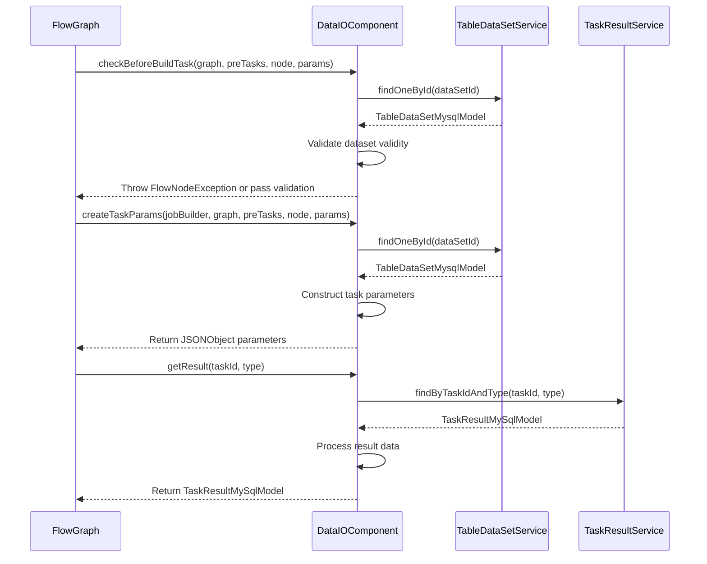

# Basic Information

|      |      |
|------|------|
| Name | DataIOComponent |
| Language | .java |
| Code Path | WeFe/board/board-service/src/main/java/com/welab/wefe/board/service/component/DataIOComponent.java |
| Package Name | com.welab.wefe.board.service.component |
| Dependencies | ['com.alibaba.fastjson.JSONArray', 'com.alibaba.fastjson.JSONObject', 'com.welab.wefe.board.service.component.base.AbstractComponent', 'com.welab.wefe.board.service.component.base.dto.AbstractDataIOParam', 'com.welab.wefe.board.service.component.base.dto.AbstractDataSetItem', 'com.welab.wefe.board.service.component.base.io.IODataType', 'com.welab.wefe.board.service.component.base.io.InputMatcher', 'com.welab.wefe.board.service.component.base.io.Names', 'com.welab.wefe.board.service.component.base.io.OutputItem', 'com.welab.wefe.board.service.database.entity.data_resource.TableDataSetMysqlModel', 'com.welab.wefe.board.service.database.entity.job.JobMemberMySqlModel', 'com.welab.wefe.board.service.database.entity.job.TaskMySqlModel', 'com.welab.wefe.board.service.database.entity.job.TaskResultMySqlModel', 'com.welab.wefe.board.service.dto.vo.data_set.table_data_set.LabelDistribution', 'com.welab.wefe.board.service.exception.FlowNodeException', 'com.welab.wefe.board.service.model.FlowGraph', 'com.welab.wefe.board.service.model.FlowGraphNode', 'com.welab.wefe.board.service.model.JobBuilder', 'com.welab.wefe.board.service.service.CacheObjects', 'com.welab.wefe.board.service.service.data_resource.table_data_set.TableDataSetService', 'com.welab.wefe.common.fieldvalidate.annotation.Check', 'com.welab.wefe.common.util.JObject', 'com.welab.wefe.common.web.Launcher', 'com.welab.wefe.common.wefe.enums.ComponentType', 'com.welab.wefe.common.wefe.enums.FederatedLearningType', 'com.welab.wefe.common.wefe.enums.JobMemberRole', 'com.welab.wefe.common.wefe.enums.TaskResultType', 'org.apache.commons.collections4.CollectionUtils', 'org.springframework.beans.factory.annotation.Autowired', 'org.springframework.stereotype.Service', 'java.util.ArrayList', 'java.util.Arrays', 'java.util.List', 'java.util.stream.Collectors'] |
| Brief Description | The DataIOComponent is a service component that handles data input and output for federated learning, encompassing functions such as data validation, task parameter generation, and result processing. The validation logic ensures datasets meet federated learning requirements (e.g., feature consistency, label categories, etc.) and supports both horizontal and hybrid modeling modes. The component operates datasets via the TableDataSetService, generates task parameters, and manages task results. |

# Description

DataIOComponent is a service class inherited from AbstractComponent, primarily designed to handle data input and output tasks in federated learning. It includes the following core functionalities: 1. Task type defined as DataIO; 2. Performing multiple validations before task construction, including checking member count, dataset count, existence of initiator datasets, feature column selection, etc.; 3. Supporting specific validation rules for horizontal and hybrid federated learning; 4. Processing dataset information when creating task parameters; 5. Providing implementations for retrieving task results; 6. Defining output items as standardized datasets. The inner class Params is used to manage dataset parameters, while DataSetItem extends the abstract dataset item by adding a feature column attribute. The component operates on datasets via the auto-injected TableDataSetService and incorporates rigorous business logic validation.

# Class Summary

| Name   | Type  | Description |
|-------|------|-------------|
| DataIOComponent | class | The DataIOComponent is a component that handles data input and output for federated learning, encompassing functions such as data validation, task parameter generation, and result processing. Validation includes member roles, dataset features, label distribution, and more. It supports horizontal and hybrid modeling to ensure data consistency. During task parameter generation, it processes dataset information and outputs standardized dataset instances. |

## Class DataIOComponent

|      |      |
|------|------|
| Access Modifier | @Service;public |
| Type | class |
| Name | DataIOComponent |
| Description | The DataIOComponent is a component that handles data input and output for federated learning, encompassing functions such as data validation, task parameter generation, and result processing. Validation includes member roles, dataset features, label distribution, and more. It supports horizontal and hybrid modeling to ensure data consistency. During task parameter generation, it processes dataset information and outputs standardized dataset instances. |

### UML Class Diagram

This class diagram illustrates the structure of DataIOComponent and its related classes. DataIOComponent inherits from AbstractComponent and implements core functionalities for data processing, including parameter validation, task creation, and result retrieval. It depends on the TableDataSetService interface for data access and contains two inner classes (Params and DataSetItem) to handle parameter configuration. The Params class is responsible for obtaining dataset configuration information, while DataSetItem encapsulates feature column data. The overall design reflects secure processing and strict validation mechanisms for multi-party data in federated learning scenarios.

### Internal Method Call Graph

Flowchart Description: This flowchart illustrates the core structure and key method invocation relationships of the DataIOComponent class. As a data I/O component in federated learning, it performs dataset operations through TableDataSetService, encompassing three functional modules: parameter validation, task creation, and result processing. The inner classes Params and DataSetItem handle parameter configuration and dataset item definition respectively, with the overall structure demonstrating rigorous data validation and task parameter construction processes.

Sequence Diagram Description: The sequence diagram depicts the interaction process between DataIOComponent and external services across three stages: dataset validation, task parameter creation, and result query. It first validates dataset validity via TableDataSetService, then constructs task parameters as a JSON object, and finally retrieves task execution results through TaskResultService. The entire process reflects strict error-checking mechanisms and data transformation logic.

### Field List

| Name  | Type  | Description |
|-------|-------|------|
| tableDataSetService | TableDataSetService | Automatically inject the TableDataSetService instance. |

### Method List

| Name  | Type  | Description |
|-------|-------|------|
| createTaskParams | JSONObject | The method generates task parameters based on the role and dataset configuration. If the role is an arbiter, it returns null; otherwise, after verifying the existence of the dataset, it returns a JSON object containing the dataset ID, labels, namespace, and other information. If the dataset is invalid, an exception is thrown. |
| taskType | ComponentType | The method returns a component of type DataIO. |
| checkBeforeBuildTask | void | Method checks the conditions before constructing a federated learning task:  1. Members must include at least 2 participants with designated datasets.  2. Datasets must be multiple and contain features.  3. The initiating party must possess a dataset containing Y values.  4. Horizontal modeling requires consistent features across datasets.  5. Hybrid modeling requires the initiating party to have more than 2 datasets with consistent features. |
| inputs | List<InputMatcher> | Rewrite the method `inputs` to return an empty list, with parameters `graph` and `node`. |
| outputs | List<OutputItem> | The method checks the dataset list in the node parameters, returns an empty list if it is empty; throws an exception if the specified dataset does not exist; otherwise, returns a list of output items containing dataset instances. |
| getAllResult | List<TaskResultMySqlModel> | This method overrides the parent class method, retrieves all task results for the specified taskId by invoking the listAllResult method of taskResultService, and returns a list of TaskResultMySqlModel. |
| getResult | TaskResultMySqlModel | The method queries results based on task ID and type, merges normal data and model results, updates the result object, and returns it. |

