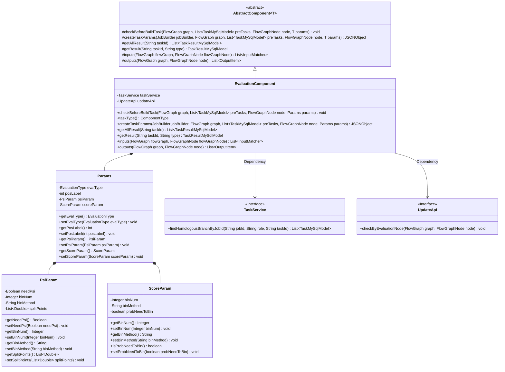
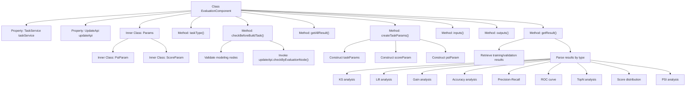

# Basic Information

|      |      |
|------|------|
| Name | EvaluationComponent |
| Language | .java |
| Code Path | WeFe/board/board-service/src/main/java/com/welab/wefe/board/service/component/EvaluationComponent.java |
| Package Name | com.welab.wefe.board.service.component |
| Dependencies | ['com.alibaba.fastjson.JSONObject', 'com.welab.wefe.board.service.api.project.node.UpdateApi', 'com.welab.wefe.board.service.component.base.AbstractComponent', 'com.welab.wefe.board.service.component.base.io', 'com.welab.wefe.board.service.component.enums.EvaluationType', 'com.welab.wefe.board.service.database.entity.job.TaskMySqlModel', 'com.welab.wefe.board.service.database.entity.job.TaskResultMySqlModel', 'com.welab.wefe.board.service.exception.FlowNodeException', 'com.welab.wefe.board.service.model.FlowGraph', 'com.welab.wefe.board.service.model.FlowGraphNode', 'com.welab.wefe.board.service.model.JobBuilder', 'com.welab.wefe.board.service.service.TaskService', 'com.welab.wefe.common.exception.StatusCodeWithException', 'com.welab.wefe.common.fieldvalidate.AbstractCheckModel', 'com.welab.wefe.common.fieldvalidate.annotation.Check', 'com.welab.wefe.common.util.JObject', 'com.welab.wefe.common.web.util.ModelMapper', 'com.welab.wefe.common.wefe.enums.ComponentType', 'com.welab.wefe.common.wefe.enums.JobMemberRole', 'com.welab.wefe.common.wefe.enums.TaskResultType', 'org.apache.commons.collections4.CollectionUtils', 'org.apache.commons.compress.utils.Lists', 'org.springframework.beans.factory.annotation.Autowired', 'org.springframework.stereotype.Service', 'java.math.BigDecimal', 'java.util.ArrayList', 'java.util.Arrays', 'java.util.List', 'java.util.stream.Collectors'] |
| Brief Description | The EvaluationComponent is an evaluation component that inherits from AbstractComponent. It checks the existence of modeling nodes, creates task parameters, processes evaluation results, and supports various evaluation types such as KS and Lift. It includes parameters for PSI and score distribution. |

# Description

The EvaluationComponent is a Spring service class that inherits from AbstractComponent, primarily used for evaluation task processing. It utilizes TaskService and UpdateApi for task management and update operations. Core functionalities include: pre-checking to ensure the existence of modeling nodes before evaluation, creating JSON task parameters containing scoring parameters and PSI parameters, as well as retrieving and parsing various evaluation result types (such as KS, Lift, Gain, etc.). This class also defines three inner classes—Params, PsiParam, and ScoreParam—for encapsulating evaluation parameters. The output is in JSON format, supporting data merging and parsing for both training and validation sets.

# Class Summary

| Name   | Type  | Description |
|-------|------|-------------|
| EvaluationComponent | class | The EvaluationComponent is an evaluation component that inherits from AbstractComponent and is used to handle evaluation tasks. It includes functionalities such as checking modeling nodes, creating task parameters, and obtaining evaluation results. It supports various evaluation types like KS, Lift, Gain, etc., and processes PSI and scoring parameters. |

## Class EvaluationComponent

|      |      |
|------|------|
| Access Modifier | @Service;public |
| Type | class |
| Name | EvaluationComponent |
| Description | The EvaluationComponent is an evaluation component that inherits from AbstractComponent and is used to handle evaluation tasks. It includes functionalities such as checking modeling nodes, creating task parameters, and obtaining evaluation results. It supports various evaluation types like KS, Lift, Gain, etc., and processes PSI and scoring parameters. |

### UML Class Diagram

This code implements an evaluation component (EvaluationComponent) that inherits from an abstract component class (AbstractComponent), primarily used for handling machine learning model evaluation tasks. Core functionalities include: pre-check (checkBeforeBuildTask), creating task parameters (createTaskParams), retrieving evaluation results (getResult), etc. The component interacts with other services through the TaskService and UpdateApi interfaces, using the Params class to encapsulate evaluation parameters, including nested configuration classes such as PSI parameters (PsiParam) and scoring parameters (ScoreParam). The evaluation component supports various evaluation types such as KS, Lift, Gain, etc., and can handle the merging of results from training and validation sets.

### Internal Method Call Graph

This code implements an evaluation component primarily responsible for processing machine learning model evaluation tasks. The flowchart illustrates the class structure and core method invocation relationships, including parameter validation, task creation, result retrieval, and multiple evaluation metric analysis functionalities. The component utilizes TaskService and UpdateApi for task management, supports calculation of 9 evaluation metrics such as KS, Lift, and Gain, and can handle comparative analysis between training and validation sets, ultimately outputting evaluation results in JSON format. The inner class Params and its nested classes define the parameter structures required for evaluation.

### Field List

| Name  | Type  | Description |
|-------|-------|------|
| updateApi | UpdateApi | Automatically inject the UpdateApi instance. |
| taskService | TaskService | Using @Autowired to automatically inject a TaskService instance. |

### Method List

| Name  | Type  | Description |
|-------|-------|------|
| extractXAxis | String | The method `extractXAxis` generates an X-axis range string in the format of "previous key ~ current key" based on the input list of data keys and the index. If the index is 0, the previous key is set to "0"; otherwise, it takes the preceding key value in the list. The result is processed by `precisionProcessByString`. |
| extractFlowNodeId | String | Extract the process node ID from the task result, and find the corresponding task by the task result to return its process node ID. |
| extractNormalName | String | Extract the task result model name, combining component type, process node ID, and suffix. |
| getDistributionObjByTaskId | JObject | This method retrieves a distribution object by task ID, queries the database, and returns the result in JSON format. If no result is found, it returns an empty JSON. |
| getResultByType | JObject | Retrieve result data based on task ID and type, supporting various types such as KS, Lift, Gain, Accuracy, Precision_Recall, ROC, TopN, Scores_Distribution, and PSI, returning the corresponding JSON object. |
| findEvaluationTaskResultByTaskId | TaskResultMySqlModel | Query the evaluation task results based on the task ID, prioritizing the return of training results. If none are available, return the validation results instead. The two types differ but are ultimately merged and returned together. |
| extractPreValidateName | String | This method generates pre-validation names based on the task result model, following the format "validate_componentType_processNodeID_suffix". |
| extractYAxis2 | double | The method extracts Y-axis data for specified keys from a JSON object, retrieves the "count_rate" value, and returns it after precision processing. |
| getAllResult | List<TaskResultMySqlModel> | This is a Java method that overrides the getAllResult method of the parent class, retrieving a list of all task results for the specified taskId through the listAllResult method of taskResultService. |
| createTaskParams | JSONObject | The method determines whether to return parameters based on the role, and when not acting as an arbiter, constructs a JSON object containing evaluation type, score binning, and PSI binning parameters. |
| getValidateJObject | JObject | Private method retrieves the validation object by task ID and extracts the JObject with the specified name from it. May throw status code exceptions. |
| extractModelComponentType | String | This method extracts the task type string of the associated task from the task result model. It first searches for the corresponding task model through the task result and then returns its task type string. An exception will be thrown if the search fails. |
| getResult | TaskResultMySqlModel | This method retrieves the task results based on the task ID and type, first querying the database and returning null if no record exists. It then constructs a JSON object containing validation and training data, parses the result data according to the type, updates the result fields, and finally returns the model object. |
| parserValidateCurveData | JObject | Method for parsing validation curve data, call `parserCurveData` for processing, with the prefix `validate_`. |
| findEvaluationDistributionTaskResultByTaskId | TaskResultMySqlModel | The method retrieves the evaluation distribution task results by task ID, invoking the service layer to search and return results based on the task ID and type (metric_train_validate). |
| getPsiObjByTaskId | JObject | This method retrieves the PSI task result by task ID, returning a JSON object if it exists or an empty JSON otherwise. |
| findPsiTaskResultByTaskId | TaskResultMySqlModel | Find the PSI task result for the specified task ID by calling the findByTaskIdAndType method of taskResultService, with the type set to metric_train_validate. |
| getValidateObjByTaskId | JObject | This method retrieves the validation result object by task ID. If the validation task result exists, it returns the corresponding JSON object; otherwise, it returns an empty JSON object. |
| taskType | ComponentType | The method returns the task type as evaluation. |
| checkBeforeBuildTask | void | The method checks the preconditions for the build task: searches for the modeling node of the parent node, and throws an exception if none is found; validates through the evaluation node's API check. |
| getTrainJObject | JObject | The method `getTrainJObject` retrieves the training object by `taskId` and extracts the `JObject` corresponding to the preprocessing name. The parameters are `taskId` and `taskResultMySqlModel`, and it may throw a `StatusCodeWithException` exception. |
| precisionProcessByString | double | This method converts the string into a BigDecimal, retains 3 decimal places with rounding, and finally returns a double value. |
| parserScoresDistributionCurveData | JObject | Analyze the score distribution curve data, extract and sort key values, generate a list containing X-axis and dual Y-axis data, and ultimately return the score distribution results. |
| findEvaluationTrainTaskResultByTaskId | TaskResultMySqlModel | Find the training evaluation results for the specified task ID. |
| extractScoreDistributionData | JObject | This method extracts score distribution data from a JSON object, sequentially retrieves nested objects with specified key names, and ultimately returns the bin_result. |
| scoreDistributionKey | String | The method `scoreDistributionKey` generates a training-validation scoring key in the format "train_validate_[taskResultName]_scored". |
| parserCurveData | JObject | Method for parsing curve data: Generate keys based on type, name, and data type, then retrieve corresponding curve data from the input object. Return an empty object if the data does not exist; otherwise, standardize the data and return a JObject containing the parsed results. |
| normalizerData | JObject | This method takes a JObject, extracts its "data" field, and sorts it by key. It then iterates through the sorted keys, using each key as the X-axis and its corresponding value as the Y-axis to construct a coordinate list. Finally, it stores the coordinate list in the original object and returns it. |
| inputs | List<InputMatcher> | Method override, retrieves modeling nodes via flowGraph, and returns an InputMatcher list containing dataset names and types. |
| outputs | List<OutputItem> | Java method override, returns a list of OutputItem containing JSON results. |
| extractPreTrainName | String | Extract the pre-trained name by combining the model type, process node ID, and suffix in the format "train_type_nodeID_suffix". |
| extractSuffix | String | Extract task ID suffix: If it does not end with a process node ID, return an underscore followed by the last segment; otherwise, return an empty string. |
| findEvaluationTaskByTaskResult | TaskMySqlModel | This method searches for evaluation tasks based on task results and returns the first task in the homologous branch task list that meets the task type condition, or returns null if none is found. |
| getTrainObjByTaskId | JObject | Retrieve the training result object based on the task ID. If it exists, return the result object; otherwise, return an empty object. |
| precisionProcessByDouble | double | This method rounds a double-precision floating-point number to two decimal places, using BigDecimal to ensure precision, with ROUND_HALF_UP indicating the rounding rule. |
| extractYAxis | int | Extract Y-axis data: Retrieve the value of the specified key from the JSON object and return the integer value of its count field. |
| parserTopN | JObject | Parse the topN data in the training object, extract the specified type of topN list, and return a new object. |
| findEvaluationValidateTaskResultByTaskId | TaskResultMySqlModel | Search for the evaluation and validation task results of the specified task ID and return the MySQL model object. |
| parserTrainCurveData | JObject | Parse the training curve data, process it by calling the parserCurveData method, with the prefix "train_". |

