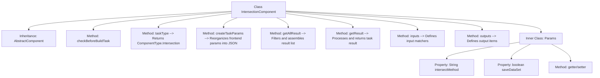

# Basic Information

|      |      |
|------|------|
| Name | IntersectionComponent |
| Language | .java |
| Code Path | WeFe/board/board-service/src/main/java/com/welab/wefe/board/service/component/IntersectionComponent.java |
| Package Name | com.welab.wefe.board.service.component |
| Dependencies | ['com.alibaba.fastjson.JSONObject', 'com.welab.wefe.board.service.component.base.AbstractComponent', 'com.welab.wefe.board.service.component.base.io.IODataType', 'com.welab.wefe.board.service.component.base.io.InputMatcher', 'com.welab.wefe.board.service.component.base.io.Names', 'com.welab.wefe.board.service.component.base.io.OutputItem', 'com.welab.wefe.board.service.database.entity.job.TaskMySqlModel', 'com.welab.wefe.board.service.database.entity.job.TaskResultMySqlModel', 'com.welab.wefe.board.service.exception.FlowNodeException', 'com.welab.wefe.board.service.model.FlowGraph', 'com.welab.wefe.board.service.model.FlowGraphNode', 'com.welab.wefe.board.service.model.JobBuilder', 'com.welab.wefe.common.fieldvalidate.AbstractCheckModel', 'com.welab.wefe.common.fieldvalidate.annotation.Check', 'com.welab.wefe.common.util.JObject', 'com.welab.wefe.common.wefe.enums.ComponentType', 'com.welab.wefe.common.wefe.enums.TaskResultType', 'org.springframework.beans.BeanUtils', 'org.springframework.stereotype.Service', 'java.util.Arrays', 'java.util.List', 'java.util.stream.Collectors'] |
| Brief Description | The IntersectionComponent is a service component that handles dataset intersections, encompassing parameter validation, task creation, result retrieval, and input/output definitions, with support for intersection methods and data storage configuration. |

# Description

The `IntersectionComponent` is a service class that inherits from `AbstractComponent` and is designed to handle data intersection tasks. It defines the task type as `Intersection` and implements several key methods: `checkBeforeBuildTask` for pre-build validation, `createTaskParams` to restructure frontend parameters (including intersection methods and dataset saving flags), `getAllResult` to retrieve task results while filtering training metrics, and `getResult` to extract and reorganize training intersection data (including counts, intersection numbers, and intersection rates). Inputs and outputs correspond to dataset instances. The internal `Params` class encapsulates required intersection methods and optional dataset-saving parameters.

# Class Summary

| Name   | Type  | Description |
|-------|------|-------------|
| IntersectionComponent | class | The IntersectionComponent is a service component that handles data intersection operations, incorporating parameter validation, task creation, and result retrieval functionalities. It supports dataset alignment operations and result statistics. |


## Class IntersectionComponent

|      |      |
|------|------|
| Access Modifier | @Service |
| Type | class |
| Name | IntersectionComponent |
| Description | The IntersectionComponent is a service component that handles data intersection operations, incorporating parameter validation, task creation, and result retrieval functionalities. It supports dataset alignment operations and result statistics. |


### UML Class Diagram

```mermaid
classDiagram
    class AbstractComponent~T~ {
        <<Abstract>>
        #checkBeforeBuildTask(FlowGraph graph, List~TaskMySqlModel~ preTasks, FlowGraphNode node, T params) void
        #createTaskParams(JobBuilder jobBuilder, FlowGraph graph, List~TaskMySqlModel~ preTasks, FlowGraphNode node, T params) JSONObject
        #getAllResult(String taskId) List~TaskResultMySqlModel~
        #getResult(String taskId, String type) TaskResultMySqlModel
        #inputs(FlowGraph graph, FlowGraphNode node) List~InputMatcher~
        +outputs(FlowGraph graph, FlowGraphNode node) List~OutputItem~
        +taskType() ComponentType
    }

    class IntersectionComponent {
        +IntersectionComponent$Params
        #checkBeforeBuildTask(FlowGraph graph, List~TaskMySqlModel~ preTasks, FlowGraphNode node, Params params) void
        #createTaskParams(JobBuilder jobBuilder, FlowGraph graph, List~TaskMySqlModel~ preTasks, FlowGraphNode node, Params params) JSONObject
        #getAllResult(String taskId) List~TaskResultMySqlModel~
        #getResult(String taskId, String type) TaskResultMySqlModel
        #inputs(FlowGraph graph, FlowGraphNode node) List~InputMatcher~
        +outputs(FlowGraph graph, FlowGraphNode node) List~OutputItem~
        +taskType() ComponentType
    }

    class IntersectionComponent$Params {
        -String intersectMethod
        -boolean saveDataSet
        +getIntersectMethod() String
        +setIntersectMethod(String intersectMethod) void
        +isSaveDataSet() boolean
        +setSaveDataSet(boolean saveDataSet) void
    }

    class AbstractCheckModel {
        <<Abstract>>
    }

    class TaskResultMySqlModel {
        +String result
        +String type
        +getResult() String
        +setResult(String result) void
    }

    class InputMatcher {
        <<Interface>>
    }

    class OutputItem {
        <<Interface>>
    }

    AbstractComponent~T~ <|-- IntersectionComponent
    AbstractCheckModel <|-- IntersectionComponent$Params
    IntersectionComponent --> IntersectionComponent$Params : uses
    IntersectionComponent --> TaskResultMySqlModel : generates
    IntersectionComponent ..|> InputMatcher : implements
    IntersectionComponent ..|> OutputItem : implements
```

This code demonstrates a service class named `IntersectionComponent`, which inherits from the generic abstract class `AbstractComponent` and specializes in handling data intersection tasks. The class includes core methods for parameter processing, task construction, and result retrieval, with the `Params` inner class encapsulating intersection algorithm parameters and `TaskResultMySqlModel` storing computation results. The class diagram clearly illustrates inheritance relationships, generic parameter passing, and interface implementation, reflecting the complete workflow of parameter validation, task construction, and result processing in component-based design.


### Internal Method Call Graph



This flowchart illustrates the complete structure of the IntersectionComponent class, highlighting its inheritance relationships and core method invocation chain. As a data processing component, it reorganizes parameters through the createTaskParams method, processes training metric results via the getResult method, and defines data input/output specifications. The inner class Params encapsulates configuration parameters required by the intersection algorithm, containing two core properties: alignment method and dataset save flag. All methods revolve around data transformation and workflow control, forming a clear task processing闭环 (closed-loop).

### Field List

| Name  | Type  | Description |
|-------|-------|------|

### Method List

| Name  | Type  | Description |
|-------|-------|------|
| getAllResult | List<TaskResultMySqlModel> | This method retrieves all training metric results for a specified task ID, first filtering out data of type metric_train, then supplementing it with restructured data of the same type, and finally returning the merged list. |
| createTaskParams | JSONObject | This method is used to reorganize front-end parameters and generate a JSON object containing the intersection method and whether to save the dataset. |
| checkBeforeBuildTask | void | The method checks preconditions for build tasks, with parameters including flowcharts, pre-task lists, nodes, and parameters, and may throw process node exceptions. |
| getResult | TaskResultMySqlModel | The method queries results based on the task ID and type, extracts training intersection data (quantity, intersection count, intersection rate), processes it, and returns a new result object. |
| taskType | ComponentType | This method returns the component type as Intersection. |
| inputs | List<InputMatcher> | Java method override, returns a list of input matchers containing dataset instances. |
| outputs | List<OutputItem> | This method returns a list containing a single OutputItem, which consists of NORMAL_DATA_SET and DataSetInstance types. |


