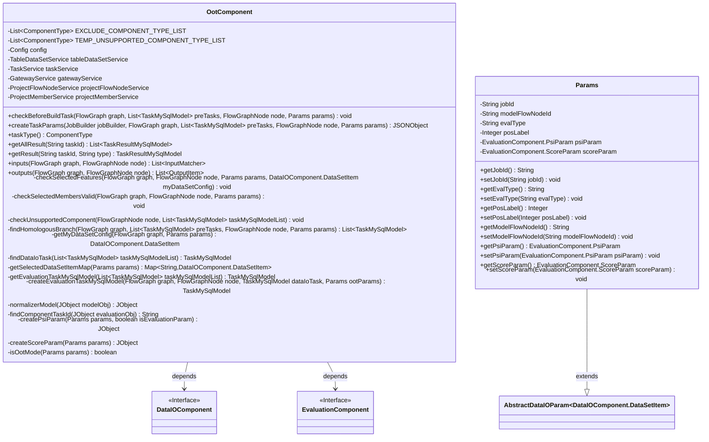

# Basic Information

|      |      |
|------|------|
| Name | OotComponent |
| Language | .java |
| Code Path | WeFe/board/board-service/src/main/java/com/welab/wefe/board/service/component/OotComponent.java |
| Package Name | com.welab.wefe.board.service.component |
| Dependencies | ['com.alibaba.fastjson.JSON', 'com.alibaba.fastjson.JSONObject', 'com.welab.wefe.board.service.api.project.flow.QueryDataIoTaskConfigApi', 'com.welab.wefe.board.service.api.project.member.ListInProjectApi', 'com.welab.wefe.board.service.component.base.AbstractComponent', 'com.welab.wefe.board.service.component.base.dto.AbstractDataIOParam', 'com.welab.wefe.board.service.component.base.io.IODataType', 'com.welab.wefe.board.service.component.base.io.InputMatcher', 'com.welab.wefe.board.service.component.base.io.Names', 'com.welab.wefe.board.service.component.base.io.OutputItem', 'com.welab.wefe.board.service.constant.Config', 'com.welab.wefe.board.service.database.entity.data_resource.TableDataSetMysqlModel', 'com.welab.wefe.board.service.database.entity.job', 'com.welab.wefe.board.service.dto.kernel.machine_learning.TaskConfig', 'com.welab.wefe.board.service.exception.FlowNodeException', 'com.welab.wefe.board.service.model.FlowGraph', 'com.welab.wefe.board.service.model.FlowGraphNode', 'com.welab.wefe.board.service.model.JobBuilder', 'com.welab.wefe.board.service.service', 'com.welab.wefe.board.service.service.data_resource.table_data_set.TableDataSetService', 'com.welab.wefe.common.exception.StatusCodeWithException', 'com.welab.wefe.common.util.JObject', 'com.welab.wefe.common.util.StringUtil', 'com.welab.wefe.common.wefe.enums.ComponentType', 'com.welab.wefe.common.wefe.enums.FederatedLearningType', 'com.welab.wefe.common.wefe.enums.JobMemberRole', 'com.welab.wefe.common.wefe.enums.TaskResultType', 'org.apache.commons.collections4.CollectionUtils', 'org.springframework.beans.factory.annotation.Autowired', 'org.springframework.stereotype.Service', 'java.util', 'java.util.stream.Collectors'] |
| Brief Description | The OotComponent is a scoring validation component that supports OOT mode for evaluating model performance. Its main functions include checking dataset feature completeness, validating member selection effectiveness, processing evaluation task configurations, and generating standardized output results. Key points: excluding specific component types, temporarily unsupported component lists, mixed federated learning restrictions, feature column validation, and evaluation parameter generation. |

# Description

The OotComponent is a scoring validation component that inherits from AbstractComponent, primarily designed for handling Out of Time (OOT) mode validation in federated learning. This component includes the following key functionalities: 1. Defines lists of excluded components and temporarily unsupported components; 2. Implements data operations, task processing, and other features through multiple service injections; 3. Performs multiple checks before task construction, including role validation, federated learning type verification, and dataset feature completeness validation; 4. Supports both OOT and non-OOT scenarios; 5. Handles dataset replacement and model component adjustments when creating task parameters; 6. Provides various evaluation result query functions, such as KS, Lift, ROC, and other metrics; 7. Includes a parameter class, Params, for configuring critical information like jobId and evaluation types. The component strictly verifies that input dataset features must include the original modeling feature columns to ensure the validity of the validation process.

# Class Summary

| Name   | Type  | Description |
|-------|------|-------------|
| OotComponent | class | The OotComponent is a scoring validation component that supports OOT mode for verifying dataset feature completeness, inspecting modeling and evaluation nodes, generating evaluation task configurations, and handling PSI and scoring parameters. |

## Class OotComponent

|      |      |
|------|------|
| Access Modifier | @Service;public |
| Type | class |
| Name | OotComponent |
| Description | The OotComponent is a scoring validation component that supports OOT mode for verifying dataset feature completeness, inspecting modeling and evaluation nodes, generating evaluation task configurations, and handling PSI and scoring parameters. |

### UML Class Diagram

This code demonstrates an OotComponent class, which is a generic subclass of AbstractComponent primarily used for handling scoring validation logic in federated learning. The class contains multiple service dependencies and constant definitions, providing methods such as building task parameters, checking preconditions, and creating evaluation tasks. The Params class, as an inner class, encapsulates configuration parameters required for OOT mode, including task ID, evaluation type, etc. The class diagram clearly illustrates the dependency relationships between OotComponent and DataIOComponent/EvaluationComponent, as well as the inheritance structure of the Params class.

### Internal Method Call Graph

```mermaid
graph TD
    A["Class OotComponent"]
    B["Static Constant: EXCLUDE_COMPONENT_TYPE_LIST"]
    C["Static Constant: TEMP_UNSUPPORTED_COMPONENT_TYPE_LIST"]
    D["Dependency Injection: Config config"]
    E["Dependency Injection: TableDataSetService"]
    F["Dependency Injection: TaskService"]
    G["Dependency Injection: GatewayService"]
    H["Dependency Injection: ProjectFlowNodeService"]
    I["Dependency Injection: ProjectMemberService"]
    J["Method: checkBeforeBuildTask"]
    K["Method: createTaskParams"]
    L["Method: taskType"]
    M["Method: getAllResult"]
    N["Method: getResult"]
    O["Method: inputs"]
    P["Method: outputs"]
    Q["Private Method: checkSelectedFeatures"]
    R["Private Method: checkSelectedMembersValid"]
    S["Private Method: checkUnsupportedComponent"]
    T["Private Method: findHomologousBranch"]
    U["Private Method: getMyDataSetConfig"]
    V["Private Method: findDataIoTask"]
    W["Private Method: getSelectedDataSetItemMap"]
    X["Private Method: getEvaluationTaskMySqlModel"]
    Y["Private Method: createEvaluationTaskMySqlModel"]
    Z["Private Method: normalizerModel"]
    AA["Private Method: findComponentTaskId"]
    AB["Private Method: createPsiParam"]
    AC["Private Method: createScoreParam"]
    AD["Private Method: isOotMode"]
    AE["Inner Class: Params"]

    A --> B
    A --> C
    A --> D
    A --> E
    A --> F
    A --> G
    A --> H
    A --> I
    A --> J
    A --> K
    A --> L
    A --> M
    A --> N
    A --> O
    A --> P
    A --> Q
    A --> R
    A --> S
    A --> T
    A --> U
    A --> V
    A --> W
    A --> X
    A --> Y
    A --> Z
    A --> AA
    A --> AB
    A --> AC
    A --> AD
    A --> AE

    J -->|Calls| U
    J -->|Calls| V
    J -->|Calls| S
    J -->|Calls| Q
    J -->|Calls| R
    K -->|Calls| U
    K -->|Calls| V
    K -->|Calls| X
    K -->|Calls| Y
    K -->|Calls| AB
    K -->|Calls| AC
    N -->|Calls| AA
    N -->|Calls| Z
    Q -->|Calls| W
    Q -->|Calls| AD
    R -->|Calls| AD
    Y -->|Calls| AB
    Y -->|Calls| AC
```

This flowchart illustrates the complete structure of the OotComponent class, including static constants, dependency injection services, and key method invocation relationships. Core methods checkBeforeBuildTask and createTaskParams handle validation and task creation, calling multiple private methods to perform feature checks, member validation, and evaluation task generation. Private methods such as checkSelectedFeatures implement feature column validation, while createEvaluationTaskMySqlModel handles evaluation component creation, forming a comprehensive OOT validation workflow. The inner class Params encapsulates critical parameters including job ID and evaluation type.

### Field List

| Name  | Type  | Description |
|-------|-------|------|
| tableDataSetService | TableDataSetService | Automatically inject the TableDataSetService instance. |
| TEMP_UNSUPPORTED_COMPONENT_TYPE_LIST = Arrays.asList(ComponentType.MixLR,            ComponentType.MixSecureBoost, ComponentType.HorzNN, ComponentType.VertNN) | List<ComponentType> | Temporarily unsupported component types: MixLR, MixSecureBoost, HorzNN, VertNN. |
| taskService | TaskService | Automatically inject the TaskService instance. |
| EXCLUDE_COMPONENT_TYPE_LIST = Arrays.asList(ComponentType.FeatureStatistic,            ComponentType.FeatureCalculation, ComponentType.MixStatistic,            ComponentType.Segment, ComponentType.VertPearson, ComponentType.Oot, ComponentType.VertFeaturePSI, ComponentType.VertFilter, ComponentType.ScoreCard) | List<ComponentType> | List of excluded component types: FeatureStatistic, FeatureCalculation, MixStatistic, Segment, VertPearson, Oot, VertFeaturePSI, VertFilter, ScoreCard. |
| gatewayService | GatewayService | Using @Autowired to automatically inject an instance of GatewayService. |
| projectFlowNodeService | ProjectFlowNodeService | Automatically inject project process node service instances. |
| config | Config | Use @Autowired to automatically inject an instance of the Config configuration class. |
| projectMemberService | ProjectMemberService | Use @Autowired to automatically inject an instance of ProjectMemberService. |

### Method List

| Name  | Type  | Description |
|-------|-------|------|
| findComponentTaskId | String | This method searches for keys with a specific suffix in a JSON object and returns the key names with the suffix removed. If no match is found, it returns an empty string. |
| inputs | List<InputMatcher> | Rewrite the method inputs to return an empty list, with parameters graph and node, and may throw a FlowNodeException. |
| checkUnsupportedComponent | void | Check if the node task information is empty, and traverse the task list to verify whether the component type is in the temporarily unsupported list. If an unsupported type is found, throw an exception. |
| findHomologousBranch | List<TaskMySqlModel> | The method `findHomologousBranch` searches for homologous branch tasks based on the parameter mode: in OOT mode, it validates the modeling node task; otherwise, it retrieves the parent task ID and ultimately calls `taskService` to query the homologous branch. |
| outputs | List<OutputItem> | The method `outputs` returns a list of `OutputItem` containing JSON results, with parameters `FlowGraph` and `FlowGraphNode`, and may throw a `FlowNodeException`. |
| getSelectedDataSetItemMap | Map<String, DataIOComponent.DataSetItem> | This method retrieves a dataset list based on parameters, stores each data item's member ID as the key and the data item as the value in a Map, then returns it. |
| normalizerModel | JObject | This method normalizes the model object, extracts the module name, federated learning type, model parameters, and prediction metric data, and returns a JSON object containing this information. If the input is empty, an empty object is returned. |
| createTaskParams | JSONObject | The method creates task parameters for OOT mode, checks the dataset, processes the original task list, filters components, adds evaluation tasks, configures subtask parameters, and generates input parameters. |
| createPsiParam | JObject | Create a JSON object for PSI parameters, including the fields need_psi, bin_num, bin_method, and split_points, dynamically setting values based on input parameters. |
| checkSelectedMembersValid | void | Check the validity of selected members, verify whether dataset members match project members, ensure member consistency in vertical federated learning mode, and throw an error if any inconsistency is detected. |
| checkSelectedFeatures | void | Check selected features: Verify whether the dataset features include the original modeling feature columns to ensure feature integrity in OOT mode; otherwise, throw an exception prompting to reselect the dataset. |
| findDataIoTask | TaskMySqlModel | Find the first task in the list that matches the DATA_IO_COMPONENT_TYPE_LIST type, or return null if none exists. |
| getResult | TaskResultMySqlModel | This method retrieves task results based on task ID and type, processes different evaluation metrics (such as KS, Lift, Gain, etc.), and returns standardized output. Returns null if no results are available. |
| checkBeforeBuildTask | void | Method checks preconditions for build tasks: Arbiter role skips; Hybrid federation does not support score validation; Verifies dataset existence and feature columns containing original modeling features; Initiator must additionally validate component, feature, and member effectiveness. |
| getEvaluationTaskMySqlModel | TaskMySqlModel | Retrieve tasks of type Evaluation from the task model list. If the list is empty or no matching items are found, return null. |
| taskType | ComponentType | Method override, return component type is Oot. |
| createEvaluationTaskMySqlModel | TaskMySqlModel | This method creates a MySQL model for the evaluation task, checks the validity of parameters, generates the evaluation task configuration based on the data IO task configuration, sets attributes such as task ID, type, and job ID, reorganizes the evaluation parameters, and finally returns the model object. |
| getMyDataSetConfig | DataIOComponent.DataSetItem | Filter out the first data item from the parameter dataset list that matches the current member ID and role. If none is found, return null. |
| getAllResult | List<TaskResultMySqlModel> | Rewrite the method getAllResult to accept the taskId parameter and return an empty list. |
| createScoreParam | JObject | Create a JObject parameter, including only the prob_need_to_bin field set to false, with other fields commented out. |
| isOotMode | boolean | Check if the jobId in params is non-null and return a boolean value. |

