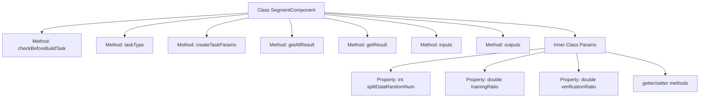
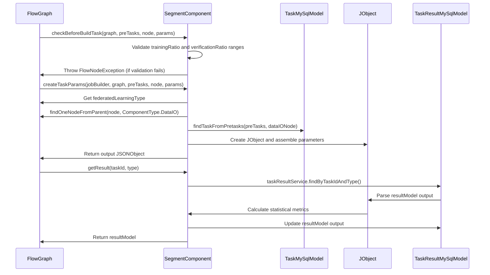

# Basic Information

|      |      |
|------|------|
| Name | SegmentComponent |
| Language | .java |
| Code Path | WeFe/board/board-service/src/main/java/com/welab/wefe/board/service/component/SegmentComponent.java |
| Package Name | com.welab.wefe.board.service.component |
| Dependencies | ['com.alibaba.fastjson.JSONObject', 'com.welab.wefe.board.service.component.base.AbstractComponent', 'com.welab.wefe.board.service.component.base.io.IODataType', 'com.welab.wefe.board.service.component.base.io.InputMatcher', 'com.welab.wefe.board.service.component.base.io.Names', 'com.welab.wefe.board.service.component.base.io.OutputItem', 'com.welab.wefe.board.service.database.entity.job.TaskMySqlModel', 'com.welab.wefe.board.service.database.entity.job.TaskResultMySqlModel', 'com.welab.wefe.board.service.exception.FlowNodeException', 'com.welab.wefe.board.service.model.FlowGraph', 'com.welab.wefe.board.service.model.FlowGraphNode', 'com.welab.wefe.board.service.model.JobBuilder', 'com.welab.wefe.common.fieldvalidate.AbstractCheckModel', 'com.welab.wefe.common.fieldvalidate.annotation.Check', 'com.welab.wefe.common.util.JObject', 'com.welab.wefe.common.wefe.enums.ComponentType', 'com.welab.wefe.common.wefe.enums.FederatedLearningType', 'com.welab.wefe.common.wefe.enums.TaskResultType', 'org.springframework.stereotype.Service', 'java.util.Arrays', 'java.util.List'] |
| Brief Description | The SegmentComponent is a component that handles data segmentation, validates the training and validation ratios, generates task parameters, and outputs the training and evaluation datasets. |

# Description

SegmentComponent is a service class that inherits from AbstractComponent and is used to handle data segmentation tasks. It first checks whether the proportions of training and validation data are between 0 and 100; otherwise, it throws an exception. Based on the federated learning type, it sets the mode to either vertical or horizontal. It retrieves label information from the DataIO component and generates task configurations containing parameters such as random numbers, training proportions, and label information. It also provides methods to obtain task results, including statistical information such as the quantities of training and validation data and the ratios of positive to negative examples. The inputs and outputs correspond to regular datasets and training/evaluation datasets, respectively. The Params class defines mandatory parameters such as segmentation random numbers and the proportions of training and validation sets.

# Class Summary

| Name   | Type  | Description |
|-------|------|-------------|
| SegmentComponent | class | The SegmentComponent is a component designed for data segmentation. It validates the ratio between training and validation sets, generates task parameters, and outputs the training and evaluation datasets. It supports both horizontal and vertical federated learning, incorporating label processing and result statistics functionalities. |


## Class SegmentComponent

|      |      |
|------|------|
| Access Modifier | @Service |
| Type | class |
| Name | SegmentComponent |
| Description | The SegmentComponent is a component designed for data segmentation. It validates the ratio between training and validation sets, generates task parameters, and outputs the training and evaluation datasets. It supports both horizontal and vertical federated learning, incorporating label processing and result statistics functionalities. |


### UML Class Diagram

```mermaid
classDiagram
    class AbstractComponent~T~ {
        <<Abstract>>
        +checkBeforeBuildTask(FlowGraph graph, List~TaskMySqlModel~ preTasks, FlowGraphNode node, T params) void
        +taskType() ComponentType
        +createTaskParams(JobBuilder jobBuilder, FlowGraph graph, List~TaskMySqlModel~ preTasks, FlowGraphNode node, T params) JSONObject
        +getAllResult(String taskId) List~TaskResultMySqlModel~
        +getResult(String taskId, String type) TaskResultMySqlModel
        +inputs(FlowGraph graph, FlowGraphNode node) List~InputMatcher~
        +outputs(FlowGraph graph, FlowGraphNode node) List~OutputItem~
    }

    class SegmentComponent {
        +checkBeforeBuildTask(FlowGraph graph, List~TaskMySqlModel~ preTasks, FlowGraphNode node, Params params) void
        +taskType() ComponentType
        +createTaskParams(JobBuilder jobBuilder, FlowGraph graph, List~TaskMySqlModel~ preTasks, FlowGraphNode node, Params params) JSONObject
        +getAllResult(String taskId) List~TaskResultMySqlModel~
        +getResult(String taskId, String type) TaskResultMySqlModel
        +inputs(FlowGraph graph, FlowGraphNode node) List~InputMatcher~
        +outputs(FlowGraph graph, FlowGraphNode node) List~OutputItem~
    }

    class SegmentComponent$Params {
        -int splitDataRandomNum
        -double trainingRatio
        -double verificationRatio
        +getSplitDataRandomNum() int
        +setSplitDataRandomNum(int splitDataRandomNum) void
        +getTrainingRatio() double
        +setTrainingRatio(double trainingRatio) void
        +getVerificationRatio() double
        +setVerificationRatio(double verificationRatio) void
    }

    class AbstractCheckModel {
        <<Abstract>>
    }

    AbstractComponent <|-- SegmentComponent
    AbstractCheckModel <|-- SegmentComponent$Params
    SegmentComponent --> SegmentComponent$Params : uses
```

This code implements a data segmentation component (SegmentComponent) for handling data splitting tasks in federated learning workflows. The class diagram shows that SegmentComponent inherits from the generic AbstractComponent class, using the inner class Params as its type parameter. Params inherits from AbstractCheckModel and contains configuration parameters such as split random number, training set ratio, and validation set ratio. The component's main functionalities include parameter validation (checkBeforeBuildTask), task parameter creation (createTaskParams), result processing (getResult), and defining input/output data specifications (inputs/outputs). The overall design encapsulates the data segmentation process in federated learning scenarios, supporting both horizontal and vertical federated learning modes.


### Internal Method Call Graph





The flowchart illustrates the structure of the SegmentComponent class and its relationship with the inner class Params, including 7 main methods and 3 properties. The sequence diagram details the invocation flow of three key methods: parameter validation (checkBeforeBuildTask), task parameter creation (createTaskParams), and result retrieval (getResult). The code primarily handles data segmentation, validates training/validation set ratios, assembles parameters based on federated learning type, and calculates statistical metrics after data segmentation. The inner class Params encapsulates configuration parameters required for segmentation, including random number, training set ratio, and validation set ratio properties.

### Field List

| Name  | Type  | Description |
|-------|-------|------|

### Method List

| Name  | Type  | Description |
|-------|-------|------|
| taskType | ComponentType | Method override, returns component type as Segment. |
| getAllResult | List<TaskResultMySqlModel> | This is a Java method that overrides the parent class method, retrieving a list of all task results for a specified taskId by invoking the listAllResult method of taskResultService. |
| checkBeforeBuildTask | void | Verify that the ratio of training and validation data is between 0 and 100 before checking the build task, otherwise throw an exception. |
| createTaskParams | JSONObject | The method creates a JSON object based on task parameters, sets the federated learning mode (vertical or horizontal), checks for the presence of the DataIO component, and configures parameters such as data split ratio and labels. If the DataIO component is missing, an exception is thrown. |
| getResult | TaskResultMySqlModel | This method retrieves the training evaluation results based on the task ID, calculates the quantity and ratio of positive and negative samples, and updates the result model before returning. |
| inputs | List<InputMatcher> | Method override, returns an input matcher list containing dataset instances. |
| outputs | List<OutputItem> | This method returns a list containing two OutputItems, corresponding to the training dataset and the evaluation dataset respectively, both of which are of the DataSetInstance type. |


