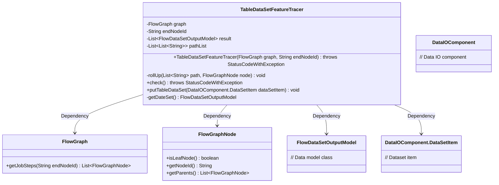

# Basic Information

|      |      |
|------|------|
| Name | TableDataSetFeatureTracer |
| Language | .java |
| Code Path | WeFe/board/board-service/src/main/java/com/welab/wefe/board/service/component/TableDataSetFeatureTracer.java |
| Package Name | com.welab.wefe.board.service.component |
| Dependencies | ['cn.hutool.core.collection.CollectionUtil', 'com.welab.wefe.board.service.dto.vo.FlowDataSetOutputModel', 'com.welab.wefe.board.service.model.FlowGraph', 'com.welab.wefe.board.service.model.FlowGraphNode', 'com.welab.wefe.common.exception.StatusCodeWithException', 'java.util.ArrayList', 'java.util.List', 'java.util.stream.Collectors'] |
| Brief Description | The `TableDataSetFeatureTracer` class is used to track flowchart node paths, supporting backtracking of all execution paths from a specified end node and generating new paths when handling branches. It includes path checking and data output functionalities. |

# Description

The `TableDataSetFeatureTracer` class is used to trace execution paths in flowcharts. It takes a `FlowGraph` and an optional end node ID as parameters, traversing all paths by backtracking upward from leaf nodes. When encountering a fork, it creates new paths. The class contains `pathList` to store all paths and `result` to store tracing results. It provides a `check` method to verify paths, a `putTableDataSet` method to add datasets, and a `getDateSet` method to retrieve datasets. The core logic involves recursively building the path list through the `rollUp` method.

# Class Summary

| Name   | Type  | Description |
|-------|------|-------------|
| TableDataSetFeatureTracer | class | The `TableDataSetFeatureTracer` class is used to trace flowchart node paths, supporting upward searches for all execution paths from leaf nodes and generating new paths when handling branches. It includes path list management and result storage functionality. |

## Class TableDataSetFeatureTracer

|      |      |
|------|------|
| Access Modifier | public |
| Type | class |
| Name | TableDataSetFeatureTracer |
| Description | The `TableDataSetFeatureTracer` class is used to trace flowchart node paths, supporting upward searches for all execution paths from leaf nodes and generating new paths when handling branches. It includes path list management and result storage functionality. |

### UML Class Diagram

This code implements a table dataset feature tracer, primarily used to analyze execution paths in flow graphs. The core functionality involves backtracking from leaf nodes upwards via the `rollUp` method, recording all possible execution paths in `pathList`. The class structure includes operations on flow graph nodes (FlowGraphNode), processing of data models (FlowDataSetOutputModel), and interaction with data IO components (DataIOComponent). The design supports reverse tracing starting from a specified end node and can handle branching scenarios in flow graphs.

### Internal Method Call Graph

This flowchart illustrates the core structure and execution logic of the TableDataSetFeatureTracer class. The main process starts from the constructor, obtains step lists via graph.getJobSteps, filters leaf nodes, and executes the rollUp method for each leaf node to build paths through upward backtracking. The rollUp method recursively processes parent nodes, creating new paths at forks. The entire process forms a tree-like backtracking structure, ultimately generating a pathList containing all possible execution paths. Other methods like check() and putTableDataSet() serve as interface placeholders without implemented logic yet.

### Field List

| Name  | Type  | Description |
|-------|-------|------|
| result = new ArrayList<>() | List<FlowDataSetOutputModel> | Declare a private list variable named result to store a collection of data of type FlowDataSetOutputModel. |
| graph | FlowGraph | The private variable `graph`, of type `FlowGraph`. |
| endNodeId | String | Private string-type variable storing the end node ID. |
| pathList = new ArrayList<>() | List<List<String>> | Defined a private variable pathList, of type List containing a list of strings, initialized as an empty ArrayList. |

### Method List

| Name  | Type  | Description |
|-------|-------|------|
| rollUp | void | Recursively traverse upward the node path, continue the current path for a single parent node, and fork a new path when encountering multiple parent nodes. |
| check | void | The method checks the path list, the unimplemented step checking logic may throw an exception. |
| getDateSet | FlowDataSetOutputModel | The method getDateSet returns an empty FlowDataSetOutputModel object. |
| putTableDataSet | void | Method definition: Empty implementation, accepts a DataSetItem parameter, returns no value. |

