# Basic Information

|      |      |
|------|------|
| Name | component |
| Language | .java |
| Code Path | WeFe/board/board-service/src/main/java/com/welab/wefe/board/service/component |
| Package Name | docs.board.board-service.src.main.java.com.welab.wefe.board.service.component |
| Brief Description | Federated Learning Platform Component Collection, including modules for data interaction, feature engineering, machine learning modeling (Logistic Regression/XGBoost/Neural Networks), deep learning (PaddlePaddle image processing), and evaluation/validation. Designed with the strategy pattern, it supports horizontal/vertical/hybrid scenarios and features a unified interface specification (parameter validation-JSON configuration-result output). It relies on Java standard libraries and internal services. |

# Description

## Overview  
This module is a core component collection of the federated learning platform, primarily responsible for implementing the end-to-end distributed machine learning workflow, including data preprocessing, feature engineering, model training, and evaluation/validation. It adopts design patterns such as the Strategy Pattern (e.g., the `AbstractComponent` base class) and Factory Pattern (e.g., the `Components` service class), resembling a data processing pipeline. Key data structures include `FlowGraphNode` (process node), `Params` (task parameters), `DataSetItem` (dataset metadata), and various algorithm configurations (e.g., neural network layers/XGBoost tree depth). External dependencies encompass the Java standard library, Spring framework, machine learning frameworks like PaddlePaddle/XGBoost, and internal services (e.g., `JobService`/`TableDataSetService`). For instance, `HorzLRComponent` implements horizontal logistic regression, while `PaddleClassify` handles image classification.

## Key Business Scenarios  
The module supports horizontal/vertical/hybrid federated learning scenarios. A typical workflow includes: 1) Data preparation (`DataIOComponent` validates datasets → `IntersectionComponent` aligns samples); 2) Feature processing (`FeatureBinning` for binning → `PCA` for dimensionality reduction); 3) Model training (`HorzLRComponent` for logistic regression → `VertSecureBoostComponent` for secure boosting trees); 4) Evaluation/validation (`EvaluationComponent` calculates KS/ROC metrics → `OotComponent` for out-of-time validation). The interaction mode uniformly follows a "validate-parameterize-execute" chain. For example, `PaddleDetection` first validates image label consistency before configuring detection parameters. API integration covers static methods (e.g., `intersected`) and dynamic services (e.g., `Components.get`), enabling end-to-end traceability from data input to model output.

### Package Internal Structure View

```mermaid
graph TD
    component --> base
    component --> modeling
    component --> deep_learning
    component --> enums
    component --> temp
    component --> feature
    component --> EvaluationComponent.java
    component --> DataIOComponent.java
    component --> SegmentComponent.java
    component --> OotComponent.java
    component --> TableDataSetFeatureTracer.java
    component --> Components.java
    component --> IntersectionComponent.java
    base --> filter
    base --> io
    base --> dto
    base --> AbstractComponent.java
    filter --> OutputItemFilterFunction.java
    filter --> BinnedOutputFilter.java
    filter --> OutputDataTypesOutputFilter.java
    filter --> IntersectedOutputFilter.java
    filter --> OutputDataTypeAndNameOutputFilter.java
    io --> NodeOutputItem.java
    io --> Names.java
    io --> DataTypeGroup.java
    io --> InputSupplier.java
    io --> InputGroup.java
    io --> InputMatcher.java
    io --> OutputItem.java
    io --> IODataType.java
    dto --> AbstractDataSetItem.java
    dto --> AbstractDataIOParam.java
    modeling --> HorzLRComponent.java
    modeling --> HorzNNComponent.java
    modeling --> AbstractModelingComponent.java
    modeling --> VertSecureBoostComponent.java
    modeling --> HorzSecureBoostComponent.java
    modeling --> ScoreCardComponent.java
    modeling --> VertLRComponent.java
    modeling --> MixLrComponent.java
    modeling --> VertNNComponent.java
    modeling --> MixSecureBoostComponent.java
    deep_learning --> PaddleClassifyComponent.java
    deep_learning --> PaddleDetectionComponent.java
    deep_learning --> ImageDataIOComponent.java
    deep_learning --> AbstractDeepLearningComponent.java
    enums --> EvaluationType.java
    temp --> AbstractValidationDataSetLoaderComponent.java
    feature --> HorzFeatureBinningComponent.java
    feature --> FeatureTransformComponent.java
    feature --> VertFilterComponent.java
    feature --> MixBinningComponent.java
    feature --> FeatureStandardizedComponent.java
    feature --> MixStatisticComponent.java
    feature --> BinningComponent.java
    feature --> HorzOneHotComponent.java
    feature --> FillMissingValueComponent.java
    feature --> FeatureStatisticsComponent.java
    feature --> HorzStatisticComponent.java
    feature --> VertOneHotComponent.java
    feature --> VertPCAComponent.java
    feature --> VertPearsonComponent.java
    feature --> FeatureCalculationComponent.java
    feature --> FeaturePsiComponent.java
    feature --> FeatureSelectionComponent.java
```

This flowchart illustrates the component structure of the board-service module in the WeFe project, including major submodules such as base, modeling, deep_learning, and their internal file relationships. The base module contains foundational functionalities like filter, io, and dto. The modeling and deep_learning modules encompass various machine learning algorithm implementations, while the feature module provides feature engineering-related functionalities. The overall structure presents a clear tree-like hierarchy.

# File List

| Name   | Type  | Description |
|-------|------|-------------|
| [temp](temp/_module.md) | package | The abstract class `AbstractValidationDataSetLoaderComponent` extends `AbstractComponent` and implements methods such as task parameter creation, result retrieval, and input-output matching, including a static `Params` class. |
| [EvaluationComponent.java](EvaluationComponent.md) | file | The EvaluationComponent is an evaluation component that inherits from AbstractComponent. It checks the existence of modeling nodes, creates task parameters, processes evaluation results, and supports various evaluation types such as KS and Lift. It includes parameters for PSI and score distribution. |
| [DataIOComponent.java](DataIOComponent.md) | file | The DataIOComponent is a service component that handles data input and output for federated learning, encompassing functions such as data validation, task parameter generation, and result processing. The validation logic ensures datasets meet federated learning requirements (e.g., feature consistency, label categories, etc.) and supports horizontal and hybrid modeling modes. The component operates datasets via the TableDataSetService, generates task parameters, and manages task results. |
| [SegmentComponent.java](SegmentComponent.md) | file | The SegmentComponent is a component that handles data segmentation, validates the training and validation ratios, generates task parameters, and outputs the training and evaluation datasets. |
| [OotComponent.java](OotComponent.md) | file | The OotComponent is a scoring validation component that supports OOT mode for validating model performance. Its main functions include checking dataset feature completeness, validating member selection effectiveness, handling evaluation task configurations, and generating standardized output results. Key points: exclusion of specific component types, temporarily unsupported component lists, hybrid federated learning restrictions, feature column validation, and evaluation parameter generation. |
| [TableDataSetFeatureTracer.java](TableDataSetFeatureTracer.md) | file | The `TableDataSetFeatureTracer` class is used to track flowchart node paths, supporting backtracking of all execution paths from a specified end node and generating new paths when handling branches. It includes path checking and data output functionalities. |
| [Components.java](Components.md) | file | The `Components` class is a Spring service that contains multiple auto-injected components. It provides methods to retrieve corresponding components based on `ComponentType` and determines whether arbitration tasks are required. |
| [IntersectionComponent.java](IntersectionComponent.md) | file | The IntersectionComponent is a service component that handles dataset intersections, encompassing parameter validation, task creation, result retrieval, and input/output definitions, while supporting intersection methods and data storage configuration. |
| [modeling](modeling/_module.md) | package | Multiple machine learning component classes inheriting from AbstractModelingComponent, including logistic regression, neural networks, secure enhanced tree models, scorecards, etc., implement parameter validation, task creation, and result processing functions, supporting various federated learning scenarios. |
| [feature](feature/_module.md) | package | The HorzFeatureBinningComponent implements horizontal feature binning, supporting equal frequency, equal width, and chi-square methods. The FeatureTransformComponent handles feature transformation tasks. The VertFilterComponent manages vertical filtering tasks. The MixBinningComponent processes mixed binning. The FeatureStandardizedComponent standardizes features. The MixStatisticComponent deals with mixed statistics. The BinningComponent implements binning functionality. The HorzOneHotComponent handles horizontal one-hot encoding. The FillMissingValueComponent fills missing values. The FeatureStatisticsComponent manages feature statistics. The HorzStatisticComponent processes horizontal statistics. The VertOneHotComponent handles vertical one-hot encoding. The VertPCAComponent implements vertical PCA. The VertPearsonComponent calculates Pearson correlation. The FeaturePsiComponent manages feature PSI operations. The FeatureSelectionComponent is used for feature selection. |
| [enums](enums/_module.md) | package | The enumeration EvaluationType defines three evaluation types: binary classification, multi-class classification, and regression. |
| [deep_learning](deep_learning/_module.md) | package | PaddleClassifyComponent is the Paddle classification component, and PaddleDetectionComponent is the Paddle detection component, both inheriting from AbstractDeepLearningComponent. ImageDataIOComponent handles the input and output of image datasets, ensuring data validity. AbstractDeepLearningComponent is the base class for deep learning components, providing task construction and parameter processing functionalities. |
| [base](base/_module.md) | package | Module 1: Implements output item filtering through the OutputItemFilterFunction interface, supporting 5 scenarios including bin detection. Depends on the Java standard library.  Module 2: Manages node input and output data, including InputMatcher matching strategies and JSON conversion. Handles scenarios such as training data matching.  Module 3: Provides base classes for data interaction, enforces mandatory field validation, and supports generic dataset operations. Implements data permission control and service routing.  Module 4: The abstract class AbstractComponent manages ML tasks, defining core functionalities such as component types and task construction, supporting multiple learning task types. |

