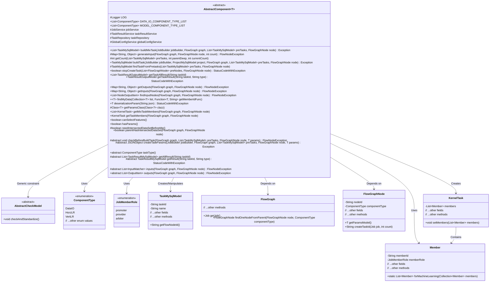
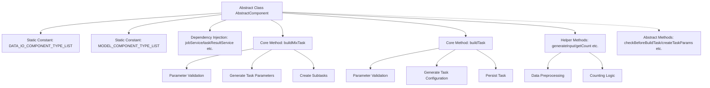

# Basic Information

|      |      |
|------|------|
| Name | AbstractComponent |
| Language | .java |
| Code Path | WeFe/board/board-service/src/main/java/com/welab/wefe/board/service/component/base/AbstractComponent.java |
| Package Name | com.welab.wefe.board.service.component.base |
| Dependencies | ['com.alibaba.fastjson.JSON', 'com.alibaba.fastjson.JSONObject', 'com.alibaba.fastjson.TypeReference', 'com.welab.wefe.board.service.component.Components', 'com.welab.wefe.board.service.component.DataIOComponent', 'com.welab.wefe.board.service.component.OotComponent', 'com.welab.wefe.board.service.component.base.io', 'com.welab.wefe.board.service.database.entity.data_resource.TableDataSetMysqlModel', 'com.welab.wefe.board.service.database.entity.job.ProjectMySqlModel', 'com.welab.wefe.board.service.database.entity.job.TaskMySqlModel', 'com.welab.wefe.board.service.database.entity.job.TaskResultMySqlModel', 'com.welab.wefe.board.service.database.repository.TaskRepository', 'com.welab.wefe.board.service.dto.entity.job.TaskResultOutputModel', 'com.welab.wefe.board.service.dto.kernel.Member', 'com.welab.wefe.board.service.dto.kernel.machine_learning.KernelTask', 'com.welab.wefe.board.service.dto.kernel.machine_learning.TaskConfig', 'com.welab.wefe.board.service.exception.FlowNodeException', 'com.welab.wefe.board.service.model.FlowGraph', 'com.welab.wefe.board.service.model.FlowGraphNode', 'com.welab.wefe.board.service.model.JobBuilder', 'com.welab.wefe.board.service.service.CacheObjects', 'com.welab.wefe.board.service.service.JobService', 'com.welab.wefe.board.service.service.TaskResultService', 'com.welab.wefe.board.service.service.globalconfig.GlobalConfigService', 'com.welab.wefe.common.exception.StatusCodeWithException', 'com.welab.wefe.common.fieldvalidate.AbstractCheckModel', 'com.welab.wefe.common.util.JObject', 'com.welab.wefe.common.web.util.ModelMapper', 'com.welab.wefe.common.wefe.enums.ComponentType', 'com.welab.wefe.common.wefe.enums.JobMemberRole', 'com.welab.wefe.common.wefe.enums.ProjectType', 'com.welab.wefe.common.wefe.enums.TaskStatus', 'org.apache.commons.collections.CollectionUtils', 'org.apache.commons.lang3.StringUtils', 'org.slf4j.Logger', 'org.slf4j.LoggerFactory', 'org.springframework.beans.factory.annotation.Autowired', 'org.springframework.stereotype.Service', 'java.lang.reflect.ParameterizedType', 'java.lang.reflect.Type', 'java.util', 'java.util.function.Function', 'java.util.stream.Collectors'] |
| Brief Description | The abstract component class AbstractComponent defines the foundational logic for data processing and modeling tasks, encompassing functionalities such as task construction, parameter validation, input/output handling, and supporting multiple component types and role collaboration. |

# Description

This is an abstract class AbstractComponent designed for constructing and managing tasks within machine learning workflows. It defines lists of data input/output component types and modeling component types, encompassing core functionalities such as task construction, parameter validation, and result retrieval. The class injects multiple service classes like JobService and TaskResultService, providing methods to build hybrid and regular tasks while handling task input/output logic and member assignment. Abstract methods requiring subclass implementation include parameter validation, task parameter creation, task type definition, and input/output declaration. It supports horizontal, vertical, and hybrid machine learning tasks, with auxiliary features like data alignment verification and task status management.

# Class Summary

| Name   | Type  | Description |
|-------|------|-------------|
| AbstractComponent | class | The abstract class AbstractComponent defines the base class for components, including data I/O and a list of modeling component types. It provides methods for task construction, parameter validation, input/output processing, and supports hybrid task creation and result querying. |

## Class AbstractComponent

|      |      |
|------|------|
| Access Modifier | @Service;public abstract |
| Type | class |
| Name | AbstractComponent |
| Description | The abstract class AbstractComponent defines the base class for components, including data I/O and a list of modeling component types. It provides methods for task construction, parameter validation, input/output processing, and supports hybrid task creation and result querying. |

### UML Class Diagram

This class diagram illustrates the AbstractComponent abstract class and its related dependencies. AbstractComponent is a generic abstract class (where T must inherit from AbstractCheckModel), serving as the core component for workflow task construction. It provides foundational functionalities such as task creation, parameter validation, and input/output processing. The class interacts with core entities like TaskMySqlModel, FlowGraph, and FlowGraphNode, while utilizing enumerations ComponentType and JobMemberRole to control component types and member roles. The design supports various machine learning workflow scenarios, incorporating key features like mixed-task construction, parameter validation, and task dependency management, embodying the principles of separation of concerns and the template method design pattern.

### Internal Method Call Graph

This flowchart illustrates the core structure of the abstract component class AbstractComponent, including static constant definitions, service dependency injections, two main task construction methods (buildMixTask and buildTask), and utility helper methods. It particularly highlights the multi-step process of mixed task construction (parameter validation → parameter generation → subtask creation) and the conventional task construction flow (validation → configuration → persistence), while maintaining connections to abstract methods implemented by subclasses. The class design embodies the core logic of federated learning task orchestration, supporting extensibility for various machine learning components through the template method pattern.

### Field List

| Name  | Type  | Description |
|-------|-------|------|
| DATA_IO_COMPONENT_TYPE_LIST = Arrays.asList(            ComponentType.DataIO,            ComponentType.HorzLRValidationDataSetLoader,            ComponentType.VertLRValidationDataSetLoader,            ComponentType.HorzXGBoostValidationDataSetLoader,            ComponentType.VertXGBoostValidationDataSetLoader    ) | List<ComponentType> | Defined an immutable static list DATA_IO_COMPONENT_TYPE_LIST containing five component types: DataIO, horizontal and vertical LR validation dataset loader, horizontal and vertical XGBoost validation dataset loader. |
| MODEL_COMPONENT_TYPE_LIST = Arrays.asList(            ComponentType.HorzLR,            ComponentType.VertLR,            ComponentType.HorzSecureBoost,            ComponentType.VertSecureBoost,            ComponentType.MixLR,            ComponentType.MixSecureBoost,            ComponentType.HorzNN,            ComponentType.VertNN    ) | List<ComponentType> | The public static constant MODEL_COMPONENT_TYPE_LIST defines eight types of model components, including horizontal and vertical LR, SecureBoost, MixLR, MixSecureBoost, and neural network types. |
| globalConfigService | GlobalConfigService | Automatically inject global configuration service instances. |
| taskRepository | TaskRepository | Use @Autowired to automatically inject an instance of TaskRepository. |
| taskResultService | TaskResultService | Automatically inject the TaskResultService service instance. |
| LOG = LoggerFactory.getLogger(this.getClass()) | Logger | Define the protected logger object of the current class, obtaining an instance using LoggerFactory. |
| jobService | JobService | Using @Autowired to automatically inject an instance of JobService. |

### Method List

| Name  | Type  | Description |
|-------|-------|------|
| findInputNodes | List<NodeOutputItem> | Method for finding input nodes: Traverse the matcher list, obtain the output items of each matcher, and return the result list. If the matcher is empty, return an empty list. |
| findMyData | T | The method iterates through the collection, retrieves member IDs via a function, compares them with the cache, and returns the matching item or null. |
| hasParams | boolean | The method hasParams returns a boolean value of true, indicating the presence of parameters. |
| getOutputs | Map<String, Object> | This method retrieves the output items of nodes in the flowchart, groups them by data type, and returns a mapping table. If the output items are empty, it returns null; otherwise, it stores the grouped list of output item names in the result object and returns it. |
| getInputs | Map<String, Object> | The method `getInputs` retrieves the input data of nodes in the flowchart. If inputs are not manually specified, it automatically searches for input nodes and groups them by data type. The result is returned as a `JObject`. If no inputs exist, an empty data node is constructed. |
| getMixTaskMembers | List<KernelTask> | This method generates a hybrid task member list based on node types and roles (initiator, arbitrator, provider), handles logical differences among various component types, and sets relevant parameters. |
| buildMixTask | List<TaskMySqlModel> | Build a hybrid task approach, check parameters to create task configurations, generate and save subtask lists. Includes role determination, random seed setting, and task status handling. |
| generateInput | Map<String, Object> | Method for generating input data: Parse JSON input, iterate through data entries, append a count suffix to strings, then return the updated data. Log exceptions and return the original input if an error occurs. |
| getTaskResult | TaskResultOutputModel | The method `getTaskResult` queries the task result based on `taskId` and `type`. If the result does not exist, it returns `null`; otherwise, it maps the result to `TaskResultOutputModel` and returns it. It may throw a `StatusCodeWithException` exception. |
| getTaskAllResult | List<TaskResultOutputModel> | Retrieve all results for the specified task ID, filter out null values, and map them to a list of output models. Returns null if no results are found. |
| parentHasIntersectedDataSet | boolean | Check if the node has a parent intersection dataset. Traverse the parent nodes, return true if it is of intersection type or a DataIO type derived from intersection, otherwise return false. |
| getTaskMembers | KernelTask | This method retrieves dataset items based on node types to generate a task member list. If the node requires an arbiter and the current member is the initiator, it adds the arbiter member. Finally, it sets the task members and returns. |
| stopCreateTask | boolean | The method `stopCreateTask` checks whether to stop creating a task, returns `false` by default, and may throw an exception. |
| findTaskFromPretasks | TaskMySqlModel | This method searches the pre-task list for the first task that matches the specified node ID and returns null if not found. |
| deserializationParam | T | The method deserializes a JSON string into an object of the specified class, defaults to "{}" if the JSON is empty, and returns it after validation and normalization. Throws StatusCodeWithException in case of exceptions. |
| buildTask | TaskMySqlModel | Construct task methods, verify the legality of the initiator, create task parameters, set task attributes, configure tasks based on project type, save and return the task instance. |
| checkBeforeBuildTask | void | Abstract method used to check the nodes, prerequisites, and parameters of a flowchart before building a task, which may throw a process node exception. |
| createTaskParams | JSONObject | Abstract method for creating a task parameter JSON object, with inputs including task builder, flowchart, predecessor task list, node, and parameters, which may throw exceptions. |
| taskType | ComponentType | Abstract method, returns the component type. |
| getAllResult | List<TaskResultMySqlModel> | Retrieve all result data for the specified task ID, returning a list of TaskResultMySqlModel type. |
| getResult | TaskResultMySqlModel | Abstract method: Retrieve MySQL model results based on task ID and type, may throw status code exceptions. |
| inputs | List<InputMatcher> | Abstract method, returns a list of input matchers based on the flowchart and nodes, may throw a flow node exception. |
| outputs | List<OutputItem> | Abstract method `outputs`, which takes parameters `FlowGraph` and `FlowGraphNode`, returns a list of `OutputItem`, and may throw a `FlowNodeException`. |
| getCount | int | This method calculates the number of tasks that meet the specified depth and returns the minimum value between the current count and the number of matching tasks. If the input is invalid, it directly returns the current count. |
| getParamsClass | Class<T> | Get generic parameter class: Recursively search parent classes until a parameterized type is found, then return the first type parameter. If none exists, continue searching upward. |
| canSelectFeatures | boolean | This method returns a fixed value of false, indicating that the selection feature is not supported. |
| needIntersectedDataSetBeforeMe | boolean | The method returns a boolean value false, indicating that no pre-intersection dataset is required. |

