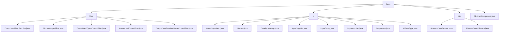

# Basic Information

|      |      |
|------|------|
| Name | base |
| Language | .java |
| Code Path | WeFe/board/board-service/src/main/java/com/welab/wefe/board/service/component/base |
| Package Name | docs.board.board-service.src.main.java.com.welab.wefe.board.service.component.base |
| Brief Description | Module 1: Implements output item filtering through the OutputItemFilterFunction interface, supporting 5 scenarios including bin detection. Depends on the Java standard library.  Module 2: Manages node input and output data, including InputMatcher matching strategies and JSON conversion. Handles scenarios such as training data matching.  Module 3: Provides base classes for data interaction, enforces mandatory field validation, and supports generic dataset operations. Implements data permission control and service routing.  Module 4: The abstract class AbstractComponent manages ML tasks, defining core functionalities such as component types and task construction, supporting multiple learning task types. |

# Description

## Overview  
The core responsibility of this module is to establish a data interaction framework within federated learning workflows, encompassing three key functionalities: output filtering, input matching, and structured transformation. It adopts the strategy pattern through functional interfaces (e.g., OutputItemFilterFunction/InputSupplier) and abstract base classes (AbstractComponent), resembling a hybrid of event bus and factory patterns. Key data structures include FlowGraphNode (process node), InputGroup (structured input), NodeOutputItem (extended output item), and the IODataType enum (type classification). External dependencies are limited to the Java standard library and internal services (e.g., JobService). For instance, BinnedOutputFilter implements binning detection, while InputMatcher supports three matching strategies.  

## Core Business Scenarios  
The module facilitates end-to-end data interaction in federated learning, with typical use cases including: 1) Output filtering (e.g., binning data validation/type matching); 2) Dynamic input matching (via InputMatcher priority strategies); 3) Heterogeneous data processing (e.g., AbstractDataIOParam routing for tabular/image services). Business workflows follow a "validation-matching-transformation" pattern—for example, IntersectedOutputFilter validates node inheritance relationships, while InputGroup transforms JSON structures. API integration covers static methods (intersected) and dynamic composition (types list), with interaction modeled as data pipelines supporting horizontal/vertical/hybrid task construction.

### Package Internal Structure View

This flowchart illustrates the foundational component structure of the board-service module in the WeFe project. The top-level base directory contains three subdirectories (filter, io, dto) and the AbstractComponent.java file. The filter directory includes five filter implementation classes, the io directory contains eight input/output related classes, and the dto directory holds two abstract data transfer object classes. The overall structure clearly presents the file organization relationships within the component base module.

# File List

| Name   | Type  | Description |
|-------|------|-------------|
| [AbstractComponent.java](AbstractComponent.md) | file | The abstract component class AbstractComponent defines the foundational logic for data processing and modeling tasks, encompassing functionalities such as task construction, parameter validation, input/output handling, and supporting multiple component types and role collaboration. |
| [dto](dto/_module.md) | package | AbstractDataSetItem is an abstract class that inherits from AbstractCheckModel, containing required fields memberId, memberRole, dataSetId, and their corresponding getter/setter methods. AbstractDataIOParam is also an abstract class, featuring a generic dataset list dataSetList, and provides methods for filtering datasets by role, supporting queries for both image and tabular data. |
| [io](io/_module.md) | package | NodeOutputItem inherits from OutputItem, encapsulating node output information with attributes including component type, node ID, and task name. The Names class manages name constants for datasets, models, etc. The DataTypeGroup enum defines data grouping types. InputSupplier is a functional interface for obtaining node inputs. InputGroup manages input data groupings and converts them to JSON. InputMatcher matches node input items, supporting three strategies. OutputItem encapsulates output items with name and data type attributes. The IODataType enum defines various data types and their groupings. |
| [filter](filter/_module.md) | package | OutputItemFilterFunction is a functional interface used to filter output items. BinnedOutputFilter checks whether the data is binned. OutputDataTypesOutputFilter filters by data type. IntersectedOutputFilter determines if the data is intersected. OutputDataTypeAndNameOutputFilter filters by type and name. |

