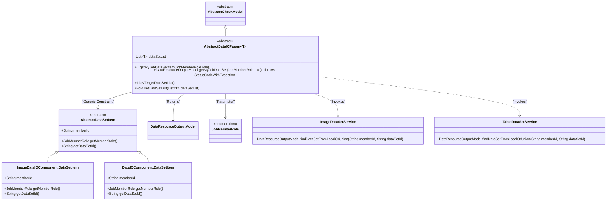
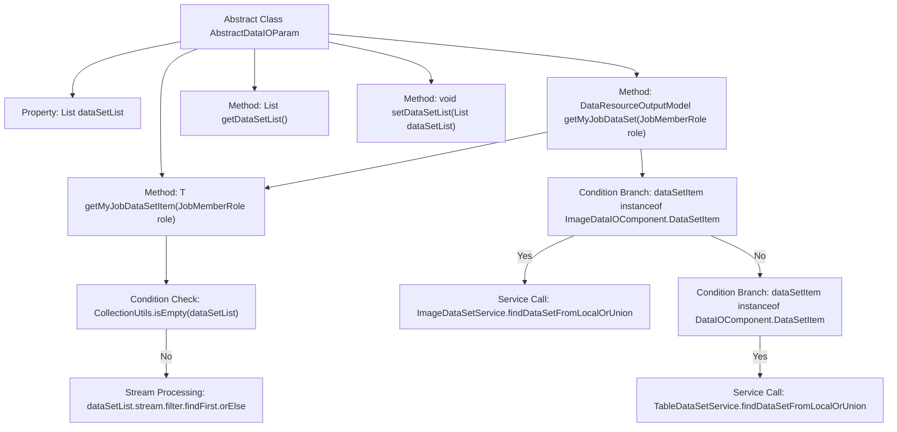

# Basic Information

|      |      |
|------|------|
| Name | AbstractDataIOParam |
| Language | .java |
| Code Path | WeFe/board/board-service/src/main/java/com/welab/wefe/board/service/component/base/dto/AbstractDataIOParam.java |
| Package Name | com.welab.wefe.board.service.component.base.dto |
| Dependencies | ['com.welab.wefe.board.service.component.DataIOComponent', 'com.welab.wefe.board.service.component.deep_learning.ImageDataIOComponent', 'com.welab.wefe.board.service.dto.entity.data_resource.output.DataResourceOutputModel', 'com.welab.wefe.board.service.service.CacheObjects', 'com.welab.wefe.board.service.service.data_resource.image_data_set.ImageDataSetService', 'com.welab.wefe.board.service.service.data_resource.table_data_set.TableDataSetService', 'com.welab.wefe.common.exception.StatusCodeWithException', 'com.welab.wefe.common.fieldvalidate.AbstractCheckModel', 'com.welab.wefe.common.web.Launcher', 'com.welab.wefe.common.wefe.enums.JobMemberRole', 'org.apache.commons.collections4.CollectionUtils', 'java.util.List'] |
| Brief Description | The abstract class `AbstractDataIOParam<T>` contains a dataset list and two methods: `getMyJobDataSetItem` filters data items based on roles, while `getMyJobDataSet` retrieves corresponding data resources. It supports two data types: images and tables. |

# Description

This is an abstract class named AbstractDataIOParam, which inherits from AbstractCheckModel. It contains a generic dataset list dataSetList, where the generic type T must inherit from AbstractDataSetItem. The class provides two core methods: getMyJobDataSetItem filters dataset items for the current user based on roles, returning matching items or null; getMyJobDataSet retrieves the complete dataset by role, supporting two data types—images and tables—by calling ImageDataSetService and TableDataSetService to query from local or federated data sources. The class also includes standard getter/setter methods for manipulating the dataset list.

# Class Summary

| Name   | Type  | Description |
|-------|------|-------------|
| AbstractDataIOParam | class | The abstract class AbstractDataIOParam defines data processing logic, including methods for retrieving dataset items and datasets, supporting both image and tabular data types, and providing getters/setters for dataset lists. |

## Class AbstractDataIOParam

|      |      |
|------|------|
| Access Modifier | public abstract |
| Type | class |
| Name | AbstractDataIOParam |
| Description | The abstract class AbstractDataIOParam defines data processing logic, including methods for retrieving dataset items and datasets, supporting both image and tabular data types, and providing getters/setters for dataset lists. |

### UML Class Diagram

This class diagram illustrates an abstract class `AbstractDataIOParam`, which inherits from `AbstractCheckModel` and uses generic type `T` constrained to subclasses of `AbstractDataSetItem`. Its primary functionalities include retrieving dataset items and datasets by role, relying on `ImageDataSetService` and `TableDataSetService` for specific data operations. It contains two dataset item implementation classes, identifies member roles via the enumeration `JobMemberRole`, and ultimately returns results of type `DataResourceOutputModel`.

### Internal Method Call Graph

This flowchart illustrates the core structure and key method invocation relationships of the abstract class AbstractDataIOParam. The class contains a generic dataset list property and four critical methods. The getMyJobDataSetItem method filters data items through stream processing, while the getMyJobDataSet method invokes different services to retrieve data based on different types of data items. The flow clearly demonstrates the logical path of empty collection checks, conditional branching, and service calls, reflecting the data retrieval and type distribution handling process.

### Field List

| Name  | Type  | Description |
|-------|-------|------|
| dataSetList | List<T> | Generic list variables defined in a class, used for storing datasets. |

### Method List

| Name  | Type  | Description |
|-------|-------|------|
| getMyJobDataSet | DataResourceOutputModel | The method retrieves the dataset based on the role. If the type is image, it calls ImageDataSetService; if the type is table, it calls TableDataSetService; otherwise, it returns null. |
| getDataSetList | List<T> | Methods for obtaining the dataset list, with the return type being a generic list. |
| setDataSetList | void | The method for setting the dataset list assigns the input parameter to the class member variable dataSetList. |
| getMyJobDataSetItem | T | The method `getMyJobDataSetItem` filters the dataset list based on roles and returns the first entry that matches the current user ID and specified role. If no match is found, it returns null. |

