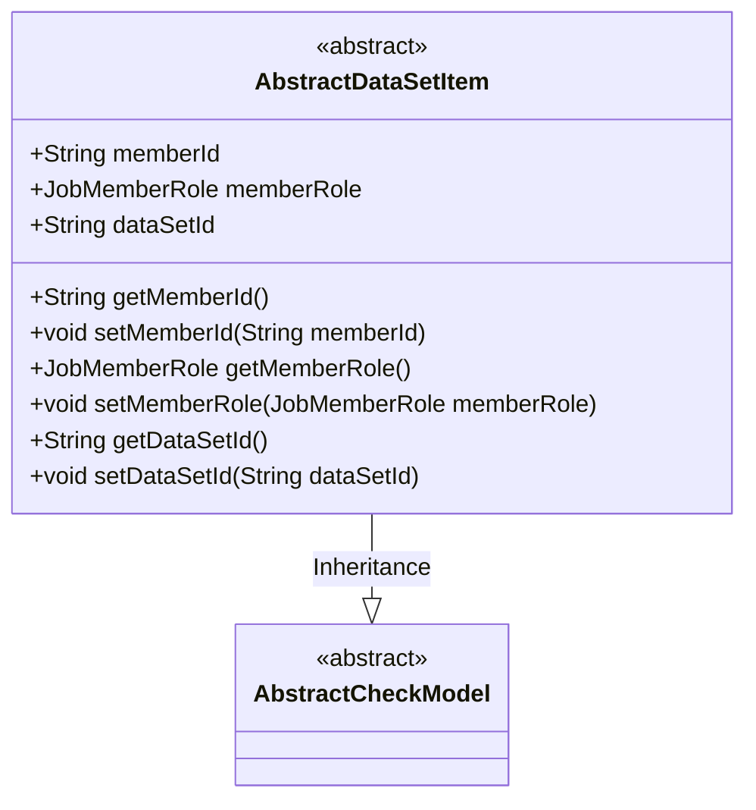
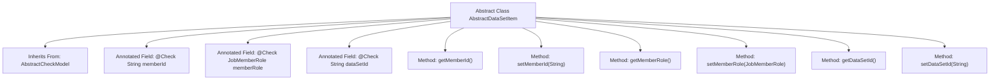

# Basic Information

|      |      |
|------|------|
| Name | AbstractDataSetItem |
| Language | .java |
| Code Path | WeFe/board/board-service/src/main/java/com/welab/wefe/board/service/component/base/dto/AbstractDataSetItem.java |
| Package Name | com.welab.wefe.board.service.component.base.dto |
| Dependencies | ['com.welab.wefe.common.fieldvalidate.AbstractCheckModel', 'com.welab.wefe.common.fieldvalidate.annotation.Check', 'com.welab.wefe.common.wefe.enums.JobMemberRole'] |
| Brief Description | The abstract class `AbstractDataSetItem` extends `AbstractCheckModel` and includes the required fields `memberId`, `memberRole`, and `dataSetId`, along with their corresponding getter/setter methods. |

# Description

This is an abstract class named AbstractDataSetItem, which inherits from AbstractCheckModel. The class defines three mandatory fields: memberId represents the member ID, memberRole represents the member role, and dataSetId represents the dataset ID. Each field is marked as a required item through the @Check annotation, with the corresponding Chinese name specified. The class also includes getter and setter methods for these three fields, used to retrieve and set the field values.

# Class Summary

| Name   | Type  | Description |
|-------|------|-------------|
| AbstractDataSetItem | class | The abstract class AbstractDataSetItem inherits from AbstractCheckModel, containing required fields member ID, member role, and dataset ID, and provides getter/setter methods. |

## Class AbstractDataSetItem

|      |      |
|------|------|
| Access Modifier | public abstract |
| Type | class |
| Name | AbstractDataSetItem |
| Description | The abstract class AbstractDataSetItem inherits from AbstractCheckModel, containing required fields member ID, member role, and dataset ID, and provides getter/setter methods. |

### UML Class Diagram

This class diagram illustrates the structure where an abstract class `AbstractDataSetItem` inherits from `AbstractCheckModel`. `AbstractDataSetItem` contains three public fields (memberId, memberRole, dataSetId) with corresponding getter/setter methods, all annotated with `@Check` validation rules. As an abstract class, it provides foundational attributes and methods for dataset members but requires subclasses to implement specific functionalities. The diagram clearly depicts the inheritance relationship and class member structure, accurately presenting field visibility and method signatures.

### Internal Method Call Graph

This flowchart illustrates the structure of the abstract class AbstractDataSetItem, which inherits from AbstractCheckModel. It contains three member variables (memberId, memberRole, dataSetId) annotated with @Check, along with their corresponding getter and setter methods. Each field is marked as required (require=true) for data validation. The class structure clearly reflects the JavaBean design pattern, encapsulating property access through methods while inheriting validation functionality from its parent class.

### Field List

| Name  | Type  | Description |
|-------|-------|------|
| memberId | String | Member ID field, mandatory validation. |
| dataSetId | String | Check the dataset ID, a required field. |
| memberRole | JobMemberRole | Member role check, required field. |

### Method List

| Name  | Type  | Description |
|-------|-------|------|
| getMemberId | String | This is a Java method that returns a member ID string. The method is named getMemberId, has a return type of String, and directly returns the value of the member variable memberId. |
| setDataSetId | void | The method to set the dataset ID assigns the input parameter to the class member variable `dataSetId`. |
| getMemberRole | JobMemberRole | The method getMemberRole returns the member role object memberRole. |
| setMemberRole | void | Method for setting member roles, which assigns the passed member roles to the member role property of the current object. |
| setMemberId | void | Methods for setting member ID, assigning the input parameter to the class member variable memberId. |
| getDataSetId | String | Methods to obtain the dataset ID, which returns the dataset ID as a string type. |

