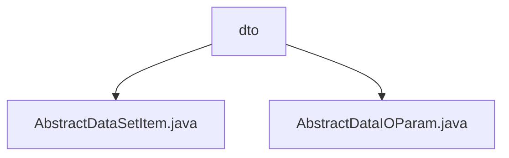

# Basic Information

|      |      |
|------|------|
| Name | dto |
| Language | .java |
| Code Path | WeFe/board/board-service/src/main/java/com/welab/wefe/board/service/component/base/dto |
| Package Name | docs.board.board-service.src.main.java.com.welab.wefe.board.service.component.base.dto |
| Brief Description | AbstractDataSetItem is an abstract class that inherits from AbstractCheckModel, containing required fields memberId, memberRole, dataSetId, and their corresponding getter/setter methods. AbstractDataIOParam is also an abstract class, featuring a generic dataset list dataSetList, and provides methods for filtering datasets by role, supporting queries for both image and tabular data. |

# Description

## Overview  
The core responsibility of this module is to provide abstract base classes for data interaction, standardizing the structured processing of dataset items and parameters. The interface specification mandates member ID, role, and dataset ID as required fields (enforced via @Check annotation) and supports dynamic operations on generic dataset lists. Key data structures include AbstractDataSetItem (containing the memberId/memberRole/dataSetId triplet) and AbstractDataIOParam (wrapping generic dataset lists). External dependencies are limited to two data query services: ImageDataSetService and TableDataSetService. For example, the getMyJobDataSet method automatically routes to image or tabular data processing services.  

## Primary Business Scenarios  
The module adopts a "data pipeline" pattern to handle heterogeneous data sources. The main workflow involves: first validating basic fields via AbstractDataSetItem, then dynamically filtering datasets by role through AbstractDataIOParam. Typical applications include data permission control in federated learning (e.g., different roles accessing distinct datasets) and adaptive data type processing (automatically invoking corresponding services). The interaction pattern resembles the factory method, where getMyJobDataSetItem implements conditional filtering, and getMyJobDataSet completes service routing. For instance, tabular data queries transparently pass parameters to TableDataSetService for execution.

### Package Internal Structure View

This flowchart illustrates the structural relationships within the dto directory of the board-service module in the WeFe project. The dto serves as the parent node containing two child nodes: AbstractDataSetItem.java and AbstractDataIOParam.java. Both files are foundational abstract classes for data transfer objects, designed to standardize data interaction formats between components.

# File List

| Name   | Type  | Description |
|-------|------|-------------|
| [AbstractDataSetItem.java](AbstractDataSetItem.md) | file | The abstract class AbstractDataSetItem extends AbstractCheckModel and includes required fields memberId, memberRole, and dataSetId along with their getter/setter methods. |
| [AbstractDataIOParam.java](AbstractDataIOParam.md) | file | The abstract class AbstractDataIOParam<T> contains a dataset list and two methods: getMyJobDataSetItem filters data items based on roles, while getMyJobDataSet retrieves corresponding data resources. It supports two data types: images and tables. |

