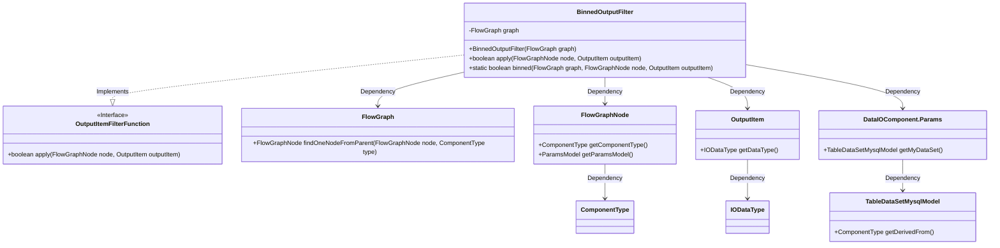

# Basic Information

|      |      |
|------|------|
| Name | BinnedOutputFilter |
| Language | .java |
| Code Path | WeFe/board/board-service/src/main/java/com/welab/wefe/board/service/component/base/filter/BinnedOutputFilter.java |
| Package Name | com.welab.wefe.board.service.component.base.filter |
| Dependencies | ['com.welab.wefe.board.service.component.DataIOComponent', 'com.welab.wefe.board.service.component.base.io.IODataType', 'com.welab.wefe.board.service.component.base.io.OutputItem', 'com.welab.wefe.board.service.database.entity.data_resource.TableDataSetMysqlModel', 'com.welab.wefe.board.service.model.FlowGraph', 'com.welab.wefe.board.service.model.FlowGraphNode', 'com.welab.wefe.common.wefe.enums.ComponentType'] |
| Brief Description | The BinnedOutputFilter class determines whether node data has undergone binning processing by checking the data type, alignment status, node type, and whether the parent node or data source is of a binning type. |

# Description

The BinnedOutputFilter class implements the OutputItemFilterFunction interface to determine whether node data has undergone binning processing. Its core method, binned, performs multi-condition validation: the output data type must be a DataSetInstance; the data must be aligned; the current node or a parent node contains a binning component; or the data source originates from binning processing. If any condition is met, it returns true; otherwise, it returns false.

# Class Summary

| Name   | Type  | Description |
|-------|------|-------------|
| BinnedOutputFilter | class | The BinnedOutputFilter class is used to determine whether node data has undergone binning processing, checking data types, alignment status, node types, and whether parent nodes or data sources contain binning components. |


## Class BinnedOutputFilter

|      |      |
|------|------|
| Access Modifier | public |
| Type | class |
| Name | BinnedOutputFilter |
| Description | The BinnedOutputFilter class is used to determine whether node data has undergone binning processing, checking data types, alignment status, node types, and whether parent nodes or data sources contain binning components. |


### UML Class Diagram



This code defines a `BinnedOutputFilter` class that implements the `OutputItemFilterFunction` interface, used to determine whether an output item has undergone binning processing. The class checks data sources, component types, and parent nodes to determine if the data has been binned. The class diagram illustrates the dependencies between `BinnedOutputFilter` and classes such as `FlowGraph`, `FlowGraphNode`, and `OutputItem`, as well as the interface `OutputItemFilterFunction` it implements. The structure clearly reflects the interactions and data flow between the various components in the code.


### Internal Method Call Graph

```mermaid
graph TD
    A["Class BinnedOutputFilter"]
    B["Property: FlowGraph graph"]
    C["Constructor: BinnedOutputFilter(FlowGraph graph)"]
    D["Method: boolean apply(FlowGraphNode node, OutputItem outputItem)"]
    E["Static Method: boolean binned(FlowGraph graph, FlowGraphNode node, OutputItem outputItem)"]
    F["Check: outputItem.getDataType() != IODataType.DataSetInstance"]
    G["Check: !IntersectedOutputFilter.intersected(graph, node, outputItem)"]
    H["Check: node.getComponentType() == ComponentType.Binning"]
    I["Check: graph.findOneNodeFromParent(node, ComponentType.Binning) != null"]
    J["Check: dataIONode.getParamsModel() returns myDataSet.getDerivedFrom() == ComponentType.Binning"]
    K["Return false"]

    A --> B
    A --> C
    A --> D
    A -.-> E
    D --> E
    E --> F
    F -->|Yes| K
    F -->|No| G
    G -->|Yes| K
    G -->|No| H
    H -->|Yes| Return true
    H -->|No| I
    I -->|Yes| Return true
    I -->|No| J
    J -->|Yes| Return true
    J -->|No| K
```

This flowchart illustrates the logical structure of the BinnedOutputFilter class, focusing on the decision-making process of the binned method. The method determines whether data has undergone binning processing through five conditional checks: data type validation, data alignment verification, current node type validation, parent node chain verification, and data source derivation validation. Each check is connected by arrows, forming a complete logical judgment chain that ultimately returns a boolean result. The flowchart clearly presents the nested conditional structure and return paths within the method.

### Field List

| Name  | Type  | Description |
|-------|-------|------|
| graph | FlowGraph | Private immutable flowchart object. |

### Method List

| Name  | Type  | Description |
|-------|-------|------|
| apply | boolean | This method overrides the apply function, calls the binned method to process nodes and output items, and returns a boolean result. |
| binned | boolean | This method determines whether the data has undergone binning processing by checking the output data type, data alignment, whether the current node or parent node is of binning type, or whether the data source originates from binned data. |


