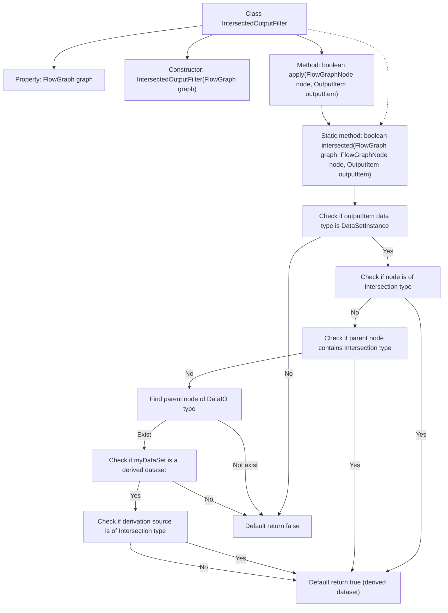

# Basic Information

|      |      |
|------|------|
| Name | IntersectedOutputFilter |
| Language | .java |
| Code Path | WeFe/board/board-service/src/main/java/com/welab/wefe/board/service/component/base/filter/IntersectedOutputFilter.java |
| Package Name | com.welab.wefe.board.service.component.base.filter |
| Dependencies | ['com.welab.wefe.board.service.component.DataIOComponent', 'com.welab.wefe.board.service.component.base.io.IODataType', 'com.welab.wefe.board.service.component.base.io.OutputItem', 'com.welab.wefe.board.service.database.entity.data_resource.TableDataSetMysqlModel', 'com.welab.wefe.board.service.model.FlowGraph', 'com.welab.wefe.board.service.model.FlowGraphNode', 'com.welab.wefe.common.wefe.enums.ComponentType'] |
| Brief Description | The `IntersectedOutputFilter` class is used to determine whether an output item is intersection data. It checks the node type, whether the parent node contains an intersection component, and whether the data source comes from a derived dataset to determine the result. If the data source is a derived dataset, it is considered aligned by default. |

# Description

The `IntersectedOutputFilter` is a class that implements the `OutputItemFilterFunction` interface, designed to determine whether an output item constitutes intersection data. Its core logic is implemented through the static `intersected` method: First, it checks if the data type is `DataSetInstance`. If either the current node or its parent node is of type `Intersection`, it returns `true`. For `DataIO` nodes, it returns `false` if the dataset is non-derived; if derived from `Intersection` or classified as any derived dataset, it is treated as intersection data. This method employs multi-level conditional checks based on flowchart nodes and component types to ultimately determine whether the data is aligned.

# Class Summary

| Name   | Type  | Description |
|-------|------|-------------|
| IntersectedOutputFilter | class | The `IntersectedOutputFilter` class is used to determine whether an output item is intersection data by checking the node type, parent node, and data source derivation relationships. |


## Class IntersectedOutputFilter

|      |      |
|------|------|
| Access Modifier | public |
| Type | class |
| Name | IntersectedOutputFilter |
| Description | The `IntersectedOutputFilter` class is used to determine whether an output item is intersection data by checking the node type, parent node, and data source derivation relationships. |


### UML Class Diagram

```mermaid
classDiagram
    class IntersectedOutputFilter {
        -FlowGraph graph
        +IntersectedOutputFilter(FlowGraph graph)
        +boolean apply(FlowGraphNode node, OutputItem outputItem)
        +static boolean intersected(FlowGraph graph, FlowGraphNode node, OutputItem outputItem)
    }

    class FlowGraph {
        +FlowGraphNode findOneNodeFromParent(FlowGraphNode node, ComponentType type)
    }

    class FlowGraphNode {
        +ComponentType getComponentType()
        +ParamsModel getParamsModel()
    }

    class OutputItem {
        +IODataType getDataType()
    }

    class DataIOComponent {
        class Params {
            +TableDataSetMysqlModel getMyDataSet()
        }
    }

    class TableDataSetMysqlModel {
        +boolean isDerivedResource()
        +ComponentType getDerivedFrom()
    }

    class ComponentType {
        <<Enumeration>>
        Intersection
        DataIO
    }

    class IODataType {
        <<Enumeration>>
        DataSetInstance
    }

    IntersectedOutputFilter --> FlowGraph : Dependency
    IntersectedOutputFilter --> FlowGraphNode : Dependency
    IntersectedOutputFilter --> OutputItem : Dependency
    FlowGraphNode --> ComponentType : Dependency
    FlowGraphNode --> DataIOComponent.Params : Dependency
    DataIOComponent.Params --> TableDataSetMysqlModel : Dependency
    OutputItem --> IODataType : Dependency
```

This code implements an output filter to determine whether a given output item is related to intersection nodes defined in the flow graph. The core logic includes: checking if the data type is an instance, determining if the current node is an intersection node, finding intersection nodes from parent nodes, and verifying the source of derived datasets. The filter employs multi-level conditional checks to validate output items, demonstrating deep analysis of data flow graphs and rigorous handling of boundary conditions.


### Internal Method Call Graph



This flowchart illustrates the core logic of the IntersectedOutputFilter class, demonstrating how multi-level conditional checks determine whether an output item belongs to intersection data. Starting from data type verification, it sequentially validates node type, parent node chain, and data source derivation relationships, ultimately yielding a boolean result. The process contains 5 main decision branches and 2 default return paths, comprehensively covering all conditional check scenarios in the code.

### Field List

| Name  | Type  | Description |
|-------|-------|------|
| graph | FlowGraph | Private immutable flowchart instance. |

### Method List

| Name  | Type  | Description |
|-------|-------|------|
| apply | boolean | Java method override, checks if the node intersects with the output item, returns a boolean value. |
| intersected | boolean | Check if the data is aligned: The data type must be an instance; the current or parent node must be of an aligned type; if the data source is derived and originates from an aligned type, it is considered aligned; otherwise, it is non-aligned by default. |


