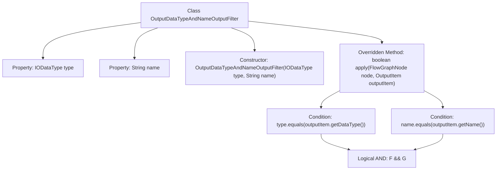

# Basic Information

|      |      |
|------|------|
| Name | OutputDataTypeAndNameOutputFilter |
| Language | .java |
| Code Path | WeFe/board/board-service/src/main/java/com/welab/wefe/board/service/component/base/filter/OutputDataTypeAndNameOutputFilter.java |
| Package Name | com.welab.wefe.board.service.component.base.filter |
| Dependencies | ['com.welab.wefe.board.service.component.base.io.IODataType', 'com.welab.wefe.board.service.component.base.io.OutputItem', 'com.welab.wefe.board.service.model.FlowGraphNode'] |
| Brief Description | The `OutputDataTypeAndNameOutputFilter` class implements the `OutputItemFilterFunction` interface. It receives data type and name parameters through its constructor, and the `apply` method checks whether the output item matches the specified type and name. |

# Description

OutputDataTypeAndNameOutputFilter is a Java class that implements the OutputItemFilterFunction interface, designed to filter output items based on data type and name. The class contains two private member variables: `type` (of type IODataType) and `name` (of type String), which are initialized via the constructor. The `apply` method takes FlowGraphNode and OutputItem parameters, checks whether the output item's data type and name match the stored `type` and `name` in the class, and returns a boolean value indicating whether the item passes the filter.

# Class Summary

| Name   | Type  | Description |
|-------|------|-------------|
| OutputDataTypeAndNameOutputFilter | class | The `OutputDataTypeAndNameOutputFilter` class implements the `OutputItemFilterFunction` interface, filtering output items by data type and name. The constructor accepts type and name parameters, and the `apply` method checks whether the output item matches. |


## Class OutputDataTypeAndNameOutputFilter

|      |      |
|------|------|
| Access Modifier | public |
| Type | class |
| Name | OutputDataTypeAndNameOutputFilter |
| Description | The `OutputDataTypeAndNameOutputFilter` class implements the `OutputItemFilterFunction` interface, filtering output items by data type and name. The constructor accepts type and name parameters, and the `apply` method checks whether the output item matches. |


### UML Class Diagram

```mermaid
classDiagram
    class OutputDataTypeAndNameOutputFilter {
        -IODataType type
        -String name
        +OutputDataTypeAndNameOutputFilter(IODataType type, String name)
        +boolean apply(FlowGraphNode node, OutputItem outputItem)
    }

    <<Interface>> OutputItemFilterFunction {
        +boolean apply(FlowGraphNode node, OutputItem outputItem)
    }

    OutputDataTypeAndNameOutputFilter ..|> OutputItemFilterFunction : implements
    OutputDataTypeAndNameOutputFilter --> IODataType : depends
    OutputDataTypeAndNameOutputFilter --> OutputItem : depends
    OutputDataTypeAndNameOutputFilter --> FlowGraphNode : depends
```

Class diagram description: The OutputDataTypeAndNameOutputFilter class implements the OutputItemFilterFunction interface, containing two private member variables 'type' and 'name' initialized via constructor. Its core method apply() takes FlowGraphNode and OutputItem parameters to compare whether an output item's data type and name match. This class depends on three external classes - IODataType, OutputItem, and FlowGraphNode - to implement output item filtering functionality based on type and name.


### Internal Method Call Graph



This flowchart illustrates the structure and working principle of the OutputDataTypeAndNameOutputFilter class. The class initializes two properties, data type (type) and name (name), through its constructor, and implements the filtering logic in the apply method: checking whether the output item's data type and name match the preset values. The two conditions are combined via a logical AND operation, ultimately returning a boolean result. The flowchart clearly presents the attribute definitions, constructor, and the calling relationships of the core filtering logic.

### Field List

| Name  | Type  | Description |
|-------|-------|------|
| name | String | The private immutable string variable name. |
| type | IODataType | Private immutable IODataType variable. |

### Method List

| Name  | Type  | Description |
|-------|-------|------|
| apply | boolean | This method checks whether the node type and name match the data type and name of the output item, returning a boolean result. |


