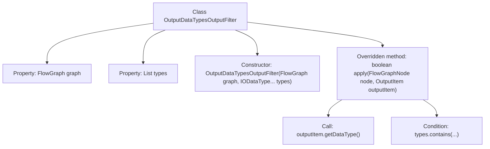

# Basic Information

|      |      |
|------|------|
| Name | OutputDataTypesOutputFilter |
| Language | .java |
| Code Path | WeFe/board/board-service/src/main/java/com/welab/wefe/board/service/component/base/filter/OutputDataTypesOutputFilter.java |
| Package Name | com.welab.wefe.board.service.component.base.filter |
| Dependencies | ['com.welab.wefe.board.service.component.base.io.IODataType', 'com.welab.wefe.board.service.component.base.io.OutputItem', 'com.welab.wefe.board.service.model.FlowGraph', 'com.welab.wefe.board.service.model.FlowGraphNode', 'java.util.Arrays', 'java.util.List'] |
| Brief Description | The `OutputDataTypesOutputFilter` class implements the `OutputItemFilterFunction` interface to filter output items based on specified data types. The constructor accepts a `FlowGraph` and a list of data types, while the `apply` method checks whether the output item's data type matches. |

# Description

This is a Java class named OutputDataTypesOutputFilter, which implements the OutputItemFilterFunction interface. The class is used to filter output items based on data types and contains two member variables: a FlowGraph-type graph and an IODataType list-type types. The constructor accepts a FlowGraph object and a variable number of IODataType parameters, converting the latter into a list for storage. The core method is apply, which takes FlowGraphNode and OutputItem parameters and determines whether to retain the output item by checking if its data type is within the predefined type list.

# Class Summary

| Name   | Type  | Description |
|-------|------|-------------|
| OutputDataTypesOutputFilter | class | The `OutputDataTypesOutputFilter` class implements the `OutputItemFilterFunction` interface to filter output items based on a specified list of data types. The constructor accepts a `FlowGraph` and an array of data types, while the `apply` method checks whether the output item's data type matches. |


## Class OutputDataTypesOutputFilter

|      |      |
|------|------|
| Access Modifier | public |
| Type | class |
| Name | OutputDataTypesOutputFilter |
| Description | The `OutputDataTypesOutputFilter` class implements the `OutputItemFilterFunction` interface to filter output items based on a specified list of data types. The constructor accepts a `FlowGraph` and an array of data types, while the `apply` method checks whether the output item's data type matches. |


### UML Class Diagram

```mermaid
classDiagram
    class OutputDataTypesOutputFilter {
        -FlowGraph graph
        -List~IODataType~ types
        +OutputDataTypesOutputFilter(FlowGraph graph, IODataType... types)
        +boolean apply(FlowGraphNode node, OutputItem outputItem)
    }
    <<Interface>> OutputItemFilterFunction {
        +boolean apply(FlowGraphNode node, OutputItem outputItem)
    }
    class IODataType {
        // Data type enum or class
    }
    class FlowGraph {
        // Flow graph structure class
    }
    class FlowGraphNode {
        // Flow graph node class
    }
    class OutputItem {
        -IODataType dataType
        +IODataType getDataType()
    }

    OutputDataTypesOutputFilter ..|> OutputItemFilterFunction : implements
    OutputDataTypesOutputFilter --> FlowGraph : depends
    OutputDataTypesOutputFilter --> IODataType : depends
    OutputDataTypesOutputFilter --> FlowGraphNode : depends
    OutputDataTypesOutputFilter --> OutputItem : depends
    OutputItem --> IODataType : depends
```

This code demonstrates a filter class `OutputDataTypesOutputFilter` that implements the `OutputItemFilterFunction` interface. It determines whether to filter output items by checking if the data type of `OutputItem` matches a predefined list of types. The class diagram clearly shows the dependencies between this filter and the flow graph structure, nodes, output items, and data types. Its core functionality is implemented through the `apply` method to perform data type-based filtering, reflecting the design philosophy of the strategy pattern.


### Internal Method Call Graph



This code defines a filter class implementing the OutputItemFilterFunction interface, used to verify whether an output item's data type matches predefined type lists. The flowchart illustrates the class structure, including two private properties (graph and types), a varargs constructor, and the core apply method implementation logic. The apply method determines whether to filter the output item by retrieving its data type and checking for matches in the types list.

### Field List

| Name  | Type  | Description |
|-------|-------|------|
| types | List<IODataType> | Private immutable list storing elements of type IODataType. |
| graph | FlowGraph | The private immutable FlowGraph object graph. |

### Method List

| Name  | Type  | Description |
|-------|-------|------|
| apply | boolean | The method checks whether the data type of the output item is within the specified set and returns a boolean result. |


