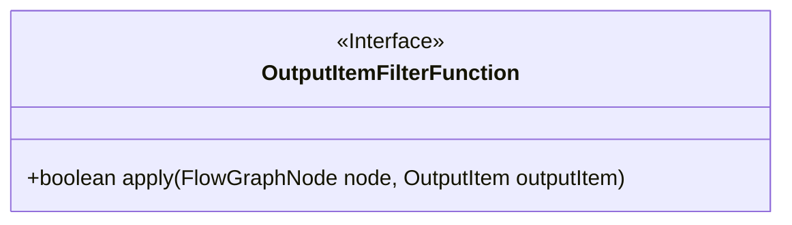
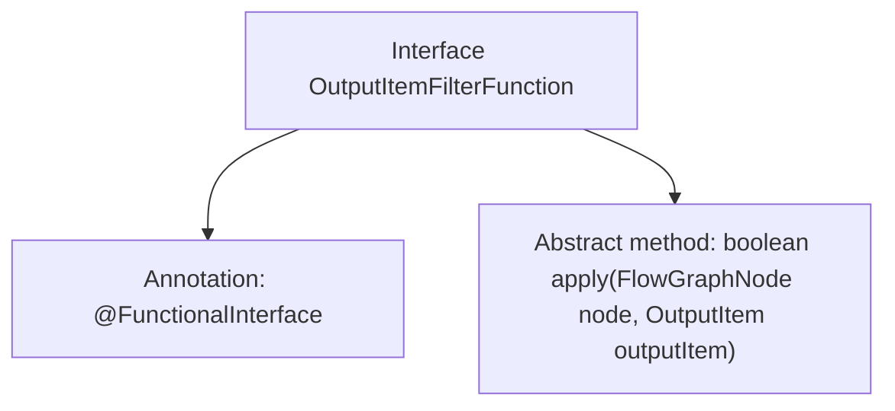

# Basic Information

|      |      |
|------|------|
| Name | OutputItemFilterFunction |
| Language | .java |
| Code Path | WeFe/board/board-service/src/main/java/com/welab/wefe/board/service/component/base/filter/OutputItemFilterFunction.java |
| Package Name | com.welab.wefe.board.service.component.base.filter |
| Dependencies | ['com.welab.wefe.board.service.component.base.io.OutputItem', 'com.welab.wefe.board.service.model.FlowGraphNode'] |
| Brief Description | The functional interface OutputItemFilterFunction defines the method apply, which accepts FlowGraphNode and OutputItem parameters and returns a boolean value. |

# Description

This is a functional interface named OutputItemFilterFunction, used to determine whether an output item meets the filtering criteria. The interface defines the apply method, which takes a FlowGraphNode and an OutputItem as parameters and returns a boolean value indicating whether the item passes the filter. The interface is marked with the @FunctionalInterface annotation, indicating it is a functional interface and can only contain one abstract method.

# Class Summary

| Name   | Type  | Description |
|-------|------|-------------|
| OutputItemFilterFunction | interface | This is a functional interface that defines a method `apply`, used to determine whether a node and an output item meet the conditions. |

## Class OutputItemFilterFunction

|      |      |
|------|------|
| Access Modifier | @FunctionalInterface;public |
| Type | interface |
| Name | OutputItemFilterFunction |
| Description | This is a functional interface that defines a method `apply`, used to determine whether a node and an output item meet the conditions. |

### UML Class Diagram

This class diagram illustrates a functional interface `OutputItemFilterFunction`, which defines a single abstract method `apply` that takes `FlowGraphNode` and `OutputItem` as parameters and returns a boolean value. As a functional interface, it is suitable for Lambda expressions or method reference scenarios, primarily used to implement filtering logic for nodes and output items. The `@FunctionalInterface` annotation ensures compliance with functional programming specifications.

### Internal Method Call Graph

This flowchart depicts the structure of the OutputItemFilterFunction interface, which is a functional interface (marked by the @FunctionalInterface annotation) containing a single abstract method apply. The method accepts two parameters, FlowGraphNode and OutputItem, and returns a boolean value, serving to implement custom filtering logic. The diagram clearly illustrates the core components of the interface: the functional annotation and the definition of the sole abstract method, conforming to the standard pattern of Java functional interfaces.

### Field List

| Name  | Type  | Description |
|-------|-------|------|

### Method List

| Name  | Type  | Description |
|-------|-------|------|
| apply | boolean | The method `apply` takes a node and an output item as input and returns a boolean value indicating whether the operation was successful. |

