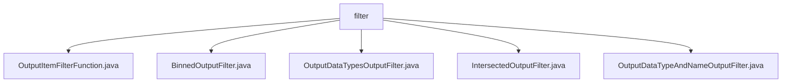

# Basic Information

|      |      |
|------|------|
| Name | filter |
| Language | .java |
| Code Path | WeFe/board/board-service/src/main/java/com/welab/wefe/board/service/component/base/filter |
| Package Name | docs.board.board-service.src.main.java.com.welab.wefe.board.service.component.base.filter |
| Brief Description | OutputItemFilterFunction is a functional interface used to filter output items. BinnedOutputFilter checks whether the data is binned. OutputDataTypesOutputFilter filters by data type. IntersectedOutputFilter determines if the data is intersected. OutputDataTypeAndNameOutputFilter filters by type and name. |

# Description

## Overview  
The core responsibility of this module is to implement various output item filtering strategies through the functional interface OutputItemFilterFunction, resembling an event bus pattern. The interface specification requires implementing classes to include an apply method that accepts FlowGraphNode and OutputItem parameters and returns a boolean value. Key data structures include FlowGraphNode (flowchart node), OutputItem (output item), and IODataType (data type enumeration). The only external dependency is the Java standard library. For example, BinnedOutputFilter determines data validity by checking binned component features.

## Primary Business Scenarios  
The module provides five typical filtering scenarios: binned data detection (BinnedOutputFilter), data type matching (OutputDataTypesOutputFilter), intersection data identification (IntersectedOutputFilter), and composite condition filtering (OutputDataTypeAndNameOutputFilter). All business processes follow the "node-output item" validation pattern. For instance, IntersectedOutputFilter determines data sources through component inheritance relationships. API integration examples include static method calls (e.g., intersected) and dynamic condition combinations (e.g., types list matching).

### Package Internal Structure View

This flowchart illustrates the file structure relationships under the `filter` directory in the WeFe project. The root node is the `filter` folder, which contains five Java class files implementing distinct filtering functionalities: `OutputItemFilterFunction` handles output item filtering, `BinnedOutputFilter` implements binned output filtering, `OutputDataTypesOutputFilter` manages output data type filtering, `IntersectedOutputFilter` performs intersection filtering, and `OutputDataTypeAndNameOutputFilter` processes both data type and name filtering.

# File List

| Name   | Type  | Description |
|-------|------|-------------|
| [OutputItemFilterFunction.java](OutputItemFilterFunction.md) | file | The functional interface OutputItemFilterFunction defines the method apply, which accepts FlowGraphNode and OutputItem parameters and returns a boolean value. |
| [BinnedOutputFilter.java](BinnedOutputFilter.md) | file | The BinnedOutputFilter class determines whether node data has undergone binning processing by checking the data type, alignment status, node type, and whether the parent node or data source is of a binning type. |
| [OutputDataTypesOutputFilter.java](OutputDataTypesOutputFilter.md) | file | The `OutputDataTypesOutputFilter` class implements the `OutputItemFilterFunction` interface to filter output items based on specified data types. The constructor accepts a `FlowGraph` and a list of data types, while the `apply` method checks whether the output item's data type matches. |
| [IntersectedOutputFilter.java](IntersectedOutputFilter.md) | file | The `IntersectedOutputFilter` class is used to determine whether an output item is intersection data. It checks the node type, whether the parent node contains intersection components, and whether the data source is derived from a derived dataset to determine the result. If the data source is a derived dataset, it is considered aligned by default. |
| [OutputDataTypeAndNameOutputFilter.java](OutputDataTypeAndNameOutputFilter.md) | file | The `OutputDataTypeAndNameOutputFilter` class implements the `OutputItemFilterFunction` interface. It receives data type and name parameters through the constructor, and the `apply` method checks whether the output item matches the specified type and name. |

