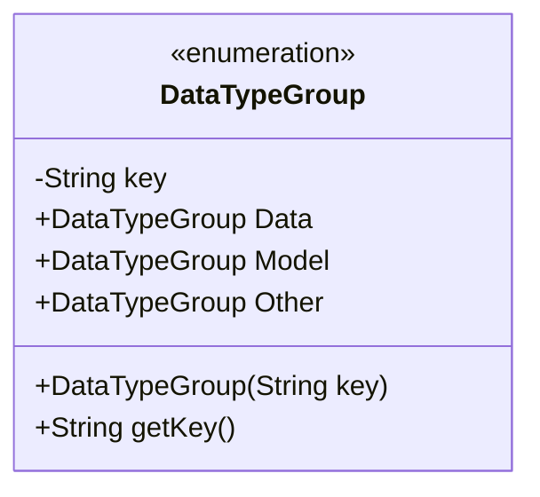
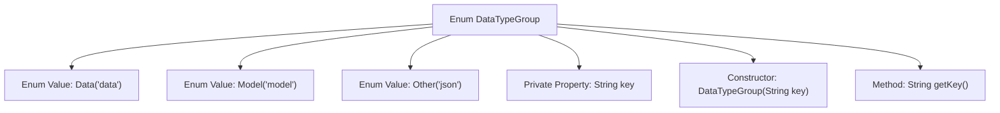

# Basic Information

|      |      |
|------|------|
| Name | DataTypeGroup |
| Language | .java |
| Code Path | WeFe/board/board-service/src/main/java/com/welab/wefe/board/service/component/base/io/DataTypeGroup.java |
| Package Name | com.welab.wefe.board.service.component.base.io |
| Dependencies | [] |
| Brief Description | The enumeration DataTypeGroup defines three data types: Data (key as "data"), Model (key as "model"), and Other (key as "json"). The key values can be obtained through the getKey() method. |

# Description

This is an enum class named DataTypeGroup, which defines three types of data groupings: Data, Model, and Other. Each enum value has a corresponding string key, with Data corresponding to "data", Model to "model", and Other to "json". The enum class includes a private constructor for initializing the key values and a public getKey method for retrieving the key values. The entire structure is concise and clear, used to represent grouping identifiers for different types of data.

# Class Summary

| Name   | Type  | Description |
|-------|------|-------------|
| DataTypeGroup | enum | The DataTypeGroup enumeration defines three data types: Data ("data"), Model ("model"), and Other ("json"). Each type has a corresponding key value, which can be obtained via getKey(). |

## Class DataTypeGroup

|      |      |
|------|------|
| Access Modifier | public |
| Type | enum |
| Name | DataTypeGroup |
| Description | The DataTypeGroup enumeration defines three data types: Data ("data"), Model ("model"), and Other ("json"). Each type has a corresponding key value, which can be obtained via getKey(). |

### UML Class Diagram

This code defines an enumeration class DataTypeGroup, which includes three enum constants: Data, Model, and Other. Each enum constant has an associated string key, initialized via the constructor and retrievable through the getKey() method. The enumeration class is used to represent different types of data groupings, where Data corresponds to "data", Model to "model", and Other to "json". This design is suitable for scenarios requiring a fixed set of types where each type needs to carry additional information.

### Internal Method Call Graph

This flowchart illustrates the structure of the DataTypeGroup enum, which contains three enum values (Data/Model/Other), a private key property, and two methods (constructor and getKey). The enum initializes the key value through its constructor and provides access via the getKey method. This design pattern is commonly used to define fixed sets of constants, where each enum instance is bound to a specific string identifier.

### Field List

| Name  | Type  | Description |
|-------|-------|------|

### Method List

| Name  | Type  | Description |
|-------|-------|------|

