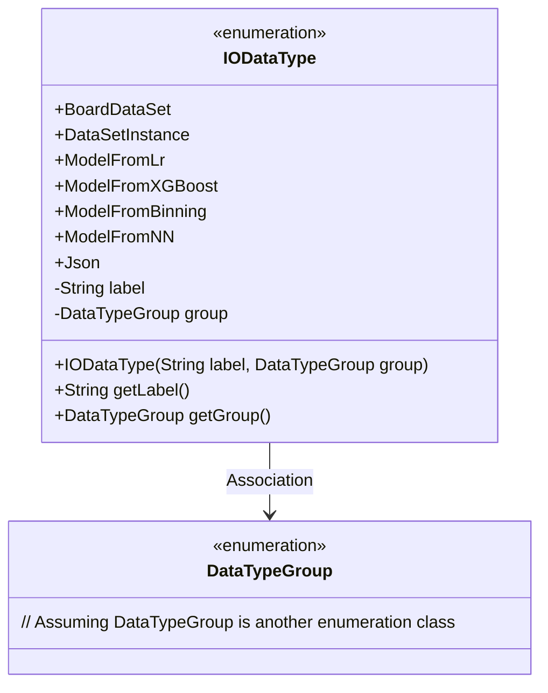

# Basic Information

|      |      |
|------|------|
| Name | IODataType |
| Language | .java |
| Code Path | WeFe/board/board-service/src/main/java/com/welab/wefe/board/service/component/base/io/IODataType.java |
| Package Name | com.welab.wefe.board.service.component.base.io |
| Dependencies | [] |
| Brief Description | The enumeration IODataType defines data types, including raw dataset, loaded dataset, logistic regression model, XGBoost model, binning model, deep learning model, and Json result, with each type having label and group attributes. |

# Description

This enumeration defines IODataType, which includes various data types categorized into three groups: Data, Model, and Other. Specific types include raw datasets, loaded datasets, logistic regression models, XGBoost models, binning models, deep learning models, and Json results. Each type has corresponding labels and group affiliations, which can be retrieved using the getLabel and getGroup methods.

# Class Summary

| Name   | Type  | Description |
|-------|------|-------------|
| IODataType | enum | The enumeration IODataType defines data types, including raw datasets, loaded datasets, logistic regression models, XGBoost models, binning models, deep learning models, and Json results, with each type having label and group attributes. |

## Class IODataType

|      |      |
|------|------|
| Access Modifier | public |
| Type | enum |
| Name | IODataType |
| Description | The enumeration IODataType defines data types, including raw datasets, loaded datasets, logistic regression models, XGBoost models, binning models, deep learning models, and Json results, with each type having label and group attributes. |

### UML Class Diagram

This code defines an enumeration class IODataType containing 7 enumeration constants, each associated with a label string and a DataTypeGroup category. The class diagram illustrates the enumeration structure, private fields (label and group), constructor method, and two getter methods, with an arrow indicating the association relationship with the DataTypeGroup enumeration. This enumeration is used to classify and identify different types of data input/output, such as raw datasets, various models, and JSON results.

### Internal Method Call Graph

```mermaid
graph TD
    A["Enum IODataType"]
    B["Enum Value: BoardDataSet('Raw Dataset', DataTypeGroup.Data)"]
    C["Enum Value: DataSetInstance('Loaded Dataset', DataTypeGroup.Data)"]
    D["Enum Value: ModelFromLr('Logistic Regression Model', DataTypeGroup.Model)"]
    E["Enum Value: ModelFromXGBoost('XGBoost Model', DataTypeGroup.Model)"]
    F["Enum Value: ModelFromBinning('Binned Model', DataTypeGroup.Model)"]
    G["Enum Value: ModelFromNN('Deep Learning Model', DataTypeGroup.Model)"]
    H["Enum Value: Json('Json Result', DataTypeGroup.Other)"]
    I["Property: String label"]
    J["Property: DataTypeGroup group"]
    K["Constructor: IODataType(String label, DataTypeGroup group)"]
    L["Method: String getLabel()"]
    M["Method: DataTypeGroup getGroup()"]

    A --> B
    A --> C
    A --> D
    A --> E
    A --> F
    A --> G
    A --> H
    A --> I
    A --> J
    A --> K
    A --> L
    A --> M
```

This flowchart illustrates the structure of the IODataType enum, which contains 8 enum values, 2 private properties, 1 constructor, and 2 public methods. Each enum value is initialized via the constructor with label and group properties, where label describes the data type name and group indicates the category (Data/Model/Other). This design is used to uniformly manage metadata of different data types, facilitating the identification and processing of different types of data objects during IO operations.

### Field List

| Name  | Type  | Description |
|-------|-------|------|

### Method List

| Name  | Type  | Description |
|-------|-------|------|

