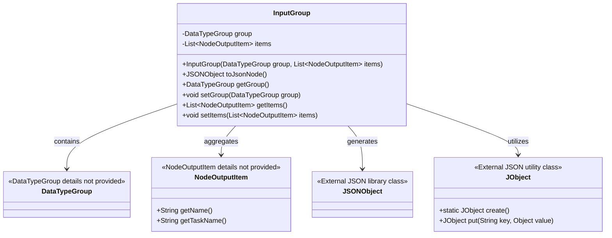
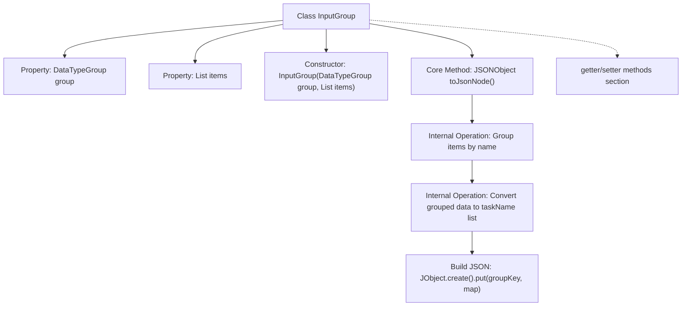

# Basic Information

|      |      |
|------|------|
| Name | InputGroup |
| Language | .java |
| Code Path | WeFe/board/board-service/src/main/java/com/welab/wefe/board/service/component/base/io/InputGroup.java |
| Package Name | com.welab.wefe.board.service.component.base.io |
| Dependencies | ['com.alibaba.fastjson.JSONObject', 'com.welab.wefe.common.util.JObject', 'java.util.HashMap', 'java.util.List', 'java.util.Map', 'java.util.stream.Collectors'] |
| Brief Description | The InputGroup class includes DataTypeGroup and a list of NodeOutputItem, providing the toJsonNode method to convert data into the JSON structure required by the kernel, and contains getter/setter methods. |

# Description

The `InputGroup` class is a Java class designed for managing input data groupings, which includes a `group` attribute of type `DataTypeGroup` and an `items` attribute consisting of a list of `NodeOutputItem`. The constructor initializes the class by accepting these two parameters. The core method, `toJsonNode`, groups the `items` by name and converts them into a mapped structure containing a list of task names, ultimately encapsulating the result as a `JSONObject` for return. The class also provides getter/setter methods for `group` and `items`. Its overall functionality is to organize input data into the structured JSON format required by the kernel.

# Class Summary

| Name   | Type  | Description |
|-------|------|-------------|
| InputGroup | class | The InputGroup class encapsulates data type groups and output item lists, providing the toJsonNode method to organize data by name and convert it into JSON format, along with getter/setter methods. |

## Class InputGroup

|      |      |
|------|------|
| Access Modifier | public |
| Type | class |
| Name | InputGroup |
| Description | The InputGroup class encapsulates data type groups and output item lists, providing the toJsonNode method to organize data by name and convert it into JSON format, along with getter/setter methods. |

### UML Class Diagram

This class diagram illustrates the core structure and relationships of InputGroup. As a data converter, InputGroup encapsulates a DataTypeGroup enumeration and a list of NodeOutputItems, converting data into JSON format via the toJsonNode() method. It relies on DataTypeGroup for data classification, aggregates multiple NodeOutputItem objects to collect output data, utilizes the JObject utility to construct JSON structures, and ultimately returns a JSONObject result. This design implements functionalities for data grouping, name mapping, and JSON serialization, making it suitable for scenarios requiring structured output to the kernel.

### Internal Method Call Graph

This flowchart illustrates the complete structure of the InputGroup class, with emphasis on the processing flow of the toJsonNode() method. The method first groups items by name through stream operations, then converts elements within each group into a taskName list, and finally constructs a JSON object containing the group key and mapped data. The class also includes standard property access methods, with the overall design enabling efficient conversion from data structures to JSON format, suitable for core processing scenarios.

### Field List

| Name  | Type  | Description |
|-------|-------|------|
| items | List<NodeOutputItem> | List of private node output items. |
| group | DataTypeGroup | Private data type group variable `group`. |

### Method List

| Name  | Type  | Description |
|-------|-------|------|
| toJsonNode | JSONObject | Group the items by name, extract the list of task names from each group, construct a JSON object, and return it. |
| getGroup | DataTypeGroup | The method returns a group object of type DataTypeGroup. |
| setGroup | void | Set the public method for the data type group, assigning the input parameters to the member variable `group` of the class. |
| getItems | List<NodeOutputItem> | The method returns a list of items of type NodeOutputItem. |
| setItems | void | Set the node output item list. |

