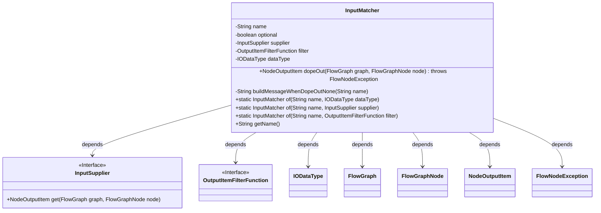
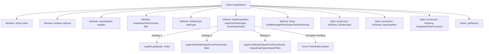

# Basic Information

|      |      |
|------|------|
| Name | InputMatcher |
| Language | .java |
| Code Path | WeFe/board/board-service/src/main/java/com/welab/wefe/board/service/component/base/io/InputMatcher.java |
| Package Name | com.welab.wefe.board.service.component.base.io |
| Dependencies | ['com.welab.wefe.board.service.component.base.filter.OutputDataTypesOutputFilter', 'com.welab.wefe.board.service.component.base.filter.OutputItemFilterFunction', 'com.welab.wefe.board.service.exception.FlowNodeException', 'com.welab.wefe.board.service.model.FlowGraph', 'com.welab.wefe.board.service.model.FlowGraphNode', 'com.welab.wefe.common.wefe.enums.ComponentType'] |
| Brief Description | The `InputMatcher` class is used to match input nodes, including name, optionality, and three matching strategies (direct supply, filtered lookup, data type matching). It throws an exception and provides error messages when no match is found. |

# Description

The `InputMatcher` class is used to match input items of nodes in a flowchart, containing attributes such as name, optionality, and three matching strategies (direct supply, adapter check, and data type search). The `dopeOut` method attempts the three strategies in order of priority to obtain the input node, throwing an exception and generating corresponding error messages upon failure. It provides three static factory methods to create matchers with different strategies and supports basic operations like retrieving names. Error messages are customized for different scenarios, such as prompts when binning models or training datasets are not found.

# Class Summary

| Name   | Type  | Description |
|-------|------|-------------|
| InputMatcher | class | The InputMatcher class is used to match inputs for nodes in a flowchart, supporting three strategies: direct acquisition via supplier, filtering using a filter, or automatic search by data type. If the match fails and the parameter is not optional, an exception is thrown with the corresponding error message. |

## Class InputMatcher

|      |      |
|------|------|
| Access Modifier | public |
| Type | class |
| Name | InputMatcher |
| Description | The InputMatcher class is used to match inputs for nodes in a flowchart, supporting three strategies: direct acquisition via supplier, filtering using a filter, or automatic search by data type. If the match fails and the parameter is not optional, an exception is thrown with the corresponding error message. |

### UML Class Diagram

This code describes an input matcher class InputMatcher, which locates predecessor node output items in a flow graph through three priority strategies (direct supplier provision, filter matching, and automatic data type search). The class contains a core method dopeOut() implementing the three-level lookup strategy, a private method buildMessageWhenDopeOutNone() generating error messages for unmatched nodes, and three static factory methods for creating instances with different strategies. The class has dependencies with multiple interfaces and classes, including the InputSupplier interface, OutputItemFilterFunction interface, IODataType class, etc., collectively forming a flexible node matching system.

### Internal Method Call Graph

The flowchart depicts the structure of the InputMatcher class and its primary method invocation relationships. The class employs three prioritized strategies (direct supplier retrieval, filter matching, automatic data type search) to infer input nodes, throwing an exception if all fail for non-optional parameters. Constructors support initialization with different strategies, while exception message generation logic incorporates customized prompts for various business scenarios. Overall, it demonstrates a flexible input matching mechanism combining multiple strategies.

### Field List

| Name  | Type  | Description |
|-------|-------|------|
| name | String | Declare a private string variable name. |
| dataType | IODataType | Private IO data type variable dataType. |
| filter | OutputItemFilterFunction | Private filter function variable `filter`. |
| optional | boolean | The boolean private variable `optional` indicates the optional state. |
| supplier | InputSupplier | Private input supply interface instance. |

### Method List

| Name  | Type  | Description |
|-------|-------|------|
| buildMessageWhenDopeOutNone | String | The method returns different prompt messages based on the input name: binning model not found, training dataset unchecked process, validation dataset requires segmented generation, dataset unchecked process. By default, it returns the not found prompt. |
| of | InputMatcher | Create an InputMatcher instance, set the name and data type, then return it. |
| dopeOut | NodeOutputItem | The method `dopeOut` retrieves node output through three strategies: prioritizing the use of `supplier`, followed by `filter`, and finally performing an automatic search based on data type. If no output is found and it is not optional, an exception is thrown. |
| of | InputMatcher | Create an InputMatcher instance, set the name and supplier, then return it. |
| of | InputMatcher | Create a static method named InputMatcher that takes a name and a filter function as parameters, initializes and returns an InputMatcher object. |
| getName | String | Methods to obtain the name, returning the value of the string-type name variable. |

