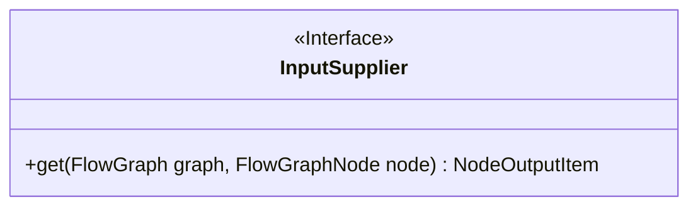
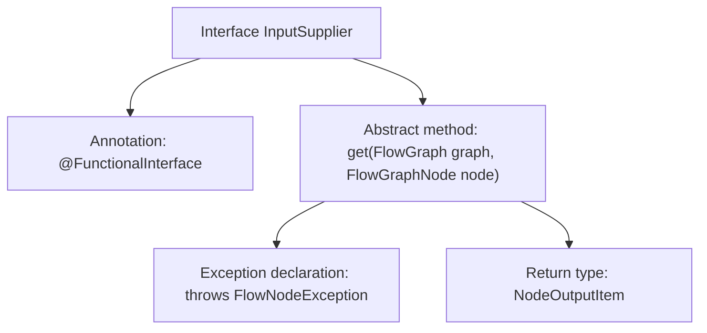

# Basic Information

|      |      |
|------|------|
| Name | InputSupplier |
| Language | .java |
| Code Path | WeFe/board/board-service/src/main/java/com/welab/wefe/board/service/component/base/io/InputSupplier.java |
| Package Name | com.welab.wefe.board.service.component.base.io |
| Dependencies | ['com.welab.wefe.board.service.exception.FlowNodeException', 'com.welab.wefe.board.service.model.FlowGraph', 'com.welab.wefe.board.service.model.FlowGraphNode'] |
| Brief Description | The functional interface InputSupplier defines the method get, which retrieves input items based on the graph and nodes, and may throw exceptions. |

# Description

This is a functional interface named InputSupplier, marked with the @FunctionalInterface annotation. It defines an abstract method `get` that takes two parameters, FlowGraph and FlowGraphNode, returns a NodeOutputItem object, and may throw a FlowNodeException. The interface's documentation states that the `get` method needs to independently locate input nodes regardless of the graph structure. The interface is concise and clear, adhering to the functional programming paradigm, making it suitable for scenarios requiring dynamic retrieval of node inputs.

# Class Summary

| Name   | Type  | Description |
|-------|------|-------------|
| InputSupplier | interface | The functional interface InputSupplier defines the method get, which retrieves a NodeOutputItem based on graph and node, and may throw a FlowNodeException. |

## Class InputSupplier

|      |      |
|------|------|
| Access Modifier | @FunctionalInterface;public |
| Type | interface |
| Name | InputSupplier |
| Description | The functional interface InputSupplier defines the method get, which retrieves a NodeOutputItem based on graph and node, and may throw a FlowNodeException. |

### UML Class Diagram

This class diagram depicts a functional interface `InputSupplier`, which defines a single abstract method `get()`. The method accepts `FlowGraph` and `FlowGraphNode` as parameters, returns a `NodeOutputItem`, and may throw `FlowNodeException`. As a functional interface, it is primarily used for lambda expressions or method references, providing a standardized way to obtain input data for nodes in a flow graph. The interface design embodies the dependency injection principle by passing the graph structure and nodes as parameters, allowing implementing classes to remain decoupled from specific contexts.

### Internal Method Call Graph

This flowchart illustrates the structure of the InputSupplier interface, which is a functional interface (annotated with @FunctionalInterface). Its core is the definition of the abstract get method. This method takes FlowGraph and FlowGraphNode parameters, returns a NodeOutputItem object, and may throw a FlowNodeException. The diagram clearly presents the hierarchical relationships of the interface's annotation, method signature, return type, and exception declaration, conforming to the single abstract method characteristic of functional interfaces.

### Field List

| Name  | Type  | Description |
|-------|-------|------|

### Method List

| Name  | Type  | Description |
|-------|-------|------|
| get | NodeOutputItem | To obtain the node output item, the flowchart and node parameters need to be passed in, and a node exception may be thrown. |

