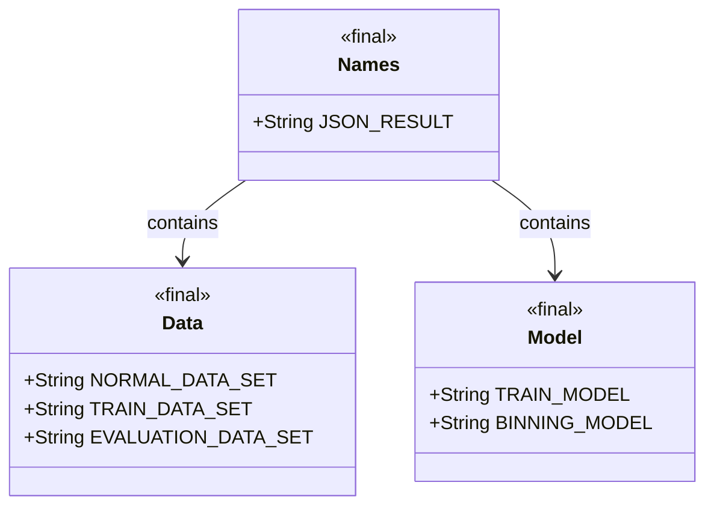
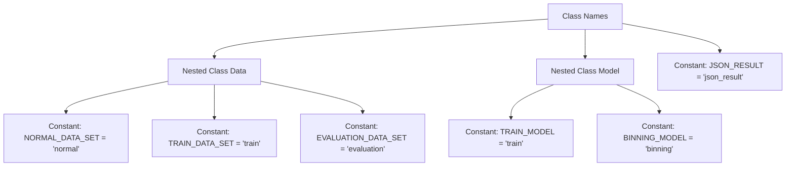

# Basic Information

|      |      |
|------|------|
| Name | Names |
| Language | .java |
| Code Path | WeFe/board/board-service/src/main/java/com/welab/wefe/board/service/component/base/io/Names.java |
| Package Name | com.welab.wefe.board.service.component.base.io |
| Dependencies | [] |
| Brief Description | The Java class `Names` contains static nested classes `Data` and `Model`, which define constant strings for dataset and model types respectively, as well as a JSON result constant. |

# Description

This is a public Java class named Names, consisting of three main parts. The first part is the static nested class Data, which defines three string constants: NORMAL_DATA_SET represents the normal dataset, TRAIN_DATA_SET represents the training dataset, and EVALUATION_DATA_SET represents the evaluation dataset. The second part is the static nested class Model, which defines two string constants: TRAIN_MODEL represents the training model, and BINNING_MODEL represents the binning model. The third part is an independent string constant JSON_RESULT, representing the result in JSON format. The entire class is used to centrally manage various name constants utilized in the project.

# Class Summary

| Name   | Type  | Description |
|-------|------|-------------|
| Names | class | The Java class `Names` contains static nested classes `Data` and `Model`, which define constant strings for dataset and model types respectively, as well as a JSON result constant. |

## Class Names

|      |      |
|------|------|
| Access Modifier | public |
| Type | class |
| Name | Names |
| Description | The Java class `Names` contains static nested classes `Data` and `Model`, which define constant strings for dataset and model types respectively, as well as a JSON result constant. |

### UML Class Diagram

This code defines a class named `Names`, which contains two static inner classes `Data` and `Model`, along with a static constant `JSON_RESULT`. The `Data` class defines constant strings for three types of datasets, while the `Model` class defines constant strings for two types of models. The `Names` class acts as a container, organizing these constant definitions through containment relationships for unified management and access. All classes and fields are declared as `final`, indicating they are immutable constant definitions.

### Internal Method Call Graph

This flowchart illustrates the structure of the Names class, which contains two nested static classes (Data and Model) and a top-level constant JSON_RESULT. The Data class defines three dataset type constants, while the Model class includes two model type constants. All members are of public static final type, indicating this is an immutable constant definition class designed for centralized management of string constants within the project.

### Field List

| Name  | Type  | Description |
|-------|-------|------|
| JSON_RESULT = "json_result" | String | Define a static constant JSON_RESULT with the value "json_result". |

### Method List

| Name  | Type  | Description |
|-------|-------|------|

