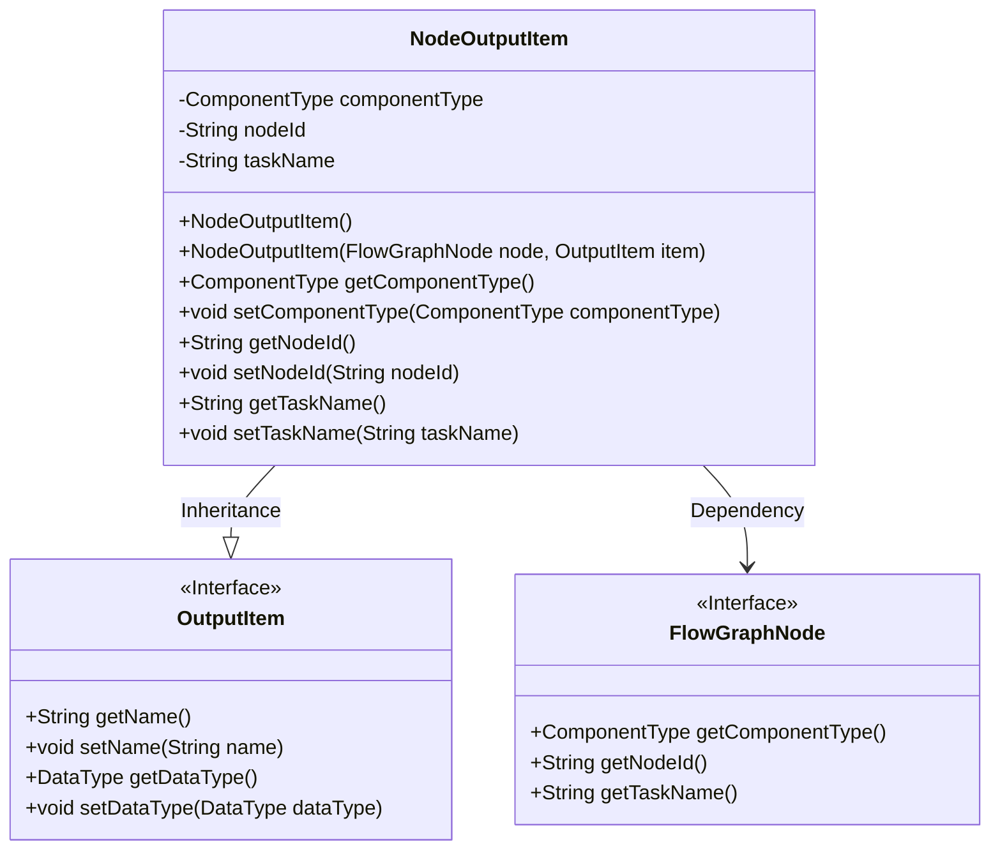
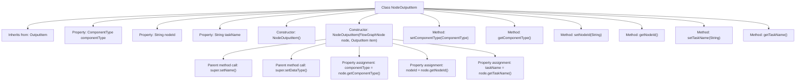

# Basic Information

|      |      |
|------|------|
| Name | NodeOutputItem |
| Language | .java |
| Code Path | WeFe/board/board-service/src/main/java/com/welab/wefe/board/service/component/base/io/NodeOutputItem.java |
| Package Name | com.welab.wefe.board.service.component.base.io |
| Dependencies | ['com.welab.wefe.board.service.model.FlowGraphNode', 'com.welab.wefe.common.wefe.enums.ComponentType'] |
| Brief Description | NodeOutputItem inherits from OutputItem, containing attributes such as component type, node ID, and task name, and provides constructors and getter/setter methods. |

# Description

The `NodeOutputItem` class inherits from `OutputItem` and is used to encapsulate information related to node output items. This class includes three private attributes: `componentType` represents the component type, `nodeId` represents the node ID, and `taskName` represents the task name. It provides a no-argument constructor and a constructor based on `FlowGraphNode` and `OutputItem`. The latter sets the `name` and `dataType` attributes of the parent class and initializes the three attributes of this class. Additionally, it provides getter and setter methods for these three attributes to retrieve and set the corresponding attribute values.

# Class Summary

| Name   | Type  | Description |
|-------|------|-------------|
| NodeOutputItem | class | NodeOutputItem inherits from OutputItem, containing component type, node ID, and task name attributes, providing constructor methods and getter/setter. |

## Class NodeOutputItem

|      |      |
|------|------|
| Access Modifier | public |
| Type | class |
| Name | NodeOutputItem |
| Description | NodeOutputItem inherits from OutputItem, containing component type, node ID, and task name attributes, providing constructor methods and getter/setter. |

### UML Class Diagram

This code defines a `NodeOutputItem` class that inherits from the `OutputItem` interface and includes node-related attributes (`componentType`, `nodeId`, `taskName`). The class initializes these attributes through constructors from `FlowGraphNode` and `OutputItem` instances, while providing corresponding getter and setter methods. The class diagram clearly illustrates the inheritance and dependency relationships, with `NodeOutputItem` as a concrete implementation class extending the functionality of the base interface and interacting with the node structure of the flow graph.

### Internal Method Call Graph

This code demonstrates a NodeOutputItem class that inherits from OutputItem, primarily used for encapsulating node output information. The class includes two constructors (default constructor and parameterized constructor), along with getter/setter methods for three properties. The parameterized constructor initializes its own attributes through FlowGraphNode and OutputItem objects while calling parent class methods to set the name and data type. The flowchart clearly illustrates the class inheritance relationship, properties, method invocation chains, and assignment logic during construction.

### Field List

| Name  | Type  | Description |
|-------|-------|------|
| nodeId | String | Private string type variable nodeId |
| taskName | String | The private string variable `taskName` is used to store the task name. |
| componentType | ComponentType | Private component type variable `componentType`. |

### Method List

| Name  | Type  | Description |
|-------|-------|------|
| setTaskName | void | This is a Java method used to set the task name. The method takes a string parameter taskName and assigns it to the class member variable taskName. |
| setNodeId | void | Methods for setting node ID: Assign the parameter nodeId to the nodeId property of the current object. |
| getNodeId | String | Methods to obtain the node ID, returns a string-type nodeId. |
| getComponentType | ComponentType | Methods to obtain the component type, returns the value of the componentType property. |
| getTaskName | String | Methods to obtain the task name, returning a string-type taskName. |
| setComponentType | void | The method for setting the component type assigns the parameter `componentType` to the `componentType` property of the current object. |

