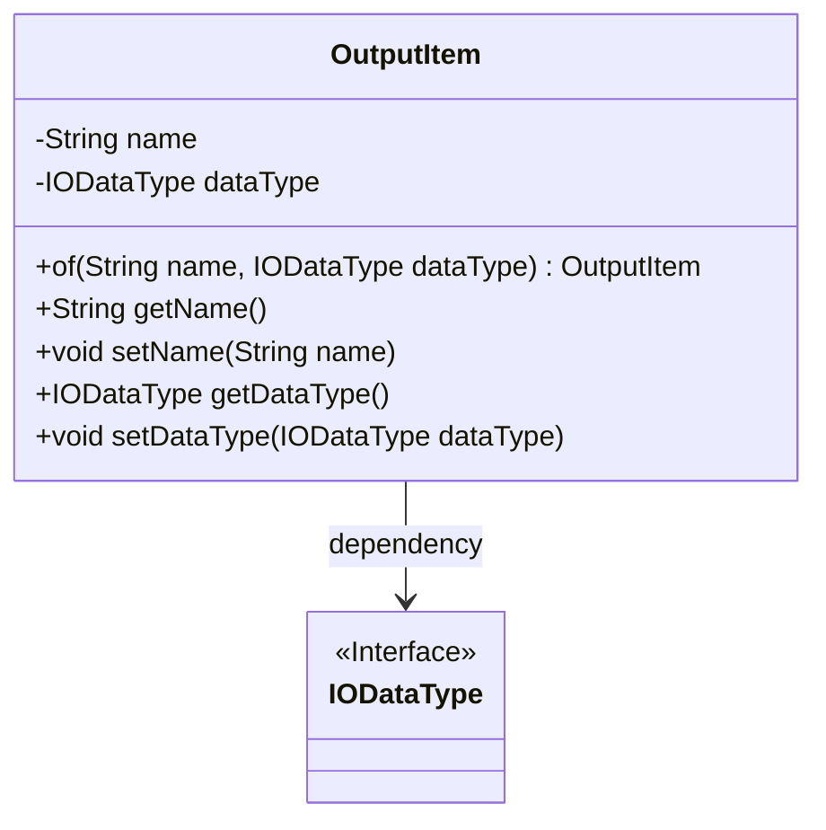
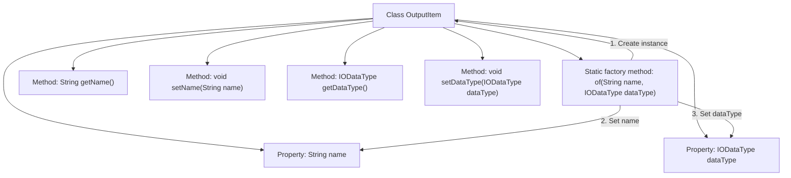

# Basic Information

|      |      |
|------|------|
| Name | OutputItem |
| Language | .java |
| Code Path | WeFe/board/board-service/src/main/java/com/welab/wefe/board/service/component/base/io/OutputItem.java |
| Package Name | com.welab.wefe.board.service.component.base.io |
| Dependencies | [] |
| Brief Description | The OutputItem class contains name and dataType attributes, providing static creation methods along with getter/setter methods. |

# Description

The `OutputItem` class is a Java class designed to encapsulate output items, containing two private attributes: `name` (String type) and `dataType` (IODataType type). This class provides a static factory method `of` for quickly creating instances and initializing attribute values. It also includes standard getter and setter methods for accessing and modifying these two attributes. The overall design is concise, compliant with the Java Bean specification, facilitating the management and manipulation of output item data.

# Class Summary

| Name   | Type  | Description |
|-------|------|-------------|
| OutputItem | class | The OutputItem class contains name and dataType attributes, providing static creation methods along with getter/setter methods. |

## Class OutputItem

|      |      |
|------|------|
| Access Modifier | public |
| Type | class |
| Name | OutputItem |
| Description | The OutputItem class contains name and dataType attributes, providing static creation methods along with getter/setter methods. |

### UML Class Diagram

This code defines a class named OutputItem, which encapsulates the name and data type of an output item. The class contains two private fields: name and dataType, where dataType depends on the IODataType interface. It provides a static factory method of() for creating instances, along with standard getter/setter methods. The class diagram clearly illustrates the dependency relationship between OutputItem and IODataType, demonstrating a design approach that decouples data types through interfaces.

### Internal Method Call Graph

This flowchart illustrates the structure of the OutputItem class, containing two private properties and five methods. The core is the static factory method of(), which creates and initializes an object in three steps: first instantiating OutputItem, then setting the name and dataType properties respectively, and finally returning the constructed object. The other four methods handle property read/write operations, adhering to standard JavaBean conventions. The class design is concise, encapsulating object creation logic through the factory method.

### Field List

| Name  | Type  | Description |
|-------|-------|------|
| name | String | Declare a private string variable name. |
| dataType | IODataType | Private data type variable `dataType`. |

### Method List

| Name  | Type  | Description |
|-------|-------|------|
| of | OutputItem | The static method `of` creates and returns an `OutputItem` instance, setting the name and data type attributes. |
| setName | void | Methods for setting the object name: assign the parameter 'name' to the 'name' property of the current object. |
| getDataType | IODataType | Methods to obtain data types, returns an IODataType object. |
| setDataType | void | Methods for setting data types, assigning input parameters to the dataType property of the class. |
| getName | String | The method returns the value of the name variable of type string. |

