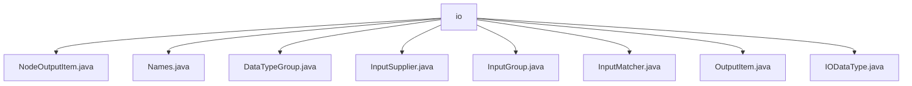

# Basic Information

|      |      |
|------|------|
| Name | io |
| Language | .java |
| Code Path | WeFe/board/board-service/src/main/java/com/welab/wefe/board/service/component/base/io |
| Package Name | docs.board.board-service.src.main.java.com.welab.wefe.board.service.component.base.io |
| Brief Description | NodeOutputItem inherits from OutputItem, encapsulating node output information with attributes including component type, node ID, and task name. The Names class manages name constants for datasets, models, etc. The DataTypeGroup enum defines data grouping types. InputSupplier is a functional interface for obtaining node inputs. InputGroup manages input data groupings and converts them to JSON. InputMatcher matches node input items, supporting three strategies. OutputItem encapsulates output items with name and data type attributes. The IODataType enum defines various data types and their groupings. |

# Description

## Overview  
The core responsibility of this module is to manage the input and output data of nodes in the federated learning workflow, including type definitions, matching strategies, and structured transformations. The interface specifications cover the functional interface InputSupplier (similar to the factory pattern) and three matching strategies of InputMatcher (direct supply/adaptation check/data type search). Key data structures include NodeOutputItem (encapsulating node output), InputGroup (JSON-structured), and the enumeration classes IODataType/DataTypeGroup (type classification). External dependencies are limited to FlowGraph-related classes. For example, NodeOutputItem extends OutputItem to include additional node information, while the Names class centrally manages constants such as TRAIN_DATA_SET.  

## Main Business Scenarios  
The module primarily handles data interactions between nodes in the workflow, such as training dataset matching or model transfer. The complete process includes: 1) Locating inputs via InputMatcher according to priority strategies; 2) Converting data into the JSON structure required by the kernel using InputGroup; 3) Validating type legality through IODataType. A typical application is binning model matching, where error messages distinguish between TRAIN_MODEL and BINNING_MODEL. API integration examples include InputSupplier dynamically obtaining node inputs, resembling a callback mechanism. The interaction mode follows a unified three-step workflow: "match-convert-validate."

### Package Internal Structure View

This flowchart illustrates the basic IO module structure of the board-service component in the WeFe project. The io directory contains 8 Java files that handle different types of input/output operations, including core functional classes such as node output items, data type groups, input suppliers, and input matchers. Together, these files form the infrastructure for data interaction between components.

# File List

| Name   | Type  | Description |
|-------|------|-------------|
| [NodeOutputItem.java](NodeOutputItem.md) | file | NodeOutputItem extends OutputItem, containing component type, node ID, and task name attributes, providing constructors and getter/setter methods. |
| [Names.java](Names.md) | file | The Java class `Names` contains static nested classes `Data` and `Model`, which define constant strings for dataset and model types respectively, along with a JSON result constant. |
| [DataTypeGroup.java](DataTypeGroup.md) | file | The enumeration DataTypeGroup defines three data types: Data (key is "data"), Model (key is "model"), and Other (key is "json"). The key values can be obtained through the getKey() method. |
| [InputSupplier.java](InputSupplier.md) | file | The functional interface InputSupplier defines the method get, which retrieves input items based on the graph and nodes and may throw exceptions. |
| [InputGroup.java](InputGroup.md) | file | The InputGroup class contains DataTypeGroup and a list of NodeOutputItem, providing the toJsonNode method to convert data into the JSON structure required by the kernel, and includes getter/setter methods. |
| [InputMatcher.java](InputMatcher.md) | file | The `InputMatcher` class is used to match input nodes, including names, optionality, and three matching strategies (direct supply, filtered lookup, data type matching). It throws an exception and provides error messages when no match is found. |
| [OutputItem.java](OutputItem.md) | file | The OutputItem class contains name and dataType attributes, providing static creation methods along with getter/setter methods. |
| [IODataType.java](IODataType.md) | file | The enumeration IODataType defines data types, including raw datasets, loaded datasets, logistic regression models, XGBoost models, binning models, deep learning models, and Json results, each with label and group attributes. |

