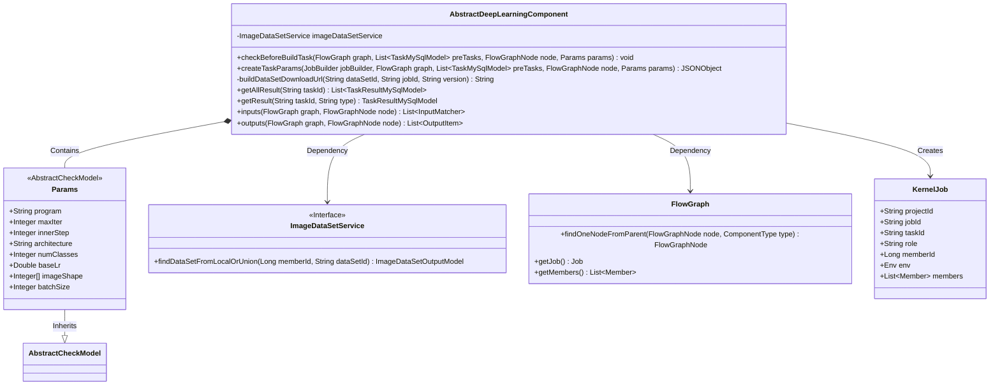
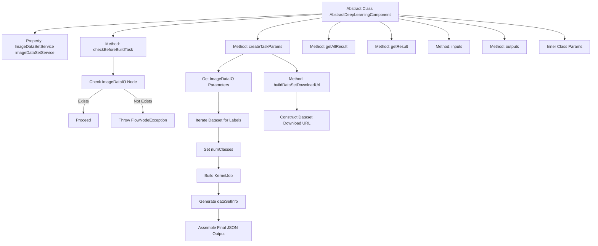

# Basic Information

|      |      |
|------|------|
| Name | AbstractDeepLearningComponent |
| Language | .java |
| Code Path | WeFe/board/board-service/src/main/java/com/welab/wefe/board/service/component/deep_learning/AbstractDeepLearningComponent.java |
| Package Name | com.welab.wefe.board.service.component.deep_learning |
| Dependencies | ['com.alibaba.fastjson.JSONObject', 'com.welab.wefe.board.service.api.data_resource.image_data_set.ImageDataSetDownloadApi', 'com.welab.wefe.board.service.component.base.AbstractComponent', 'com.welab.wefe.board.service.component.base.io.InputMatcher', 'com.welab.wefe.board.service.component.base.io.OutputItem', 'com.welab.wefe.board.service.database.entity.job.TaskMySqlModel', 'com.welab.wefe.board.service.database.entity.job.TaskResultMySqlModel', 'com.welab.wefe.board.service.dto.entity.data_resource.output.DataResourceOutputModel', 'com.welab.wefe.board.service.dto.entity.data_resource.output.ImageDataSetOutputModel', 'com.welab.wefe.board.service.dto.kernel.Member', 'com.welab.wefe.board.service.dto.kernel.deep_learning.Env', 'com.welab.wefe.board.service.dto.kernel.deep_learning.KernelJob', 'com.welab.wefe.board.service.exception.FlowNodeException', 'com.welab.wefe.board.service.model.FlowGraph', 'com.welab.wefe.board.service.model.FlowGraphNode', 'com.welab.wefe.board.service.model.JobBuilder', 'com.welab.wefe.board.service.service.CacheObjects', 'com.welab.wefe.board.service.service.data_resource.image_data_set.ImageDataSetService', 'com.welab.wefe.board.service.service.data_resource.image_data_set.data_set_parser.AbstractImageDataSetParser', 'com.welab.wefe.board.service.service.globalconfig.GlobalConfigService', 'com.welab.wefe.common.exception.StatusCodeWithException', 'com.welab.wefe.common.fieldvalidate.AbstractCheckModel', 'com.welab.wefe.common.fieldvalidate.annotation.Check', 'com.welab.wefe.common.util.JObject', 'com.welab.wefe.common.util.StringUtil', 'com.welab.wefe.common.web.Launcher', 'com.welab.wefe.common.web.api.base.Api', 'com.welab.wefe.common.wefe.dto.global_config.BoardConfigModel', 'com.welab.wefe.common.wefe.enums.ComponentType', 'org.springframework.beans.factory.annotation.Autowired', 'java.util.HashSet', 'java.util.List', 'java.util.Set'] |
| Brief Description | Abstract deep learning component class, inheriting from AbstractComponent, includes methods such as dataset validation, task parameter creation, and result retrieval. The Params class defines mandatory parameters like algorithm type and iteration count. Core functionalities include verifying dataset existence, constructing task parameter JSON, and generating dataset download URLs. |

# Description

This is an abstract class named AbstractDeepLearningComponent, which inherits from AbstractComponent and serves as the foundational implementation for deep learning components. The class primarily includes the following functionalities: 1. Checking whether a dataset has been selected before building a task; 2. Creating task parameters, including dataset information, algorithm configurations, etc.; 3. Providing methods to retrieve task results; 4. Defining an internal Params class that contains various parameters required for deep learning algorithms, such as algorithm type, iteration count, learning rate, etc. The class handles dataset-related operations through the automatically injected imageDataSetService and provides a method for constructing dataset download URLs.

# Class Summary

| Name   | Type  | Description |
|-------|------|-------------|
| AbstractDeepLearningComponent | class | Abstract deep learning component class, including dataset validation, task parameter creation, and result retrieval functionalities, defining algorithm parameters such as type, iteration count, etc. |

## Class AbstractDeepLearningComponent

|      |      |
|------|------|
| Access Modifier | public abstract |
| Type | class |
| Name | AbstractDeepLearningComponent |
| Description | Abstract deep learning component class, including dataset validation, task parameter creation, and result retrieval functionalities, defining algorithm parameters such as type, iteration count, etc. |

### UML Class Diagram

This code demonstrates an abstract base class for deep learning components, primarily handling task parameter construction and validation related to image datasets. The class diagram comprises six core classes: AbstractDeepLearningComponent as the main class, which utilizes the ImageDataSetService through dependency injection and inherits from a generic AbstractComponent; contains a static inner class Params for storing algorithm configuration parameters; interacts with FlowGraph to obtain node information; and creates KernelJob objects to encapsulate task parameters. The component implements core methods such as pre-task validation, parameter generation, and result querying, reflecting the key logic of deep learning task processing workflows.

### Internal Method Call Graph

This flowchart illustrates the core structure of the abstract class AbstractDeepLearningComponent, emphasizing the data validation and task parameter creation processes. The class ensures the existence of dataset nodes through checkBeforeBuildTask, while the createTaskParams method constructs deep learning task parameters, including dataset processing, job configuration, and result assembly. The inner class Params defines parameter validation rules required by the algorithm, collectively implementing the core functional logic of the deep learning component.

### Field List

| Name  | Type  | Description |
|-------|-------|------|
| imageDataSetService | ImageDataSetService | The code snippet uses @Autowired to automatically inject an instance of ImageDataSetService. |

### Method List

| Name  | Type  | Description |
|-------|-------|------|
| getAllResult | List<TaskResultMySqlModel> | This is a Java method override that retrieves all task results by calling the `listAllResult` method of `taskResultService` based on the `taskId` and returns the list. |
| checkBeforeBuildTask | void | Ensure the dataset node exists before checking the build task, otherwise throw an unselected dataset exception. |
| createTaskParams | JSONObject | This method creates parameters for deep learning tasks, including dataset label processing, task information encapsulation, and output configuration. The main steps are: extracting dataset labels and calculating the number of categories, constructing core task parameters, integrating dataset download information, and finally generating JSON output containing algorithm configurations. |
| buildDataSetDownloadUrl | String | Method for constructing dataset download URL: Obtain the path via annotation, combine it with the configured intranet base URI, and concatenate the dataset ID, task ID, and version parameters to generate the complete URL. |
| getResult | TaskResultMySqlModel | Rewrite the method to query MySQL results based on task ID and type. |
| inputs | List<InputMatcher> | Java method override, returns an empty input matcher list. |
| outputs | List<OutputItem> | Rewrite the outputs method to return null values, accepting FlowGraph and FlowGraphNode parameters, and potentially throwing a FlowNodeException. |

