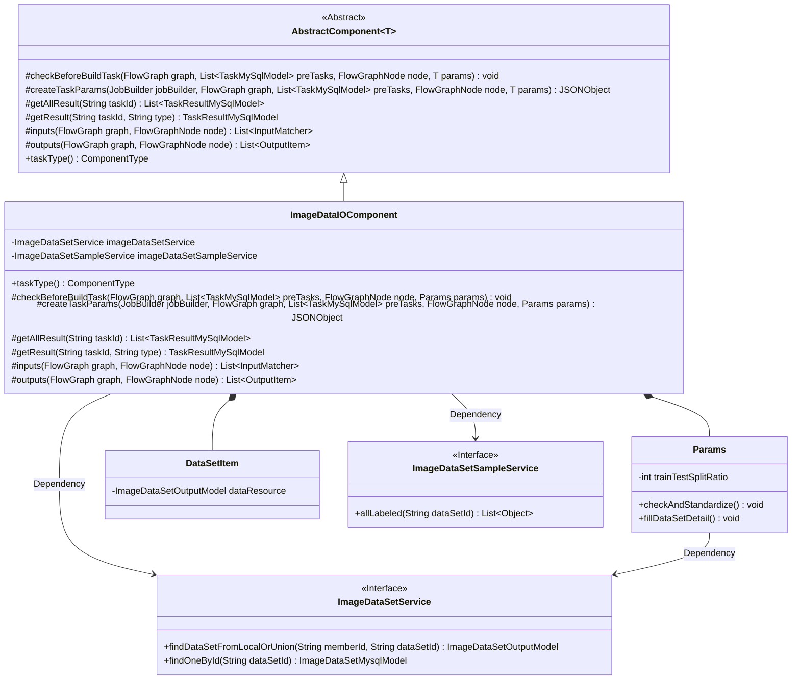
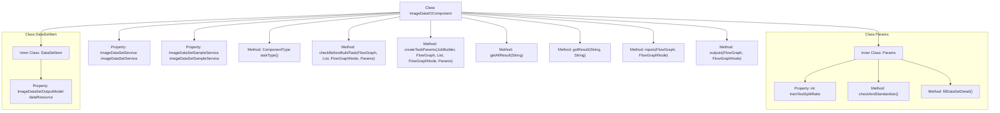

# Basic Information

|      |      |
|------|------|
| Name | ImageDataIOComponent |
| Language | .java |
| Code Path | WeFe/board/board-service/src/main/java/com/welab/wefe/board/service/component/deep_learning/ImageDataIOComponent.java |
| Package Name | com.welab.wefe.board.service.component.deep_learning |
| Dependencies | ['com.alibaba.fastjson.JSONObject', 'com.welab.wefe.board.service.component.base.AbstractComponent', 'com.welab.wefe.board.service.component.base.dto.AbstractDataIOParam', 'com.welab.wefe.board.service.component.base.dto.AbstractDataSetItem', 'com.welab.wefe.board.service.component.base.io.InputMatcher', 'com.welab.wefe.board.service.component.base.io.OutputItem', 'com.welab.wefe.board.service.database.entity.data_resource.ImageDataSetMysqlModel', 'com.welab.wefe.board.service.database.entity.job.JobMemberMySqlModel', 'com.welab.wefe.board.service.database.entity.job.TaskMySqlModel', 'com.welab.wefe.board.service.database.entity.job.TaskResultMySqlModel', 'com.welab.wefe.board.service.dto.entity.data_resource.output.ImageDataSetOutputModel', 'com.welab.wefe.board.service.exception.FlowNodeException', 'com.welab.wefe.board.service.model.FlowGraph', 'com.welab.wefe.board.service.model.FlowGraphNode', 'com.welab.wefe.board.service.model.JobBuilder', 'com.welab.wefe.board.service.service.CacheObjects', 'com.welab.wefe.board.service.service.data_resource.image_data_set.ImageDataSetSampleService', 'com.welab.wefe.board.service.service.data_resource.image_data_set.ImageDataSetService', 'com.welab.wefe.board.service.service.data_resource.image_data_set.data_set_parser.AbstractImageDataSetParser', 'com.welab.wefe.common.StatusCode', 'com.welab.wefe.common.exception.StatusCodeWithException', 'com.welab.wefe.common.fieldvalidate.annotation.Check', 'com.welab.wefe.common.util.JObject', 'com.welab.wefe.common.util.StringUtil', 'com.welab.wefe.common.web.Launcher', 'com.welab.wefe.common.wefe.enums.ComponentType', 'com.welab.wefe.common.wefe.enums.JobMemberRole', 'org.apache.commons.collections4.CollectionUtils', 'org.springframework.beans.factory.annotation.Autowired', 'org.springframework.stereotype.Service', 'java.util.List'] |
| Brief Description | The ImageDataIOComponent is a module designed for handling image datasets in federated learning tasks. Its primary functions include: validating dataset integrity (number of members, dataset counts, label consistency), generating dataset files, and managing task results. Parameter validation covers dataset splitting ratios (1-99). It is suitable for multi-member collaboration scenarios, ensuring data compliance. |

# Description

The ImageDataIOComponent is a service component designed for handling the input and output of image datasets, inheriting from AbstractComponent. It operates on datasets through the imageDataSetService and imageDataSetSampleService. Key functionalities include: validating dataset integrity before task construction, requiring at least two members and datasets while ensuring the presence of a promoter role and consistent dataset labels; generating dataset files and setting versions during task creation; and providing methods to retrieve task results. The Params class defines dataset splitting ratio parameters with range validation, while the DataSetItem class contains dataset resource information. This component ensures the validity and consistency of datasets in federated learning tasks.

# Class Summary

| Name   | Type  | Description |
|-------|------|-------------|
| ImageDataIOComponent | class | The ImageDataIOComponent is a component that handles the input and output of image datasets, inheriting from AbstractComponent. Its primary functions include: validating dataset integrity (e.g., member count, label consistency), generating dataset files, and managing task results. The Params class defines parameters such as dataset splitting ratios and performs validation. |

## Class ImageDataIOComponent

|      |      |
|------|------|
| Access Modifier | @Service;public |
| Type | class |
| Name | ImageDataIOComponent |
| Description | The ImageDataIOComponent is a component that handles the input and output of image datasets, inheriting from AbstractComponent. Its primary functions include: validating dataset integrity (e.g., member count, label consistency), generating dataset files, and managing task results. The Params class defines parameters such as dataset splitting ratios and performs validation. |

### UML Class Diagram

Class Diagram Description: This diagram illustrates the structure of ImageDataIOComponent and its related classes. ImageDataIOComponent inherits from the generic abstract class AbstractComponent, contains two inner classes Params and DataSetItem, and depends on the ImageDataSetService and ImageDataSetSampleService interfaces. Its core functionalities include dataset validation, task parameter creation, and result processing, involving multi-member dataset coordination and label consistency checks in federated learning scenarios.

### Internal Method Call Graph

This code defines a service class named ImageDataIOComponent, which inherits from AbstractComponent and is primarily used for handling image data input/output operations. The class includes multiple methods such as checking pre-task conditions, creating task parameters, and retrieving task results. Among them, the checkBeforeBuildTask method validates dataset validity and consistency, while the createTaskParams method generates task parameters and processes dataset files. Additionally, the class contains two inner classes, Params and DataSetItem, which define dataset parameters and dataset items respectively. The Params class includes properties like dataset split ratio and provides parameter validation and standardization methods; the DataSetItem class contains data resource properties. Overall, this class is designed for image data processing and task management in federated learning scenarios.

### Field List

| Name  | Type  | Description |
|-------|-------|------|
| imageDataSetSampleService | ImageDataSetSampleService | Automatically inject the ImageDataSetSampleService instance. |
| imageDataSetService | ImageDataSetService | Using @Autowired to automatically inject an instance of ImageDataSetService. |

### Method List

| Name  | Type  | Description |
|-------|-------|------|
| inputs | List<InputMatcher> | The rewrite method inputs returns an empty list, with parameters graph and node. |
| getResult | TaskResultMySqlModel | Rewrite the method to query results by task ID and type. |
| getAllResult | List<TaskResultMySqlModel> | This method overrides the parent class logic by invoking the `listAllResult` method of `taskResultService` to retrieve all task result lists corresponding to the specified `taskId`. |
| taskType | ComponentType | Method override, returning component type as ImageDataIO. |
| createTaskParams | JSONObject | The method creates a JSON object based on task parameters, filters matching dataset configurations, parses samples to generate dataset files, and sets the version to the jobBuilder. It returns a JObject containing dataset information. |
| outputs | List<OutputItem> | Rewrite the outputs method to return null values, accepting FlowGraph and FlowGraphNode parameters, and potentially throwing FlowNodeException. |
| checkBeforeBuildTask | void | Method checks prerequisites for federated learning task construction: there must be at least 2 members including a promoter, multiple valid datasets are required, label lists must be consistent, otherwise an exception is thrown. |

