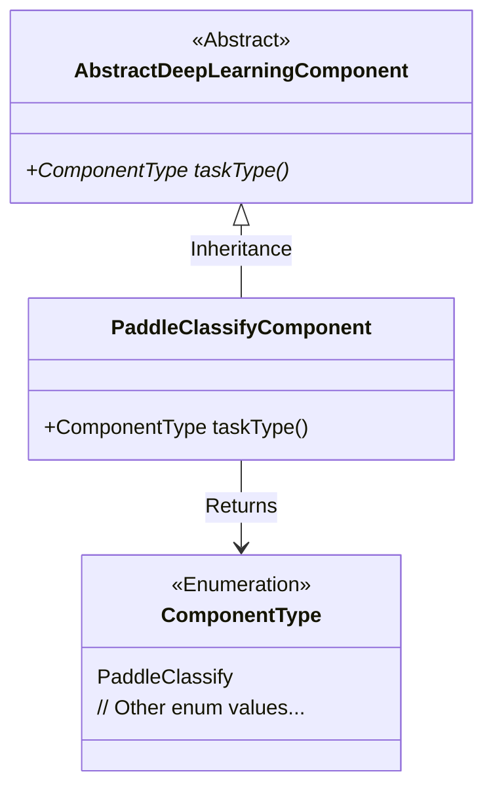
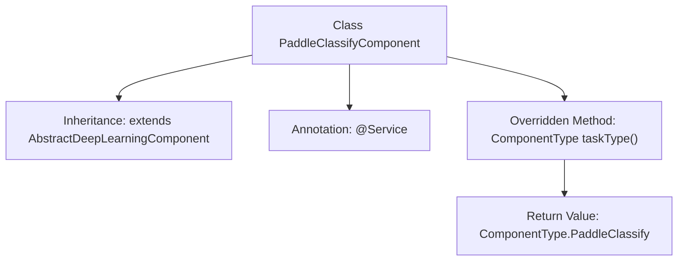

# Basic Information

|      |      |
|------|------|
| Name | PaddleClassifyComponent |
| Language | .java |
| Code Path | WeFe/board/board-service/src/main/java/com/welab/wefe/board/service/component/deep_learning/PaddleClassifyComponent.java |
| Package Name | com.welab.wefe.board.service.component.deep_learning |
| Dependencies | ['com.welab.wefe.common.wefe.enums.ComponentType', 'org.springframework.stereotype.Service'] |
| Brief Description | This is a Java service class named PaddleClassifyComponent, which extends AbstractDeepLearningComponent and overrides the taskType method to return the PaddleClassify type. |

# Description

This code snippet defines a service class named `PaddleClassifyComponent`, which inherits from the abstract class `AbstractDeepLearningComponent`. The class is marked as a Spring framework service component via the `@Service` annotation and overrides the `taskType` method to return the `PaddleClassify` type from the `ComponentType` enumeration, indicating this is a classification task component based on the Paddle framework.

# Class Summary

| Name   | Type  | Description |
|-------|------|-------------|
| PaddleClassifyComponent | class | This is a Paddle-based deep learning classification component, inherited from the abstract deep learning component class, with the component type specified as PaddleClassify. |

## Class PaddleClassifyComponent

|      |      |
|------|------|
| Access Modifier | @Service;public |
| Type | class |
| Name | PaddleClassifyComponent |
| Description | This is a Paddle-based deep learning classification component, inherited from the abstract deep learning component class, with the component type specified as PaddleClassify. |

### UML Class Diagram

This class diagram illustrates a Spring-based service component inheritance structure. The PaddleClassifyComponent inherits from the abstract class AbstractDeepLearningComponent and implements its abstract method taskType(), which returns a specific ComponentType enumeration value. ComponentType is an enumeration type containing classification identifiers such as PaddleClassify. The overall structure demonstrates the application of the Template Method pattern, where the parent class defines the framework while the child class implements the specific type determination logic.

### Internal Method Call Graph

This flowchart illustrates the structure of the PaddleClassifyComponent class, which is a service class inheriting from AbstractDeepLearningComponent, marked by the @Service annotation, and overrides the taskType() method to return a specific component type. The diagram clearly presents the class inheritance, annotation usage, and core method implementation, with well-defined hierarchical relationships that facilitate understanding of this lightweight classification component's design structure.

### Field List

| Name  | Type  | Description |
|-------|-------|------|

### Method List

| Name  | Type  | Description |
|-------|-------|------|
| taskType | ComponentType | The method returns a component of type PaddleClassify. |

