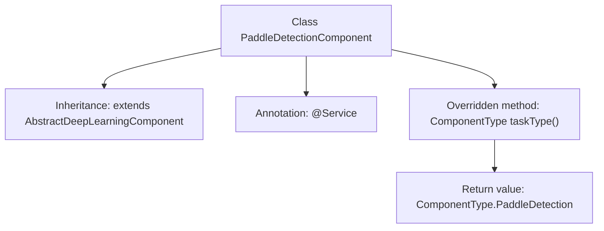

# Basic Information

|      |      |
|------|------|
| Name | PaddleDetectionComponent |
| Language | .java |
| Code Path | WeFe/board/board-service/src/main/java/com/welab/wefe/board/service/component/deep_learning/PaddleDetectionComponent.java |
| Package Name | com.welab.wefe.board.service.component.deep_learning |
| Dependencies | ['com.welab.wefe.common.wefe.enums.ComponentType', 'org.springframework.stereotype.Service'] |
| Brief Description | This is a deep learning component class based on PaddleDetection, inheriting from the abstract class AbstractDeepLearningComponent, with the component type specified as PaddleDetection. |

# Description

This code snippet defines a Spring service class named `PaddleDetectionComponent`, which inherits from the abstract class `AbstractDeepLearningComponent`. By overriding the `taskType` method, the class explicitly specifies its component type as `PaddleDetection`, indicating this is an object detection functionality component based on the PaddlePaddle framework. The entire implementation concisely accomplishes the core functionality of component type identification.

# Class Summary

| Name   | Type  | Description |
|-------|------|-------------|
| PaddleDetectionComponent | class | This is a Java service class named PaddleDetectionComponent, which extends AbstractDeepLearningComponent, overrides the taskType method, and returns the PaddleDetection type. |


## Class PaddleDetectionComponent

|      |      |
|------|------|
| Access Modifier | @Service;public |
| Type | class |
| Name | PaddleDetectionComponent |
| Description | This is a Java service class named PaddleDetectionComponent, which extends AbstractDeepLearningComponent, overrides the taskType method, and returns the PaddleDetection type. |


### UML Class Diagram

```mermaid
classDiagram
    class AbstractDeepLearningComponent {
        <<Abstract>>
        +ComponentType taskType()*
    }
    // AbstractDeepLearningComponent is the base class for all deep learning components
    class PaddleDetectionComponent {
        +ComponentType taskType()
    }
    class ComponentType {
        <<Enumeration>>
        PaddleDetection
        // Other enum values...
    }
    AbstractDeepLearningComponent <|-- PaddleDetectionComponent : Inheritance
    PaddleDetectionComponent --> ComponentType : Usage
```

This class diagram illustrates that PaddleDetectionComponent inherits from the abstract base class AbstractDeepLearningComponent and implements the taskType() method to return a specific ComponentType enumeration value. The AbstractDeepLearningComponent defines the abstract method taskType(), while PaddleDetectionComponent, as a concrete implementation class, specializes it as the PaddleDetection type. ComponentType is an enumeration containing values like PaddleDetection, used to identify component categories. The overall structure demonstrates the application of the Template Method pattern.


### Internal Method Call Graph



This flowchart illustrates the structure of the PaddleDetectionComponent class, which is a service class inheriting from AbstractDeepLearningComponent and marked as a Spring component via the @Service annotation. Its core functionality involves overriding the taskType() method to return a specific PaddleDetection component type enum value. This design enables polymorphic identification of component types, complying with the extensible architecture requirements of deep learning components, while maintaining a reasonable total node count.

### Field List

| Name  | Type  | Description |
|-------|-------|------|

### Method List

| Name  | Type  | Description |
|-------|-------|------|
| taskType | ComponentType | This method overrides the parent class method and returns the component type as PaddleDetection. |


