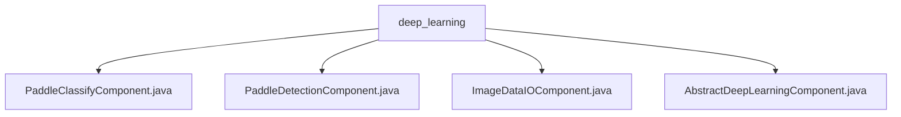

# Basic Information

|      |      |
|------|------|
| Name | deep_learning |
| Language | .java |
| Code Path | WeFe/board/board-service/src/main/java/com/welab/wefe/board/service/component/deep_learning |
| Package Name | docs.board.board-service.src.main.java.com.welab.wefe.board.service.component.deep_learning |
| Brief Description | PaddleClassifyComponent is the Paddle classification component, and PaddleDetectionComponent is the Paddle detection component, both inheriting from AbstractDeepLearningComponent. ImageDataIOComponent handles the input and output of image datasets, ensuring data validity. AbstractDeepLearningComponent is the base class for deep learning components, providing task construction and parameter processing functionalities. |

# Description

## Overview  
This module is a collection of deep learning components based on the PaddlePaddle framework within the federated learning platform. Its core responsibility is to standardize processing workflows for tasks such as image classification (PaddleClassify) and object detection (PaddleDetection). The interface specifications uniformly inherit from the `AbstractDeepLearningComponent` abstract class, with specific functional types (e.g., `PaddleClassify`/`PaddleDetection`) declared by overriding the `taskType` method. Key data structures include `Params` (algorithm parameters) and `DataSetItem` (dataset metadata), with dataset validity ensured via the `ImageDataIOComponent`. External dependencies include the Spring framework, the PaddlePaddle deep learning framework, and internal dataset services (e.g., `imageDataSetService`).  

## Key Business Scenarios  
The module adopts a factory-like design pattern, where the abstract class implements generic workflows (e.g., dataset validation, parameter construction), while subclasses focus on specific algorithm implementations. A typical workflow includes: validating dataset validity during initialization (requiring 2+ members with consistent labels) → configuring algorithm parameters (e.g., learning rate/iterations) → generating traceable dataset versions. For example, when handling image classification, the `PaddleClassifyComponent` inherits basic parameter validation logic and supplements classification-specific configurations. All components interact with the federated learning task scheduling system through a unified interface, ensuring algorithm plug-and-play compatibility.

### Package Internal Structure View

This flowchart illustrates the file structure relationships within the deep learning component directory. The root node is the deep_learning folder, which contains four Java component class files: Paddle Classify Component, Paddle Detection Component, Image Data IO Component, and Abstract Deep Learning Component. All component files are directly subordinate to the deep_learning directory, with no deeper subdirectory hierarchy.

# File List

| Name   | Type  | Description |
|-------|------|-------------|
| [PaddleClassifyComponent.java](PaddleClassifyComponent.md) | file | This is a Java service class named PaddleClassifyComponent, which extends AbstractDeepLearningComponent and overrides the taskType method to return the PaddleClassify type. |
| [PaddleDetectionComponent.java](PaddleDetectionComponent.md) | file | This is a deep learning component class based on PaddleDetection, which inherits from the abstract class AbstractDeepLearningComponent and specifies the component type as PaddleDetection. |
| [ImageDataIOComponent.java](ImageDataIOComponent.md) | file | The ImageDataIOComponent is a module designed for handling image datasets in federated learning tasks. Its primary functions include: validating dataset integrity (number of members, dataset count, label consistency), generating dataset files, and managing task results. Parameter validation covers dataset split ratios (1-99). It is suitable for multi-member collaboration scenarios to ensure data compliance. |
| [AbstractDeepLearningComponent.java](AbstractDeepLearningComponent.md) | file | Abstract deep learning component class, inheriting from AbstractComponent, includes methods such as dataset validation, task parameter creation, and result retrieval. The Params class defines mandatory parameters like algorithm type and iteration count. Core functionalities encompass verifying dataset existence, constructing task parameter JSON, and generating dataset download URLs. |

