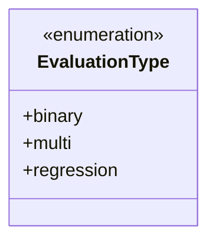
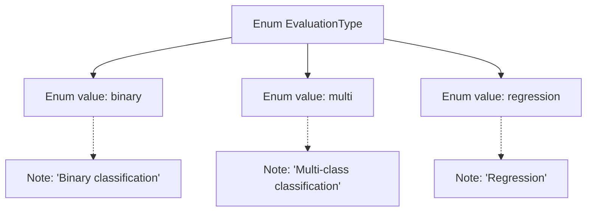

# Basic Information

|      |      |
|------|------|
| Name | EvaluationType |
| Language | .java |
| Code Path | WeFe/board/board-service/src/main/java/com/welab/wefe/board/service/component/enums/EvaluationType.java |
| Package Name | com.welab.wefe.board.service.component.enums |
| Dependencies | [] |
| Brief Description | The enumeration EvaluationType defines three evaluation types: binary classification, multi-class classification, and regression. |

# Description

The content defines an enumeration type named EvaluationType, which includes three enumeration values: binary represents binary classification tasks, multi represents multi-class classification tasks, and regression represents regression tasks. Each enumeration value has corresponding Chinese comments explaining its purpose.

# Class Summary

| Name   | Type  | Description |
|-------|------|-------------|
| EvaluationType | enum | The enumeration EvaluationType defines three evaluation types: binary classification, multi-class classification, and regression. |

## Class EvaluationType

|      |      |
|------|------|
| Access Modifier | public |
| Type | enum |
| Name | EvaluationType |
| Description | The enumeration EvaluationType defines three evaluation types: binary classification, multi-class classification, and regression. |

### UML Class Diagram

This enumeration class defines three evaluation types: binary (binary classification), multi (multi-class classification), and regression. It is a simple enumeration type used to represent different evaluation methods in machine learning or statistical analysis. The enumeration constants are all public members and can be accessed directly via the class name. This design pattern is commonly used in scenarios where value ranges need to be constrained and code readability needs to be improved, making it particularly suitable for representing fixed classification criteria or configuration options.

### Internal Method Call Graph

This flowchart illustrates the structure of the EvaluationType enum, which contains three enum values (binary/multi/regression) along with their corresponding English annotations. The value 'binary' is annotated as "Binary classification", 'multi' as "Multi-class classification", and 'regression' as "Regression". The diagram clearly presents the relationship between the enum definition and its values, as well as the semantic explanation for each enum value, facilitating understanding of this enum design used for machine learning evaluation types.

### Field List

| Name  | Type  | Description |
|-------|-------|------|

### Method List

| Name  | Type  | Description |
|-------|-------|------|

