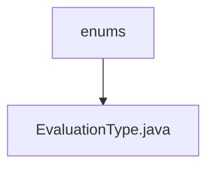

# Basic Information

|      |      |
|------|------|
| Name | enums |
| Language | .java |
| Code Path | WeFe/board/board-service/src/main/java/com/welab/wefe/board/service/component/enums |
| Package Name | docs.board.board-service.src.main.java.com.welab.wefe.board.service.component.enums |
| Brief Description | The enumeration EvaluationType defines three evaluation types: binary classification, multi-class classification, and regression. |

# Description

The content defines an enumeration type named EvaluationType, which includes three enumeration values: binary represents binary classification tasks, multi represents multi-class classification tasks, and regression represents regression tasks. Each enumeration value has corresponding Chinese annotations explaining its purpose.

### Package Internal Structure View

This flowchart illustrates the enum file structure within the board-service module of the WeFe project. The root node is the "enums" directory, which contains the concrete enum implementation file "EvaluationType.java". This structure reflects a common Java project practice for organizing enum types, where related enums are centrally stored under specific package paths for easier maintenance and usage.

# File List

| Name   | Type  | Description |
|-------|------|-------------|
| [EvaluationType.java](EvaluationType.md) | file | The enumeration EvaluationType defines three evaluation types: binary classification, multi-class classification, and regression. |

