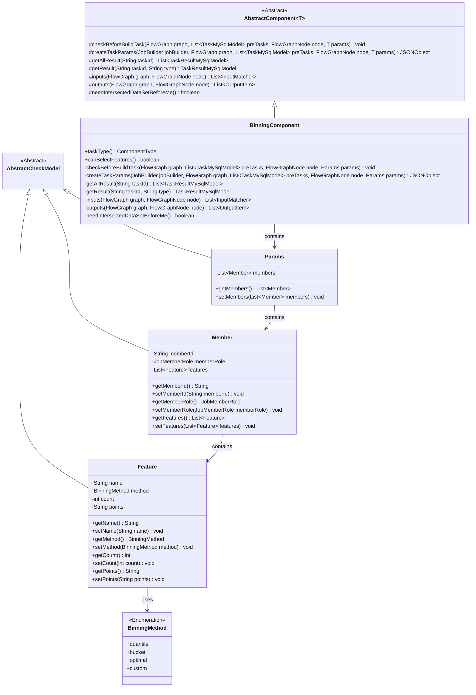

# Basic Information

|      |      |
|------|------|
| Name | BinningComponent |
| Language | .java |
| Code Path | WeFe/board/board-service/src/main/java/com/welab/wefe/board/service/component/feature/BinningComponent.java |
| Package Name | com.welab.wefe.board.service.component.feature |
| Dependencies | ['com.alibaba.fastjson.JSONArray', 'com.alibaba.fastjson.JSONObject', 'com.welab.wefe.board.service.component.DataIOComponent', 'com.welab.wefe.board.service.component.base.AbstractComponent', 'com.welab.wefe.board.service.component.base.io.IODataType', 'com.welab.wefe.board.service.component.base.io.InputMatcher', 'com.welab.wefe.board.service.component.base.io.Names', 'com.welab.wefe.board.service.component.base.io.OutputItem', 'com.welab.wefe.board.service.database.entity.job.TaskMySqlModel', 'com.welab.wefe.board.service.database.entity.job.TaskResultMySqlModel', 'com.welab.wefe.board.service.exception.FlowNodeException', 'com.welab.wefe.board.service.model.FlowGraph', 'com.welab.wefe.board.service.model.FlowGraphNode', 'com.welab.wefe.board.service.model.JobBuilder', 'com.welab.wefe.board.service.service.CacheObjects', 'com.welab.wefe.common.fieldvalidate.AbstractCheckModel', 'com.welab.wefe.common.fieldvalidate.annotation.Check', 'com.welab.wefe.common.util.JObject', 'com.welab.wefe.common.wefe.enums.ComponentType', 'com.welab.wefe.common.wefe.enums.JobMemberRole', 'com.welab.wefe.common.wefe.enums.TaskResultType', 'org.apache.commons.collections4.CollectionUtils', 'org.apache.commons.lang3.StringUtils', 'org.springframework.beans.BeanUtils', 'org.springframework.stereotype.Service', 'java.util', 'java.util.concurrent.atomic.AtomicInteger', 'java.util.stream.Collectors'] |
| Brief Description | BinningComponent is a binning processing component that inherits from AbstractComponent, encompassing functionalities such as parameter validation, task parameter construction, and result processing. It supports multiple binning methods including equal frequency, equal width, optimal binning, and custom binning, ensuring the participation of all members and generating binning models and datasets. |

# Description

The BinningComponent is a component that implements binning functionality, inheriting from AbstractComponent. It includes methods for parameter validation, task parameter creation, and result processing. The component requires a preceding sample alignment node and validates the binning strategy and participant involvement. It supports multiple binning methods (equal frequency, equal width, optimal binning, custom) with configurable parameters for binning details. The output includes binning models and datasets, supporting feature selection functionality.

# Class Summary

| Name   | Type  | Description |
|-------|------|-------------|
| BinningComponent | class | The BinningComponent is a component that handles binning logic, checking sample alignment and binning strategies, generating binning parameters, and supporting various binning methods such as equal frequency, equal width, optimal binning, and custom binning, while outputting the binning model and dataset. |

## Class BinningComponent

|      |      |
|------|------|
| Access Modifier | @Service;public |
| Type | class |
| Name | BinningComponent |
| Description | The BinningComponent is a component that handles binning logic, checking sample alignment and binning strategies, generating binning parameters, and supporting various binning methods such as equal frequency, equal width, optimal binning, and custom binning, while outputting the binning model and dataset. |

### UML Class Diagram

Class Diagram Description: This diagram illustrates the structural relationships of BinningComponent and its related classes. BinningComponent inherits from AbstractComponent and contains the inner class Params, which in turn contains the Member class. The Member class further contains the Feature class, which utilizes the BinningMethod enumeration. All model classes inherit from the base class AbstractCheckModel. This structure is primarily used to implement data binning functionality, encompassing core logic such as parameter validation, task creation, and result processing.

### Internal Method Call Graph

```mermaid
graph TD
    A["Class BinningComponent"]
    B["Method: checkBeforeBuildTask"]
    C["Method: createTaskParams"]
    D["Method: getAllResult"]
    E["Method: getResult"]
    F["Method: inputs"]
    G["Method: outputs"]
    H["Method: taskType"]
    I["Method: needIntersectedDataSetBeforeMe"]
    J["Method: canSelectFeatures"]
    K["Enum: BinningMethod"]
    L["Inner Class: Params"]
    M["Inner Class: Member"]
    N["Inner Class: Feature"]

    A --> B
    A --> C
    A --> D
    A --> E
    A --> F
    A --> G
    A --> H
    A --> I
    A --> J
    A --> K
    A --> L
    A --> M
    A --> N

    B --> B1["Check predecessor nodes"]
    B --> B2["Validate parameter validity"]
    B --> B3["Data member matching check"]
    C --> C1["Build binning parameters"]
    C --> C2["Process custom binning points"]
    C --> C3["Integrate binning strategies"]
    E --> E1["Query task results"]
    E --> E2["Reorganize binning result data"]
```

This flowchart illustrates the core structure of the BinningComponent class and its primary method invocation relationships. The class includes key methods such as parameter validation (checkBeforeBuildTask), task parameter construction (createTaskParams), and result processing (getAllResult/getResult), along with three inner classes (Params, Member, Feature) and the BinningMethod enumeration. Critical processes include: pre-condition verification, binning strategy integration, custom binning point processing, and result data reorganization, reflecting the end-to-end processing logic of the binning component from parameter validation to result generation.

### Field List

| Name  | Type  | Description |
|-------|-------|------|

### Method List

| Name  | Type  | Description |
|-------|-------|------|
| canSelectFeatures | boolean | The method canSelectFeatures returns true, indicating that feature selection is supported. |
| needIntersectedDataSetBeforeMe | boolean | Method override, returning false indicates no need for a pre-intersection dataset. |
| inputs | List<InputMatcher> | Rewrite the method `inputs` to return a list of input matchers containing dataset instances. |
| outputs | List<OutputItem> | The method outputs returns a list containing two OutputItems: one of type BINNING_MODEL and another of type NORMAL_DATA_SET. |
| getResult | TaskResultMySqlModel | This method retrieves task results based on task ID and type, processes model binning data, merges provider results, and returns a task result model containing member information. |
| checkBeforeBuildTask | void | Check preconditions for build task: Ensure the sample alignment component exists, binning strategy is not empty, and all members participate. Otherwise throw an exception. |
| getAllResult | List<TaskResultMySqlModel> | The method `getAllResult` retrieves all `TaskResultMySqlModel` results of type `model_binning` based on the `taskId`, then adds reorganized data and returns a list. |
| taskType | ComponentType | The method taskType returns the component type as Binning. |
| createTaskParams | JSONObject | Method creates task parameters, integrates feature binning strategies including custom bin points, and generates a JSON object containing transformation parameters, optimal binning parameters, and member modes. |

