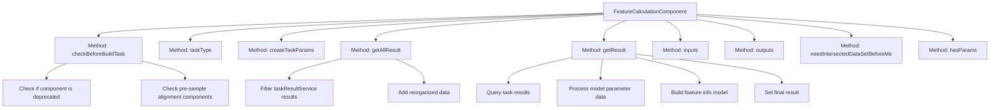
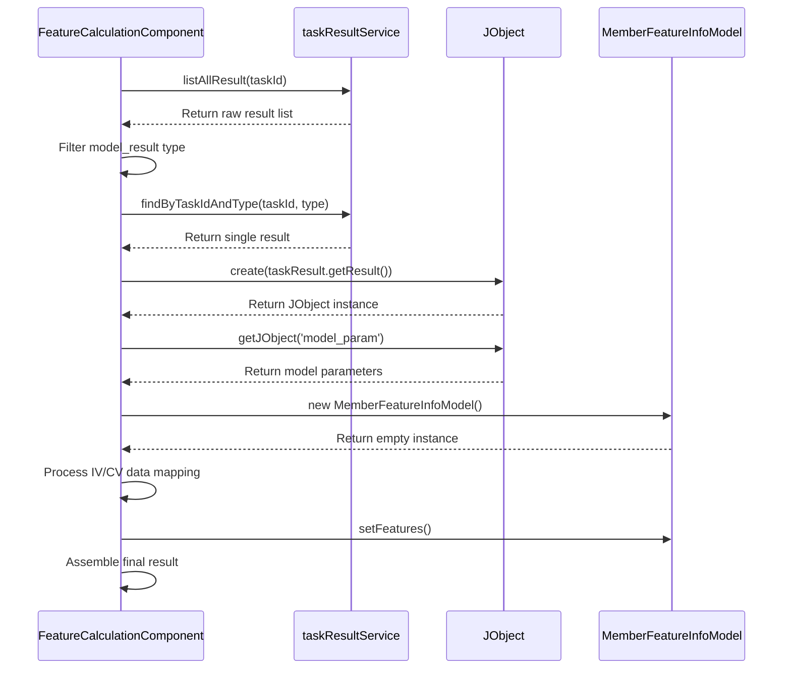

# Basic Information

|      |      |
|------|------|
| Name | FeatureCalculationComponent |
| Language | .java |
| Code Path | WeFe/board/board-service/src/main/java/com/welab/wefe/board/service/component/feature/FeatureCalculationComponent.java |
| Package Name | com.welab.wefe.board.service.component.feature |
| Dependencies | ['com.alibaba.fastjson.JSONArray', 'com.alibaba.fastjson.JSONObject', 'com.welab.wefe.board.service.component.base.AbstractComponent', 'com.welab.wefe.board.service.component.base.filter.IntersectedOutputFilter', 'com.welab.wefe.board.service.component.base.io.IODataType', 'com.welab.wefe.board.service.component.base.io.InputMatcher', 'com.welab.wefe.board.service.component.base.io.Names', 'com.welab.wefe.board.service.component.base.io.OutputItem', 'com.welab.wefe.board.service.database.entity.job.TaskMySqlModel', 'com.welab.wefe.board.service.database.entity.job.TaskResultMySqlModel', 'com.welab.wefe.board.service.dto.entity.MemberFeatureInfoModel', 'com.welab.wefe.board.service.exception.FlowNodeException', 'com.welab.wefe.board.service.model.FlowGraph', 'com.welab.wefe.board.service.model.FlowGraphNode', 'com.welab.wefe.board.service.model.JobBuilder', 'com.welab.wefe.board.service.service.CacheObjects', 'com.welab.wefe.common.fieldvalidate.AbstractCheckModel', 'com.welab.wefe.common.util.JObject', 'com.welab.wefe.common.wefe.enums.ComponentType', 'com.welab.wefe.common.wefe.enums.JobMemberRole', 'com.welab.wefe.common.wefe.enums.TaskResultType', 'org.springframework.beans.BeanUtils', 'org.springframework.stereotype.Service', 'java.util', 'java.util.stream.Collectors'] |
| Brief Description | The FeatureCalculationComponent has been deprecated. It is recommended to use the Feature Statistics component as a replacement. A sample alignment component must be configured in advance to process feature data and generate model results containing IV and CV values. |

# Description

This code implements a deprecated feature calculation component, mandating the use of the "Feature Statistics" component as a replacement. Its primary functions include: checking preconditions (requiring a sample alignment component), creating empty task parameters, retrieving task results, and reorganizing data. The result processing section parses model parameters to extract IV (Information Value) and CV (Coefficient of Variation) values, constructing a feature information list that includes member IDs, roles, feature names, and corresponding metric values. The component requires standardized datasets and binning models as input and outputs results in JSON format. It explicitly states that no parameters are required and depends on a pre-existing intersection dataset.

# Class Summary

| Name   | Type  | Description |
|-------|------|-------------|
| FeatureCalculationComponent | class | The FeatureCalculationComponent is deprecated. It is recommended to use the Feature Statistics component instead. A sample alignment component must be pre-configured to process feature IV and CV values, with results output in JSON format. |


## Class FeatureCalculationComponent

|      |      |
|------|------|
| Access Modifier | @Service;public |
| Type | class |
| Name | FeatureCalculationComponent |
| Description | The FeatureCalculationComponent is deprecated. It is recommended to use the Feature Statistics component instead. A sample alignment component must be pre-configured to process feature IV and CV values, with results output in JSON format. |


### UML Class Diagram

```mermaid
classDiagram
    class AbstractComponent~T~ {
        <<Abstract>>
        #checkBeforeBuildTask(FlowGraph graph, List~TaskMySqlModel~ preTasks, FlowGraphNode node, T params) void
        #createTaskParams(JobBuilder jobBuilder, FlowGraph graph, List~TaskMySqlModel~ preTasks, FlowGraphNode node, T params) JSONObject
        #getAllResult(String taskId) List~TaskResultMySqlModel~
        #getResult(String taskId, String type) TaskResultMySqlModel
        #inputs(FlowGraph graph, FlowGraphNode node) List~InputMatcher~
        #outputs(FlowGraph graph, FlowGraphNode node) List~OutputItem~
        #needIntersectedDataSetBeforeMe() boolean
        #hasParams() boolean
    }

    class FeatureCalculationComponent {
        +FeatureCalculationComponent$Params
        +checkBeforeBuildTask(FlowGraph graph, List~TaskMySqlModel~ preTasks, FlowGraphNode node, Params params) void
        +taskType() ComponentType
        +createTaskParams(JobBuilder jobBuilder, FlowGraph graph, List~TaskMySqlModel~ preTasks, FlowGraphNode node, Params params) JSONObject
        +getAllResult(String taskId) List~TaskResultMySqlModel~
        +getResult(String taskId, String type) TaskResultMySqlModel
        +inputs(FlowGraph graph, FlowGraphNode node) List~InputMatcher~
        +outputs(FlowGraph graph, FlowGraphNode node) List~OutputItem~
        +needIntersectedDataSetBeforeMe() boolean
        +hasParams() boolean
    }

    class FeatureCalculationComponent$Params {
        <<Model>>
    }

    class MemberFeatureInfoModel {
        -String memberId
        -String memberName
        -JobMemberRole memberRole
        -List~Feature~ features
        +setMemberId(String memberId) void
        +setMemberName(String memberName) void
        +setMemberRole(JobMemberRole memberRole) void
        +setFeatures(List~Feature~ features) void
    }

    class MemberFeatureInfoModel$Feature {
        -String name
        -Double iv
        -Double cv
        +setName(String name) void
        +setIv(Double iv) void
        +setCv(Double cv) void
    }

    AbstractComponent~T~ <|-- FeatureCalculationComponent
    FeatureCalculationComponent *-- FeatureCalculationComponent$Params
    MemberFeatureInfoModel *-- MemberFeatureInfoModel$Feature

    FeatureCalculationComponent --> MemberFeatureInfoModel : "Aggregates results"
    FeatureCalculationComponent --> TaskResultMySqlModel : "Operational results"
    FeatureCalculationComponent --> FlowGraphNode : "Validates dependencies"
    FeatureCalculationComponent --> JObject : "Parses JSON"
```

This class diagram illustrates the core structure of the feature calculation component, which inherits from the generic abstract component AbstractComponent and includes parameter class Params and nested model classes. Key functionalities include: pre-validation (checking sample alignment components), task parameter generation, result processing (aggregating feature IV/CV values), and input/output definitions. Results are organized through MemberFeatureInfoModel and its internal Feature class, interacting with task result services for data persistence. The component mandates pre-sample alignment and is marked as deprecated status.


### Internal Method Call Graph





The flowchart depicts the core method invocation relationships of the FeatureCalculationComponent class, highlighting parameter checks and result retrieval/processing flows. The sequence diagram details the interactions with taskResultService in the getResult method, data transformation, and feature model construction process, emphasizing the conversion logic from raw data to structured features. This component primarily handles result processing for feature calculation tasks, incorporating rigorous pre-execution checks and multi-step data reorganization capabilities.

### Field List

| Name  | Type  | Description |
|-------|-------|------|

### Method List

| Name  | Type  | Description |
|-------|-------|------|
| hasParams | boolean | The method `hasParams` overrides the parent class and always returns `false`, indicating no parameters. |
| needIntersectedDataSetBeforeMe | boolean | Method override, returns a fixed value true, indicating that a pre-intersection dataset is required. |
| outputs | List<OutputItem> | Method override, returns a list of output items containing JSON results. |
| getAllResult | List<TaskResultMySqlModel> | This method retrieves all model results for a specified task ID, first filtering out data of type model_result, then supplementing with reorganized data, and finally returning the merged list. |
| getResult | TaskResultMySqlModel | The method retrieves results based on task ID and type, processes computational data in the model parameters, extracts member feature information (including IV and CV values), and ultimately returns a TaskResultMySqlModel object containing the processed results. |
| taskType | ComponentType | Method override, returns task type as feature calculation. |
| checkBeforeBuildTask | void | Code inspection process: If the condition is true, throw an exception to indicate deprecated components and recommend alternatives; if no sample-aligned component nodes are found, throw an exception prompting the need to add them. |
| createTaskParams | JSONObject | Method override, returns an empty JSON object, used for creating task parameters. |
| inputs | List<InputMatcher> | The method returns two input matchers: one matches the normal dataset and uses a cross-output filter, while the other matches the binning model and specifies the data type as a binning model. |


