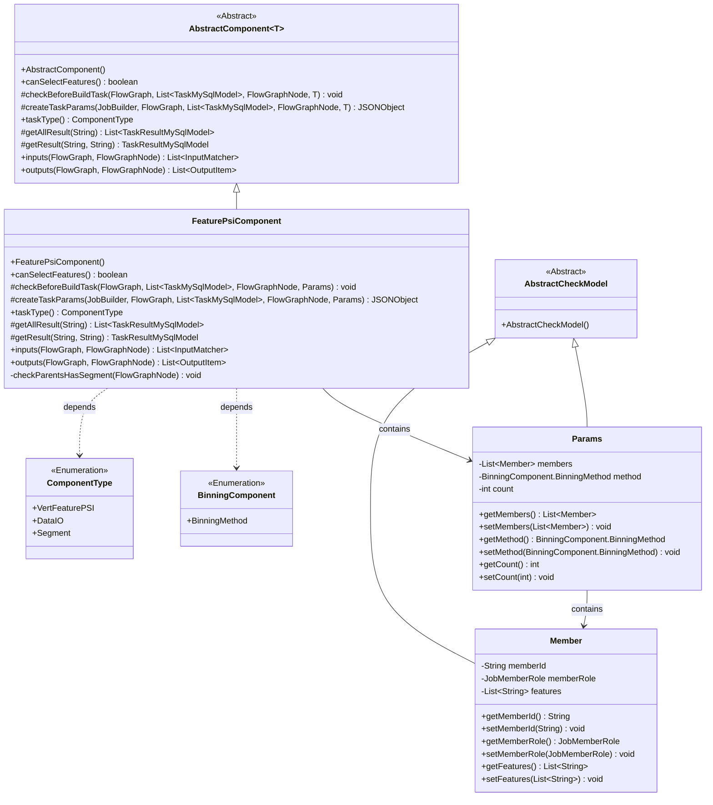
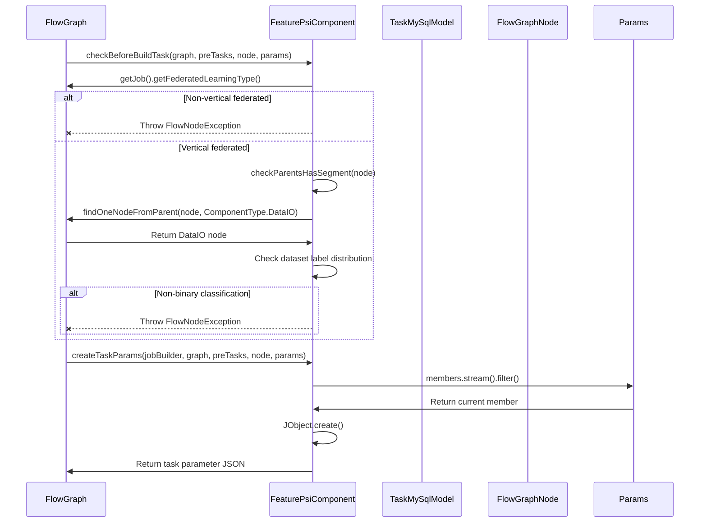

# Basic Information

|      |      |
|------|------|
| Name | FeaturePsiComponent |
| Language | .java |
| Code Path | WeFe/board/board-service/src/main/java/com/welab/wefe/board/service/component/feature/FeaturePsiComponent.java |
| Package Name | com.welab.wefe.board.service.component.feature |
| Dependencies | ['com.alibaba.fastjson.JSONObject', 'com.welab.wefe.board.service.component.DataIOComponent', 'com.welab.wefe.board.service.component.base.AbstractComponent', 'com.welab.wefe.board.service.component.base.filter.OutputDataTypeAndNameOutputFilter', 'com.welab.wefe.board.service.component.base.io.IODataType', 'com.welab.wefe.board.service.component.base.io.InputMatcher', 'com.welab.wefe.board.service.component.base.io.Names', 'com.welab.wefe.board.service.component.base.io.OutputItem', 'com.welab.wefe.board.service.database.entity.data_resource.TableDataSetMysqlModel', 'com.welab.wefe.board.service.database.entity.job.TaskMySqlModel', 'com.welab.wefe.board.service.database.entity.job.TaskResultMySqlModel', 'com.welab.wefe.board.service.dto.vo.data_set.table_data_set.LabelDistribution', 'com.welab.wefe.board.service.exception.FlowNodeException', 'com.welab.wefe.board.service.model.FlowGraph', 'com.welab.wefe.board.service.model.FlowGraphNode', 'com.welab.wefe.board.service.model.JobBuilder', 'com.welab.wefe.board.service.service.CacheObjects', 'com.welab.wefe.common.exception.StatusCodeWithException', 'com.welab.wefe.common.fieldvalidate.AbstractCheckModel', 'com.welab.wefe.common.fieldvalidate.annotation.Check', 'com.welab.wefe.common.util.JObject', 'com.welab.wefe.common.wefe.enums.ComponentType', 'com.welab.wefe.common.wefe.enums.FederatedLearningType', 'com.welab.wefe.common.wefe.enums.JobMemberRole', 'org.springframework.stereotype.Service', 'java.util.Arrays', 'java.util.List'] |
| Brief Description | FeaturePsiComponent is a vertical federated learning component designed for binary classification scenarios, which must be executed immediately after the Segment component. It checks the input dataset type and label distribution, generates task parameters, and processes the results. |

# Description

The FeaturePsiComponent is a service class that inherits from AbstractComponent, designed to handle feature PSI operations in vertical federated tasks. It supports feature selection and performs multiple checks before task construction: only vertical federated task types are allowed, the prerequisite node must contain a Segment component, and the initiator's dataset must be of binary classification type. The component receives parameters such as member lists, binning methods, and binning counts via the Params class, and generates task parameters including feature names, methods, and bin counts. The input requirements are training and evaluation datasets, and the output is JSON-formatted results. The internal Member class defines attributes such as member ID, role, and feature lists.

# Class Summary

| Name   | Type  | Description |
|-------|------|-------------|
| FeaturePsiComponent | class | FeaturePsiComponent is a vertical federated learning component that only supports binary classification datasets and must be executed immediately after the Segment component. It checks input and output, generates task parameters, and processes result queries. |

## Class FeaturePsiComponent

|      |      |
|------|------|
| Access Modifier | @Service;public |
| Type | class |
| Name | FeaturePsiComponent |
| Description | FeaturePsiComponent is a vertical federated learning component that only supports binary classification datasets and must be executed immediately after the Segment component. It checks input and output, generates task parameters, and processes result queries. |

### UML Class Diagram

This code describes a federated learning component named `FeaturePsiComponent`, which inherits from `AbstractComponent` and is primarily used for feature PSI (Private Set Intersection) processing in vertical federated tasks. The component includes parameter class `Params` and member class `Member`, ensuring process correctness through strict input validation (such as checking federated learning type, data classification type, and predecessor nodes) and generating task parameter JSON. The class diagram illustrates the component inheritance relationships, parameter structures, and key dependencies, reflecting the specific constraints and data processing logic for vertical federated learning scenarios.

### Internal Method Call Graph

```mermaid
graph TD
    A["Class FeaturePsiComponent"]
    B["Method: boolean canSelectFeatures()"]
    C["Method: checkBeforeBuildTask(FlowGraph, List<TaskMySqlModel>, FlowGraphNode, Params)"]
    D["Method: createTaskParams(JobBuilder, FlowGraph, List<TaskMySqlModel>, FlowGraphNode, Params)"]
    E["Method: ComponentType taskType()"]
    F["Method: getAllResult(String)"]
    G["Method: getResult(String, String)"]
    H["Method: inputs(FlowGraph, FlowGraphNode)"]
    I["Method: outputs(FlowGraph, FlowGraphNode)"]
    J["Private Method: checkParentsHasSegment(FlowGraphNode)"]
    K["Inner Class: Params"]
    L["Inner Class: Member"]

    A --> B
    A --> C
    A --> D
    A --> E
    A --> F
    A --> G
    A --> H
    A --> I
    A --> J
    A --> K
    A --> L

    C --> C1["Check federated learning type"]
    C --> C2["Check if parent nodes contain Segment"]
    C --> C3["Check if dataset is binary classification"]
    D --> D1["Filter current members"]
    D --> D2["Create task parameter JSON"]
    H --> H1["Create input matcher"]
    I --> I1["Create output items"]
    J --> J1["Verify parent node has Segment"]
```

This code implements a federated learning feature PSI component with key functionalities: 1) Validating the task type must be vertical federated learning; 2) Ensuring the workflow node must follow data segmentation (Segment); 3) Enforcing binary classification dataset requirement for the promoter; 4) Generating JSON configuration containing feature binning parameters. The flowchart illustrates the class structure and core method call relationships, while the sequence diagram details the pre-build validation process and task parameter generation flow. Through strict input/output control and parameter validation, this component ensures feature PSI operations are executed in compliant federated learning environments.

### Field List

| Name  | Type  | Description |
|-------|-------|------|

### Method List

| Name  | Type  | Description |
|-------|-------|------|
| taskType | ComponentType | This method overrides and returns the component type as VertFeaturePSI. |
| inputs | List<InputMatcher> | This method overrides the parent class method and returns two input matchers, corresponding to the training dataset and the evaluation dataset respectively. Accuracy must be ensured by filtering based on name and data type. |
| getResult | TaskResultMySqlModel | Rewrite the method to query results by task ID and type, which may throw exceptions. |
| createTaskParams | JSONObject | Method override, generate task parameter JSON: filter current members, add fields for features, methods, and quantities. |
| canSelectFeatures | boolean | The method canSelectFeatures returns true, indicating that feature selection is supported. |
| checkParentsHasSegment | void | Check if the parent node contains a Segment type; if not, throw an exception indicating that VertFeaturePSI must be executed immediately after Segment. |
| checkBeforeBuildTask | void | Check the vertical federated task and binary classification dataset: if it is not a vertical federated task or the dataset is not binary classification, throw an exception; validate the parent node and ensure the DataIO component exists. |
| outputs | List<OutputItem> | This method returns a list containing a single OutputItem, named JSON_RESULT with the data type Json. |
| getAllResult | List<TaskResultMySqlModel> | This is a Java method that overrides the getAllResult method of the parent class. It retrieves a list of all task results for a specified taskId by calling the listAllResult method of taskResultService. |

