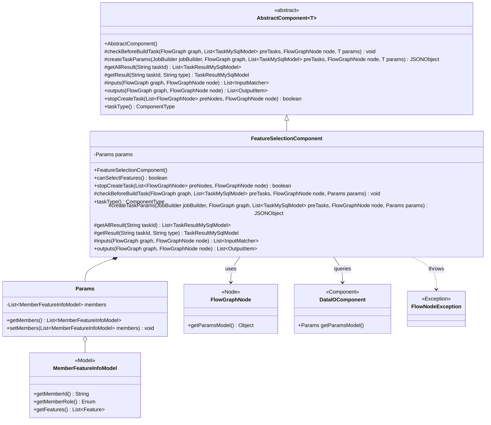
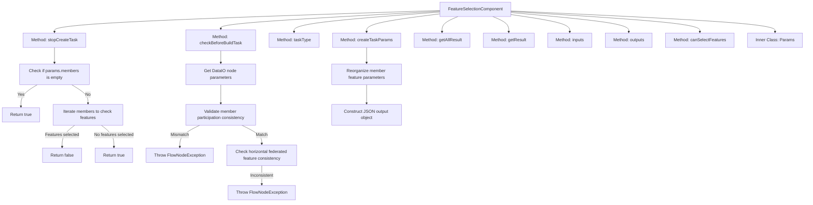
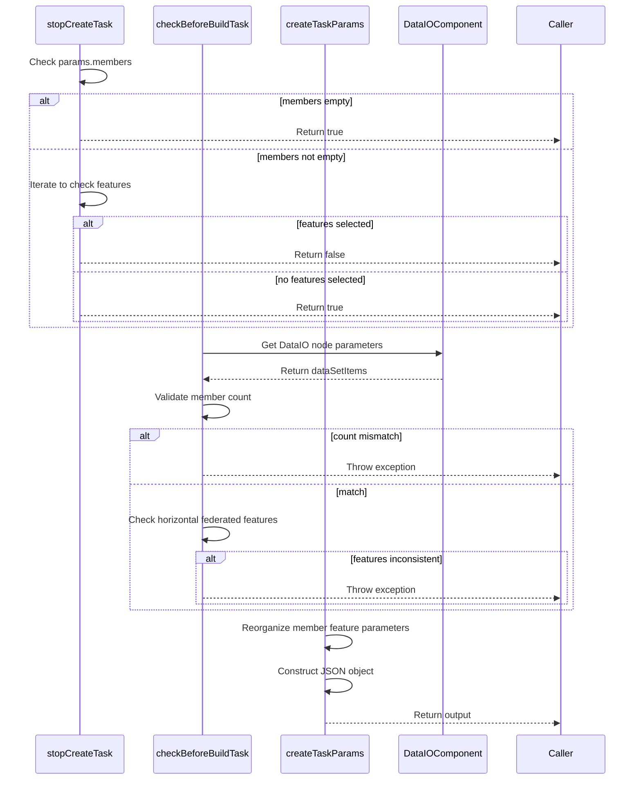

# Basic Information

|      |      |
|------|------|
| Name | FeatureSelectionComponent |
| Language | .java |
| Code Path | WeFe/board/board-service/src/main/java/com/welab/wefe/board/service/component/feature/FeatureSelectionComponent.java |
| Package Name | com.welab.wefe.board.service.component.feature |
| Dependencies | ['com.alibaba.fastjson.JSONObject', 'com.welab.wefe.board.service.component.DataIOComponent', 'com.welab.wefe.board.service.component.base.AbstractComponent', 'com.welab.wefe.board.service.component.base.io.IODataType', 'com.welab.wefe.board.service.component.base.io.InputMatcher', 'com.welab.wefe.board.service.component.base.io.Names', 'com.welab.wefe.board.service.component.base.io.OutputItem', 'com.welab.wefe.board.service.database.entity.job.TaskMySqlModel', 'com.welab.wefe.board.service.database.entity.job.TaskResultMySqlModel', 'com.welab.wefe.board.service.dto.entity.MemberFeatureInfoModel', 'com.welab.wefe.board.service.exception.FlowNodeException', 'com.welab.wefe.board.service.model.FlowGraph', 'com.welab.wefe.board.service.model.FlowGraphNode', 'com.welab.wefe.board.service.model.JobBuilder', 'com.welab.wefe.common.exception.StatusCodeWithException', 'com.welab.wefe.common.fieldvalidate.AbstractCheckModel', 'com.welab.wefe.common.util.JObject', 'com.welab.wefe.common.wefe.enums.ComponentType', 'com.welab.wefe.common.wefe.enums.FederatedLearningType', 'org.apache.commons.collections4.CollectionUtils', 'org.springframework.stereotype.Service', 'java.util.ArrayList', 'java.util.Arrays', 'java.util.List', 'java.util.concurrent.atomic.AtomicInteger', 'java.util.stream.Collectors'] |
| Brief Description | The FeatureSelectionComponent is a feature selection component that checks whether member features are consistent, ensures the feature lists for horizontal modeling are identical, and stops task creation if no features are present. |

# Description

The FeatureSelectionComponent is a component designed for feature selection, inheriting from AbstractComponent. Its primary functions include: stopping task creation when no features are selected; checking predecessor node data to ensure participation of all members; validating feature list consistency during horizontal modeling; reorganizing frontend parameters to generate task parameters; and defining input and output data types. This component supports feature selection and includes a parameter class, Params, for members and feature lists.

# Class Summary

| Name   | Type  | Description |
|-------|------|-------------|
| FeatureSelectionComponent | class | The FeatureSelectionComponent is used for feature selection, verifying the validity of members and features. Horizontal modeling requires consistent features, generating task parameters and handling input/output. The task will be terminated if there are no features or if member matching fails. |

## Class FeatureSelectionComponent

|      |      |
|------|------|
| Access Modifier | @Service;public |
| Type | class |
| Name | FeatureSelectionComponent |
| Description | The FeatureSelectionComponent is used for feature selection, verifying the validity of members and features. Horizontal modeling requires consistent features, generating task parameters and handling input/output. The task will be terminated if there are no features or if member matching fails. |

### UML Class Diagram

Class diagram description: This diagram illustrates the class structure of a feature selection component (FeatureSelectionComponent) that inherits from the generic abstract class AbstractComponent, containing an internal Params class for storing member feature information. The component retrieves parameters through FlowGraphNode, interacts with DataIOComponent for data validation, and throws FlowNodeException when validation fails. Core functionalities include task creation control, parameter validation, and result processing, supporting feature consistency checks for horizontal federated learning.

### Internal Method Call Graph

This code implements a feature selection component with three core methods: stopCreateTask validates whether features are selected to determine if task creation should be stopped; checkBeforeBuildTask performs data consistency validation before task construction; createTaskParams reorganizes feature parameters to generate task JSON. The flowchart shows the class structure and method invocation relationships, while the sequence diagram details the execution logic and data flow of key methods. The component emphasizes data consistency verification in federated learning scenarios, ensuring all participating parties have identical feature lists for horizontal modeling.

### Field List

| Name  | Type  | Description |
|-------|-------|------|

### Method List

| Name  | Type  | Description |
|-------|-------|------|
| createTaskParams | JSONObject | The method restructures front-end parameters into a JSON object, iterates through the member list, extracts each member's ID, role, and feature name, and ultimately returns a JSON structure containing all member information. |
| inputs | List<InputMatcher> | Method override, returns an input matcher list containing dataset instances. |
| checkBeforeBuildTask | void | Check preconditions for build task: Ensure all members participate and the horizontal modeling feature list is consistent, otherwise throw an exception. |
| canSelectFeatures | boolean | The method canSelectFeatures returns true, indicating that selection functionality is supported. |
| getResult | TaskResultMySqlModel | This is a Java method that overrides the parent class method to retrieve results based on task ID and type, currently returning null. |
| getAllResult | List<TaskResultMySqlModel> | This is a Java method that overrides the parent class method, retrieving a list of all task results for a specified taskId by invoking the listAllResult method of taskResultService. |
| stopCreateTask | boolean | The method checks whether features are selected in the node parameters and stops task creation if none are selected or the member is empty. |
| outputs | List<OutputItem> | This method overrides the parent class method and returns a list containing an OutputItem, which consists of NORMAL_DATA_SET and DataSetInstance types. |
| taskType | ComponentType | The method returns the component type as feature selection. |

