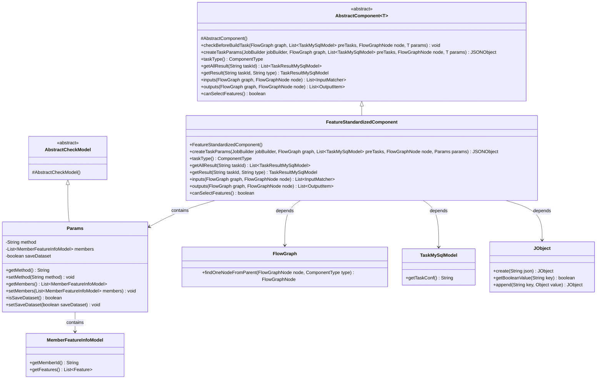
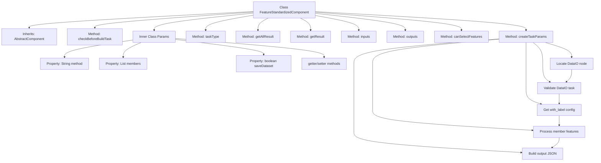
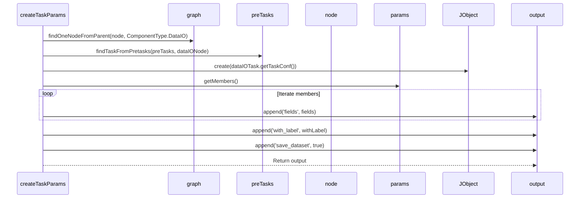

# Basic Information

|      |      |
|------|------|
| Name | FeatureStandardizedComponent |
| Language | .java |
| Code Path | WeFe/board/board-service/src/main/java/com/welab/wefe/board/service/component/feature/FeatureStandardizedComponent.java |
| Package Name | com.welab.wefe.board.service.component.feature |
| Dependencies | ['com.alibaba.fastjson.JSONObject', 'com.welab.wefe.board.service.component.base.AbstractComponent', 'com.welab.wefe.board.service.component.base.io.IODataType', 'com.welab.wefe.board.service.component.base.io.InputMatcher', 'com.welab.wefe.board.service.component.base.io.Names', 'com.welab.wefe.board.service.component.base.io.OutputItem', 'com.welab.wefe.board.service.database.entity.job.TaskMySqlModel', 'com.welab.wefe.board.service.database.entity.job.TaskResultMySqlModel', 'com.welab.wefe.board.service.dto.entity.MemberFeatureInfoModel', 'com.welab.wefe.board.service.exception.FlowNodeException', 'com.welab.wefe.board.service.model.FlowGraph', 'com.welab.wefe.board.service.model.FlowGraphNode', 'com.welab.wefe.board.service.model.JobBuilder', 'com.welab.wefe.board.service.service.CacheObjects', 'com.welab.wefe.common.fieldvalidate.AbstractCheckModel', 'com.welab.wefe.common.fieldvalidate.annotation.Check', 'com.welab.wefe.common.util.JObject', 'com.welab.wefe.common.util.StringUtil', 'com.welab.wefe.common.wefe.enums.ComponentType', 'org.springframework.stereotype.Service', 'java.util.ArrayList', 'java.util.Arrays', 'java.util.List'] |
| Brief Description | FeatureStandardizedComponent is a feature standardization component that inherits from AbstractComponent. It checks the DataIO component and extracts the with_label field, processes member feature information, supports z-score or min-max standardization methods, and outputs a standardized dataset. |

# Description

FeatureStandardizedComponent is a service class inherited from AbstractComponent, designed for feature standardization processing. It retrieves label information by checking the preceding DataIO component and processes member feature data to generate task parameters. Key functionalities include validating preceding tasks, extracting the with_label field from the DataIO component, and iterating through member feature information to produce a JSON output containing field lists and label statuses. This class defines parameters such as standardization methods, member information, and save options, supports feature selection, and specifies the data input/output type as DataSetInstance.

# Class Summary

| Name   | Type  | Description |
|-------|------|-------------|
| FeatureStandardizedComponent | class | The FeatureStandardizedComponent is a service component for handling feature standardization, inheriting from AbstractComponent. Its primary functions include checking prerequisite DataIO components, generating task parameters (containing field and label information), and defining input/output data types. It supports z-score and min-max standardization methods, with configurable member features and save options. |

## Class FeatureStandardizedComponent

|      |      |
|------|------|
| Access Modifier | @Service;public |
| Type | class |
| Name | FeatureStandardizedComponent |
| Description | The FeatureStandardizedComponent is a service component for handling feature standardization, inheriting from AbstractComponent. Its primary functions include checking prerequisite DataIO components, generating task parameters (containing field and label information), and defining input/output data types. It supports z-score and min-max standardization methods, with configurable member features and save options. |

### UML Class Diagram

This code describes a feature standardization component `FeatureStandardizedComponent`, which inherits from the generic abstract class `AbstractComponent` and is primarily used to handle feature standardization tasks. The component creates task parameters through the `createTaskParams` method, requires datasets provided by the DataIO component, and processes member feature information. The inner class `Params` inherits from `AbstractCheckModel` and contains configuration parameters such as standardization methods, member information, and save flags. The component implements interface methods for input-output data matching and task type definition, with the overall design reflecting encapsulation and extensibility for the feature standardization process.

### Internal Method Call Graph

This code implements a feature standardization component, primarily handling data feature standardization processes. The flowchart illustrates the class structure and main method call relationships, while the sequence diagram details the execution flow of the createTaskParams method. The component checks for prerequisite DataIO nodes, retrieves label configurations, processes member feature information, and ultimately generates a task parameter JSON object containing standardized fields, label identifiers, and save flags. The inner class Params encapsulates configuration parameters such as standardization methods, member information, and save flags.

### Field List

| Name  | Type  | Description |
|-------|-------|------|

### Method List

| Name  | Type  | Description |
|-------|-------|------|
| checkBeforeBuildTask | void | The method checks preconditions for building tasks, with parameters including a flowchart, a list of prerequisite tasks, nodes, and parameters, and may throw a process node exception. |
| createTaskParams | JSONObject | Method creates task parameters, checks the DataIO component and the with_label field, processes member features, and generates a JSON output containing fields, labels, and the saved dataset. |
| getResult | TaskResultMySqlModel | This is a Java method that overrides the parent class method to retrieve results based on the task ID and type, currently returning null. |
| getAllResult | List<TaskResultMySqlModel> | The method getAllResult overrides the parent class, accepts the taskId parameter, and returns a list of TaskResultMySqlModel. The current implementation returns null. |
| inputs | List<InputMatcher> | Method override, returns a list of input matchers containing dataset instances. |
| outputs | List<OutputItem> | The method outputs returns a list of output items containing dataset instances, with the key being NORMAL_DATA_SET. |
| canSelectFeatures | boolean | The method canSelectFeatures returns true, indicating that feature selection is supported. |
| taskType | ComponentType | Method override, returns task type as FeatureStandardized. |

