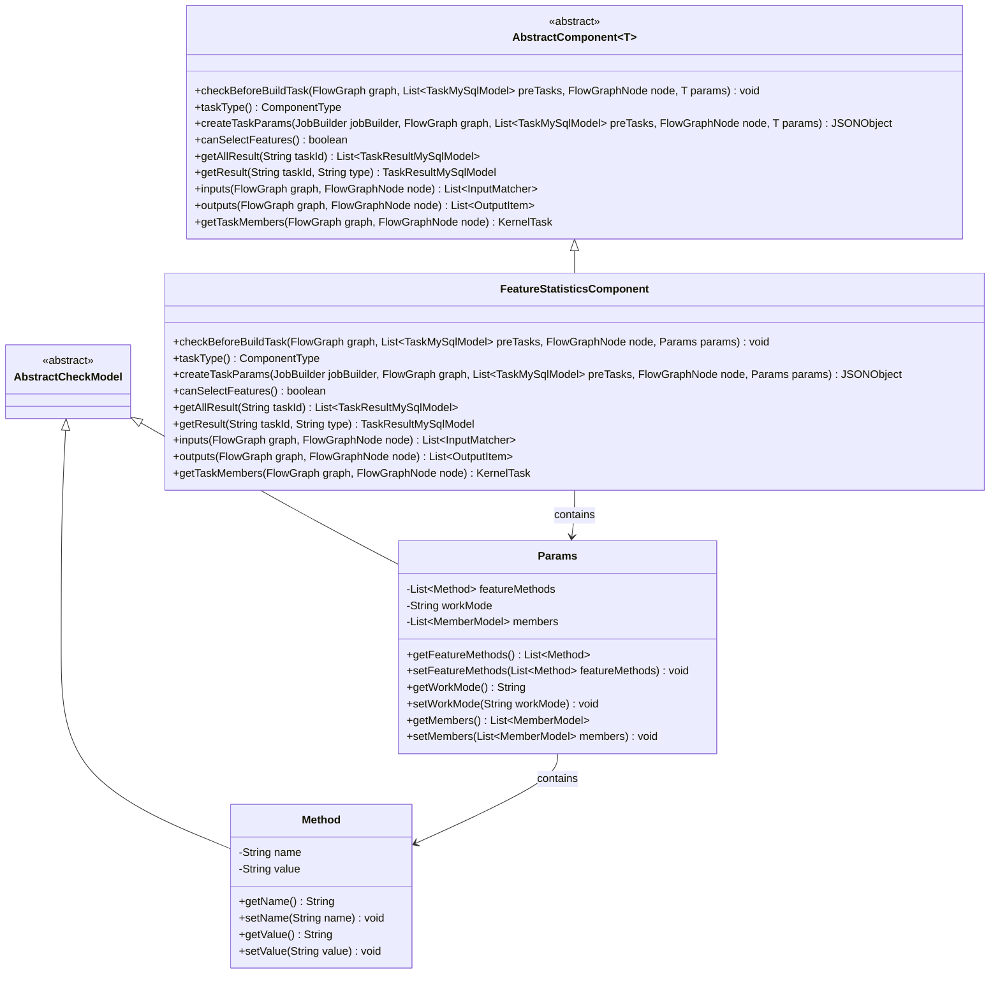
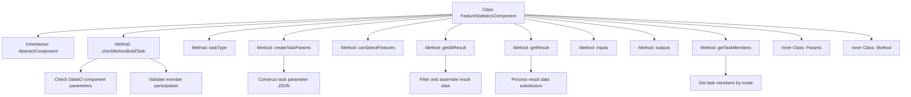
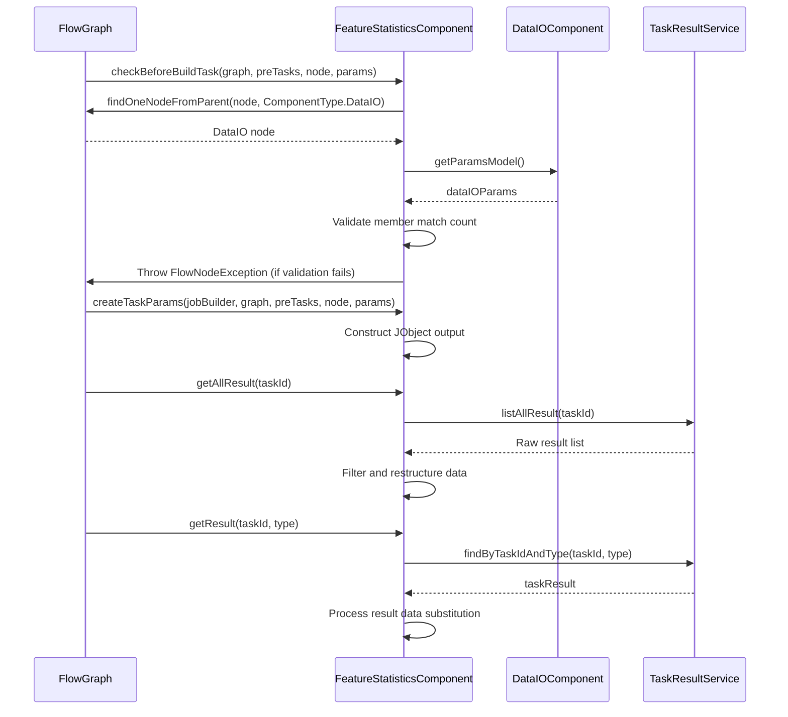

# Basic Information

|      |      |
|------|------|
| Name | FeatureStatisticsComponent |
| Language | .java |
| Code Path | WeFe/board/board-service/src/main/java/com/welab/wefe/board/service/component/feature/FeatureStatisticsComponent.java |
| Package Name | com.welab.wefe.board.service.component.feature |
| Dependencies | ['com.alibaba.fastjson.JSONObject', 'com.welab.wefe.board.service.component.DataIOComponent', 'com.welab.wefe.board.service.component.base.AbstractComponent', 'com.welab.wefe.board.service.component.base.filter.OutputDataTypesOutputFilter', 'com.welab.wefe.board.service.component.base.io.IODataType', 'com.welab.wefe.board.service.component.base.io.InputMatcher', 'com.welab.wefe.board.service.component.base.io.Names', 'com.welab.wefe.board.service.component.base.io.OutputItem', 'com.welab.wefe.board.service.database.entity.job.TaskMySqlModel', 'com.welab.wefe.board.service.database.entity.job.TaskResultMySqlModel', 'com.welab.wefe.board.service.dto.entity.MemberModel', 'com.welab.wefe.board.service.dto.kernel.Member', 'com.welab.wefe.board.service.dto.kernel.machine_learning.KernelTask', 'com.welab.wefe.board.service.exception.FlowNodeException', 'com.welab.wefe.board.service.model.FlowGraph', 'com.welab.wefe.board.service.model.FlowGraphNode', 'com.welab.wefe.board.service.model.JobBuilder', 'com.welab.wefe.board.service.service.CacheObjects', 'com.welab.wefe.common.fieldvalidate.AbstractCheckModel', 'com.welab.wefe.common.fieldvalidate.annotation.Check', 'com.welab.wefe.common.util.JObject', 'com.welab.wefe.common.wefe.enums.ComponentType', 'com.welab.wefe.common.wefe.enums.TaskResultType', 'org.apache.commons.collections4.CollectionUtils', 'org.springframework.beans.BeanUtils', 'org.springframework.stereotype.Service', 'java.util.ArrayList', 'java.util.Arrays', 'java.util.List', 'java.util.concurrent.atomic.AtomicInteger', 'java.util.stream.Collectors'] |
| Brief Description | The FeatureStatisticsComponent is a component designed for feature statistics, which checks the participation status of data IO members and supports both local and distributed modes, outputting results in JSON format. |

# Description

The FeatureStatisticsComponent is a service class inherited from AbstractComponent, designed to handle feature statistics tasks. It encompasses functionalities such as parameter validation, task creation, result processing, and member management. Before execution, the component verifies the presence of the DataIO component and ensures all members participate in non-local mode tasks. Task parameters include the working mode, and the output results are in JSON format. The component supports feature selection and can retrieve and reorganize task results, including supplementing member information. The Params class defines parameters such as feature methods, working modes, and member lists, while the Method class describes specific methods and their values. The component also handles the matching of input and output data types.

# Class Summary

| Name   | Type  | Description |
|-------|------|-------------|
| FeatureStatisticsComponent | class | The FeatureStatisticsComponent is a component for handling feature statistics, inheriting from AbstractComponent. Its primary functions include checking the participation status of data IO component members, generating task parameters, obtaining statistical results, supporting both local and distributed modes, and outputting results in JSON format. |

## Class FeatureStatisticsComponent

|      |      |
|------|------|
| Access Modifier | @Service;public |
| Type | class |
| Name | FeatureStatisticsComponent |
| Description | The FeatureStatisticsComponent is a component for handling feature statistics, inheriting from AbstractComponent. Its primary functions include checking the participation status of data IO component members, generating task parameters, obtaining statistical results, supporting both local and distributed modes, and outputting results in JSON format. |

### UML Class Diagram

This code demonstrates a feature statistics component `FeatureStatisticsComponent`, which inherits from the generic abstract class `AbstractComponent` and is primarily used for handling feature statistics tasks. The component includes parameter class `Params` and method class `Method`, where `Params` stores configuration information such as work mode, member list, and feature methods. The component implements functionalities like pre-task-build checks, task parameter creation, and result retrieval, supporting both local and distributed work modes while ensuring member consistency validation. Through inheritance relationships, the code achieves excellent extensibility and type safety.

### Internal Method Call Graph

Flowchart description: This flowchart illustrates the complete structure of the FeatureStatisticsComponent class, including its inheritance relationship, core methods, and two inner classes (Params and Method). Key methods involve parameter validation (checkBeforeBuildTask), task parameter creation (createTaskParams), and result processing (getAllResult/getResult), highlighting the component's core logic such as DataIO parameter dependency verification, operation mode determination, and result data restructuring. The sequence diagram specifically depicts the interaction process between the component and the flow graph, DataIO component, and task result service.

### Field List

| Name  | Type  | Description |
|-------|-------|------|

### Method List

| Name  | Type  | Description |
|-------|-------|------|
| inputs | List<InputMatcher> | Method override, returns a list containing InputMatcher that matches NORMAL_DATA_SET and specified output filters. |
| getTaskMembers | KernelTask | Method to retrieve task members based on work mode: filters and returns current members in local mode; otherwise calls the parent class method. |
| outputs | List<OutputItem> | The method outputs returns a list of OutputItems containing JSON results. |
| getAllResult | List<TaskResultMySqlModel> | This method retrieves all results for the specified task ID, filters data of type data_feature_statistic, adds the reorganized results, and finally returns the merged list. |
| createTaskParams | JSONObject | Override the method to create task parameters, generating a JSON object containing the work mode, while ignoring the original percentage processing code in the comments. |
| getResult | TaskResultMySqlModel | Retrieve results based on task ID and type, process statistical results of data features, replace Infinity values, and return after supplementing member names. |
| checkBeforeBuildTask | void | Check whether the members of the DataIO component in the flowchart match those in the current node parameters. If the working mode is not local and there is a mismatch, throw an exception. |
| taskType | ComponentType | Method override, returning component type as FeatureStatistic. |
| canSelectFeatures | boolean | The method canSelectFeatures returns true, indicating that feature selection is supported. |

